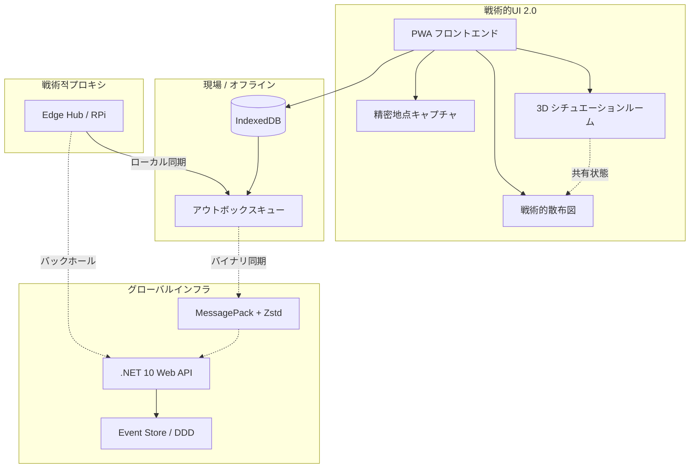

# SOS Location: レジリエント戦術マップ & 3Dシチュエーションルーム v2.0

> [!NOTE]
> **倫理的声明 (ETHICAL COMMITMENT)**
>
> このプロジェクトは、自然災害や人道危機の際に**人命を救い**、その影響を軽減するというミッションの下に運営されています。本プラットフォームを軍事目的、戦闘活動、または紛争シミュレーションに使用することは、私たちの基本原則や人道的目的とは一致しません。
>
> This project is driven by the mission to **SAVE LIVES** and mitigate the impacts of natural disasters and humanitarian crises. The use of this platform for military purposes, warfare activities, or conflict simulations does not align with our core values and humanitarian purpose.


[English](./README.md) | [Português](./README.pt.md) | **日本語**

**SOS Location** は、自然災害（洪水、土砂崩れ、人道危機）シナリオにおける意思決定支援と運用調整のためのシステムです。主な目的は、ネットワークインフラが壊滅的な故障をきたした場合でも、**100%の運用可用性**を保証することです。

---

## 🎯 ミッション
複雑なデータを即時の戦術的行動に変換すること。SOS Location は単なるダッシュボードではなく、インターネットが届かない場所でも機能するように設計されたフィールドツールです。

---

## 🏗️ レジリエンス・アーキテクチャ (v2.0)

バージョン 2.0 では、**Resilience-First** 設計が導入され、4つの基本柱に焦点が当てられています：



1. **Local-first (Offline Outbox)**: PWA アプリは IndexedDB を使用してインターネットなしで動作します。アクションは同期待ちキューに入れられ、接続が回復すると自動的に同期されます。
2. **バイナリプロトコル (MessagePack + Zstd)**: 重い JSON を Zstandard で圧縮された MessagePack に置き換え、データトラフィックを最大 80% 削減しました。これは無線や衛星回線にとって非常に重要です。
3. **イベントソーシング (DDD)**: すべてのシステム変更を不変のイベントとして扱います。これにより、自動的な競合解決（CRDT-lite）と完全な監査証跡が可能になります。
4. **Edge Hubs (分散型コマンド)**: 隔離されたエリアで戦術的プロキシとして機能するローカルサーバー（Raspberry Pi など）をサポートします。

---

## 🚀 仕組み

### 1. 3D シチュエーションルーム (v2.0)
**Three.js** を使用した没入型戦術環境。イベントを脈動する 3D ビーコンとして視覚化し、災害の空間的クラスター化と深度把握を可能にします。

### 2. 標準化された API とヘルスモニタリング
**ASPNET Core v10** との堅牢な統合。高可用性監視のための専用エンドポイントが含まれています：
- `GET /api/health`: サービスのステータスと稼働時間の確認を提供します。

### 3. 戦術分析 (Scatter Plot 2.0)
マップと統合された詳細な時間軸分析。さまざまなプロバイダー（GDACS、USGS、地元機関）にわたるパターンの特定や深刻度の傾向を把握できます。

---

### クイックスタート (Docker)
```bash
./dev.sh up
```
- **アプリ**: `http://localhost:8088` (Frontend React)
- **API**: `http://localhost:8001` (.NET Backend)
- **ヘルスチェック**: `http://localhost:8001/api/health`

### データシード (重要)
ブラジル・ミナスジェライス州ウバ（Ubá）の洪水シミュレーションデータを投入するには：
```bash
./dev.sh seed
```

---

## 📂 プロジェクト構成

```bash
├── backend-dotnet/     # ASP.NET Core 10 Web API
├── frontend-react/     # React 19 + Vite アプリケーション
├── agents/             # AI エージェントと自動化
├── docs/               # 詳細なドキュメントと計画
├── dev.sh              # DX 用の戦術的ツール
└── Dockerfile.*        # 環境定義
```

---

## 📑 詳細ドキュメント
- 📖 [現在のアーキテクチャ](docs/ARCHITECTURE_CURRENT.md)
- ⚖️ [透明性ポリシー](docs/PRIVACY_TRANSPARENCY_POLICY.md)
- 🧪 [テスト計画](docs/SECURITY_TEST_CHECKLIST.md)

---

**SOS Location © 2026** - レジリエントなテクノロジーで命を救うために開発されました。
