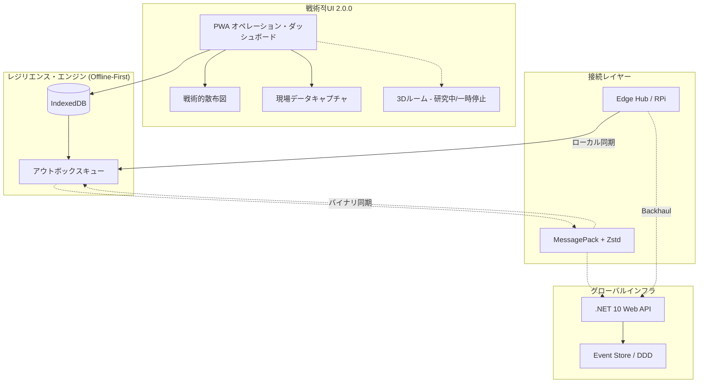

# SOS Location: レジリエント・オペレーション・ダッシュボード & 戦術管理 v2.0.0


[English](./README.md) | [Português](./README.pt.md) | **日本語**

**SOS Location** は、壊滅的なシナリオを想定したレジリエントな意思決定支援プラットフォームです。私たちの核となるのは **オペレーション・ダッシュボード** であり、グローバルなネットワークがダウンした場合でも、複数の人道的アクターを調整する高可用性な指揮官センターとして機能します。

---

## 🎯 ミッション
現場のデータと戦略的調整の間のギャップを埋めること。SOS Location はエコシステム内の各プロファイルに向けた専用ツールを提供し、リソースが正確かつ迅速に必要としている人々に届くようにします。

---

## 👥 オペレーショナル・ロールと機能

プラットフォームは、主に以下の4つのプロファイルを中心に構築されています：

### 🏛️ 政府・市民防衛
*指揮、統制、戦術的監視に重点を置いています。*
- **戦術的な可視化**: リアルタイムのオペレーション・マップとイベント追跡。
- **インシデント管理**: 高度な救助オペレーションの支援と調整。
- **戦略的な制御**: 地域的なインフラ状態や保健状況のモニタリング。

### 🧡 ボランティア・NGO
*現場活動とコミュニティ支援に重点を置いています。*
- **ロジスティクスと寄付管理**: キャンペーン、収集地点、配布ロジスティクスの管理。
- **現場レポート**: リスクエリアの登録や行方不明者の登録。
- **救助要請**: 緊急要請の直接的な処理と割り当て。

### 🛡️ 管理者・民間セクター
*プラットフォームの健全性と専門的なリソース配分に重点を置いています。*
- **エコシステムの管理**: ユーザー、権限、システムヘルス（稼働状況）の管理。
- **リソースの統合**: 民間リソース（物流、物資など）を救援活動に統合。

---

## 🏗️ レジリエンス・アーキテクチャ (v2.0.0)



1. **Local-first (Offline Outbox)**: インターネットなしで完全に機能し、オンライン復帰時に自動同期されます。
2. **バイナリプロトコル (MessagePack + Zstd)**: 低帯域幅リンク（無線、衛星）向けに最適化されています。
3. **イベントソーシング (DDD)**: 完全な監査証跡と自動的な競合解決。
4. **エッジコンピューティング**: 隔離されたエリアでの分散型ハブをサポート。

---

## 🚀 はじめる (Docker)

```bash
./dev.sh up
```
- **オペレーション・ダッシュボード**: `http://localhost:8088`
- **API (ヘルスモニタリング)**: `http://localhost:8001/api/health`

### シミュレーションデータの投入
```bash
./dev.sh seed
```

---

## 📂 プロジェクト構成
- `backend-dotnet/`: ASP.NET Core 10 Web API.
- `frontend-react/`: React 19 + Vite オペレーション・ダッシュボード.
- `agents/`: 自動調整のためのAIエージェント.

---

## ❤️ 私たちの価値観とコミットメント

> [!IMPORTANT]
> **倫理的声明 / ETHICAL COMMITMENT / COMPROMISSO ÉTICO**
>
> このプロジェクトは、自然災害や人道危機の際に**人命を救い**、その影響を軽減するというミッションの下に運営されています。本プラットフォームを軍事目的、戦闘活動、または紛争シミュレーションに使用することは、私たちの基本原則や人道的な目的とは一致しません。
>
> This project is driven by the mission to **SAVE LIVES** and mitigate the impacts of natural disasters and humanitarian crises. To use this platform for military purposes, warfare activities, or conflict simulations does not align with our core values and humanitarian purpose.
>
> Este projeto é movido pela missão de **SALVAR VIDAS** e mitigar os impactos de desastres naturais e crises humanitárias. O uso desta plataforma para fins militares, atividades bélicas ou simulações de conflito não alinha-se com nossos valores fundamentais e propósito humanitário.

## 📑 詳細ドキュメント
- 📖 [ドメインとDDD](docs/DOMAIN_SPECIFICATION.md)
- 📖 [要件とユビキタス言語](file:///home/nhmatsumoto/.gemini/antigravity/brain/99e5ff8e-f2f6-4adf-be65-0d33e9aaa49f/requirements_and_ddd.md)
- 📖 [現在のアーキテクチャ](docs/ARCHITECTURE_CURRENT.md)
- 📖 [ドメインルール](docs/DOMAIN_RULES.md)
- ⚖️ [透明性ポリシー](docs/PRIVACY_TRANSPARENCY_POLICY.md)
- 🧪 [テスト計画](docs/SECURITY_TEST_CHECKLIST.md)

---

**SOS Location © 2026** - 生命を救うためのテクノロジー (Technology for Life).
