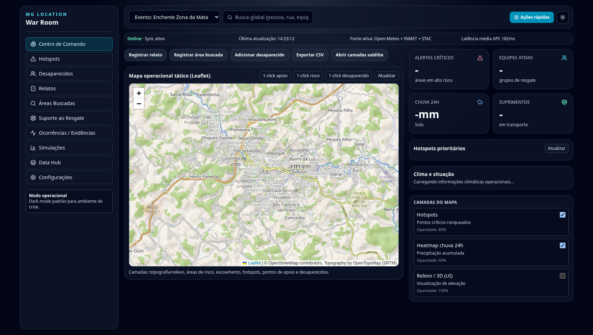
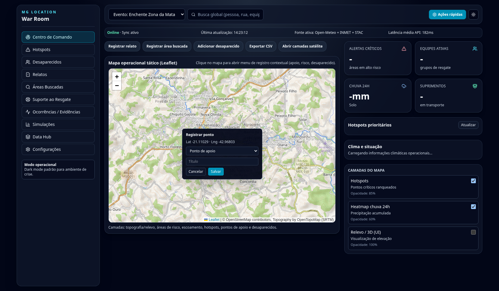

# MG Location

Plataforma open-source para apoio operacional em desastres (enchentes, deslizamentos e eventos correlatos), com foco em coordenação, geolocalização e integração de dados públicos.

**Produção:** EM BREVE

## DEMO

### Painel operacional


### Registro contextual no mapa (one-click)


> Arquivos esperados:
> - `docs/assets/demo-war-room.png`
> - `docs/assets/demo-map-click-menu.png`

---

## Comunidade

- **Grupo no Telegram:** https://t.me/+zVye-1dWSdFiMWZl

## Convite para novos colaboradores

Estamos construindo o MG Location como uma plataforma colaborativa para resposta a desastres.

Se você é:
- Desenvolvedor(a) backend/frontend;
- Arquiteto(a) de software;
- Geólogo(a);
- Cientista de dados / pesquisador(a);
- Voluntário(a) de campo e operações;

você está convidado(a) a colaborar com o projeto. Toda contribuição técnica, científica e operacional é bem-vinda.

## Tecnologias do projeto (referências oficiais)

- Django: https://www.djangoproject.com/
- React: https://react.dev/
- TypeScript: https://www.typescriptlang.org/
- PostgreSQL: https://www.postgresql.org/
- Docker: https://www.docker.com/
- OpenStreetMap: https://www.openstreetmap.org/
- Leaflet: https://leafletjs.com/

---

## Clonar e instalar o MG Location (localhost)

### 1) Clonar o repositório

```bash
git clone https://github.com/nhmatsumoto/mg_location.git
cd mg_location
```

### 2) Backend (Django)

```bash
python -m venv .venv
source .venv/bin/activate
pip install -r requirements.txt
python manage.py migrate
python manage.py runserver 0.0.0.0:8000
```

Backend local: `http://localhost:8000`

### 3) Frontend React (Vite)

Em outro terminal:

```bash
cd frontend-react
npm install
npm run dev -- --host 0.0.0.0 --port 8088
```

Frontend local: `http://localhost:8088`

> Se preferir, você pode usar Bun (`bun install`, `bun run dev --host 0.0.0.0 --port 8088`).

---

## Rodando com Docker Compose (alternativa rápida)

```bash
docker compose up --build
```

Portas padrão:
- Frontend: `http://localhost:8088`
- Backend/API: `http://localhost:8001`
- Agente de risco (ML): `http://localhost:8091`

Containers (nomes objetivos):
- `mg-location-web-frontend`
- `mg-location-api-backend`
- `mg-location-db-postgres`
- `mg-location-ml-risk-agent`

As portas são configuráveis por ambiente no `docker-compose`:

- `FRONTEND_PORT` (default `8088`)
- `BACKEND_PORT` (default `8001`)

Exemplo para evitar conflito de porta já ocupada:

```bash
FRONTEND_PORT=8090 BACKEND_PORT=8002 docker compose up --build
```

### Agente de avaliação de risco (novo)

O serviço `risk-agent` coleta dados de APIs públicas configuráveis (AlphaGeo, OGC e NGFS Guide), aplica cálculos físicos simplificados (incluindo fator de segurança geotécnico), treina um modelo de ML (`RandomForestRegressor`) e devolve um mapa de risco com relatório analítico.

Integrações no backend:
- `GET /api/risk/assessment`: consulta o agente e retorna mapa/analytics.
- `POST /api/risk/pipeline-sync`: ingere células de risco alto/crítico no banco (`MapAnnotation`).
- `python manage.py sync_risk_agent`: comando para atualização contínua em pipeline/cron.


---

## Deploy no Coolify (produção)

1. No Coolify, crie um novo recurso selecionando **Docker Compose**.
2. Configure o repositório `nhmatsumoto/mg_location` com a branch `master`.
3. Defina o caminho do compose como `docker-compose.yml`.
4. Configure variáveis de ambiente obrigatórias:
   - `SECRET_KEY` com um valor forte e único
   - `DEBUG=False`
   - `VITE_API_BASE_URL` (opcional, recomendável para domínio público, ex.: `https://api.seudominio.com`)
5. Faça o deploy. O backend executa migrações automaticamente e sobe com Gunicorn.

> Dica para testes locais com Docker Compose: se aparecer o aviso `Docker Compose requires buildx plugin to be installed`, instale o plugin `docker-buildx-plugin` no host antes de executar `docker compose build`.

Sugestão de publicação (opcional):
- Frontend: `app.seudominio.com`
- Backend/API: `api.seudominio.com`

## Atualizar stack sem risco de versão antiga

```bash
docker compose down --remove-orphans
docker compose build --no-cache backend frontend
docker compose up -d --force-recreate
docker compose ps
```

## Endpoints principais

### Operacionais
- `POST /api/calculate`
- `GET,POST /api/missing-persons`
- `GET /api/missing-people.csv`
- `GET /api/hotspots`
- `GET /api/rescue-support`
- `GET /api/terrain/context`
- `GET /api/operations/snapshot`
- `GET,POST /api/map-annotations`
- `GET,POST /api/support-points`
- `GET,POST /api/risk-areas`
- `GET /api/risk/assessment`
- `POST /api/risk/pipeline-sync`
- `GET,POST /api/rescue-groups`
- `GET,POST /api/supply-logistics`

### Data Hub
- `GET /api/weather/forecast`
- `GET /api/weather/archive`
- `GET /api/alerts`
- `GET /api/alerts/intelligence` (fusão: alertas externos + meteorologia + geocodificação)
- `GET /api/transparency/transfers`
- `GET /api/transparency/search`
- `GET /api/satellite/layers`
- `GET /api/satellite/stac/search`
- `GET /api/satellite/goes/recent`

## Licença

MIT.
