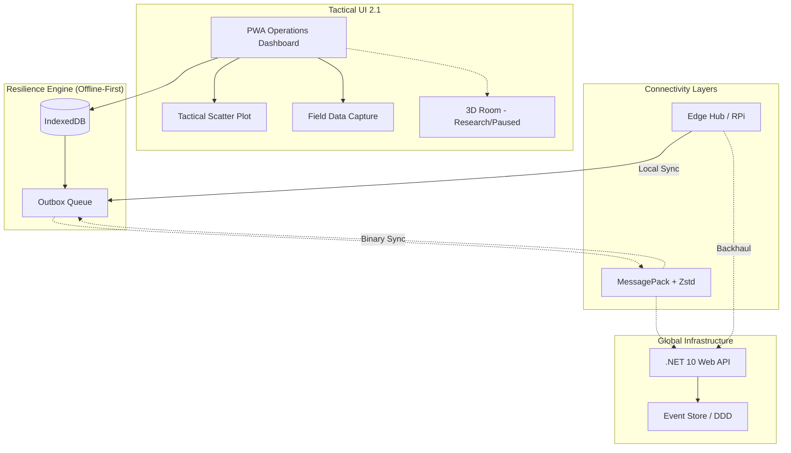

# SOS Location: Resilient Operations Dashboard & Tactical Management v2.1


**English** | [Português](./README.pt.md) | [日本語](./README.ja.md)

**SOS Location** is a resilient decision-support platform designed for catastrophic scenarios. Our focus is the **Operations Dashboard**, a high-availability nerve center that coordinates multiple humanitarian actors even when the global network fails.

---

## 🎯 Our Mission
To bridge the gap between field data and strategic coordination. SOS Location provides specialized tools for each profile in the ecosystem, ensuring that resources reach those in need precisely and quickly.

---

## 👥 Operational Roles & Features

The platform is built around four primary profiles, each with dedicated functionalities:

### 🏛️ Government & Civil Defense
*Focused on command, control, and tactical oversight.*
- **Tactical Visualization**: Real-time operational map and event tracking.
- **Incident Management**: Support and coordination of high-level rescue operations.
- **Strategic Control**: Monitoring regional health and infrastructure status.

### 🧡 Volunteers & NGOs
*Focused on ground activities and community support.*
- **Logistics & Donations**: Management of campaigns, collection points, and distribution.
- **Field Reporting**: Registration of risk areas and missing persons.
- **Help Requests**: Direct processing and assignment of emergency help requests.

### 🛡️ Admin & Private Sector
*Focused on platform integrity and specialized resource allocation.*
- **Ecosystem Oversight**: Management of users, permissions, and system health.
- **Resource Integration**: Onboarding private resources (logistics, supplies) into the relief effort.

---

## 🏗️ Resilience Architecture (v2.1)



1. **Local-first (Offline Outbox)**: Fully functional without internet; auto-syncs when back online.
2. **Binary Protocol (MessagePack + Zstd)**: Optimized for low-bandwidth links (radio, satellite).
3. **Event-Sourced DDD**: Full audit trail and automatic conflict resolution.
4. **Edge Computing**: Support for decentralized hubs in isolated areas.

---

## 🚀 Getting Started (Docker)

```bash
./dev.sh up
```
- **Operations Dashboard**: `http://localhost:8088`
- **API (Health Monitor)**: `http://localhost:8001/api/health`

### Seed Simulation Data
```bash
./dev.sh seed
```

---

## 📂 Project Structure
- `backend-dotnet/`: ASP.NET Core 10 Web API.
- `frontend-react/`: React 19 + Vite Operations Dashboard.
- `agents/`: AI Agents for automated coordination.
- `sos-3d-engine/`: Immersive visualization engine (**Current status: Research/Paused**).

---

## ❤️ Our Values & Commitment

> [!IMPORTANT]
> **ETHICAL COMMITMENT / COMPROMISSO ÉTICO / 倫理的声明**
>
> This project is driven by the mission to **SAVE LIVES** and mitigate the impacts of natural disasters and humanitarian crises. The use of this platform for military purposes, warfare activities, or conflict simulations does not align with our core values and humanitarian purpose.
>
> Este projeto é movido pela missão de **SALVAR VIDAS** e mitigar os impactos de desastres naturais e crises humanitárias. O uso desta plataforma para fins militares, atividades bélicas ou simulações de conflito não alinha-se com nossos valores fundamentais e propósito humanitário.
>
> このプロジェクトは、自然災害や人道危機の際に**人命を救い**、その影響を軽減するというミッションの下に運営されています。本プラットフォームを軍事目的、戦闘活動、または紛争シミュレーションに使用することは、私たちの基本原則や人道的な目的とは一致しません。

---

## 📑 Detailed Documentation
- 📖 [Domain & DDD](docs/DOMAIN_SPECIFICATION.md)
- 📖 [Current Architecture](docs/ARCHITECTURE_CURRENT.md)
- 📖 [Domain Rules](docs/DOMAIN_RULES.md)
- ⚖️ [Transparency Policies](docs/PRIVACY_TRANSPARENCY_POLICY.md)
- 🧪 [Test Plan](docs/SECURITY_TEST_CHECKLIST.md)

---

**SOS Location © 2026** - Developed to save lives with resilient technology.

