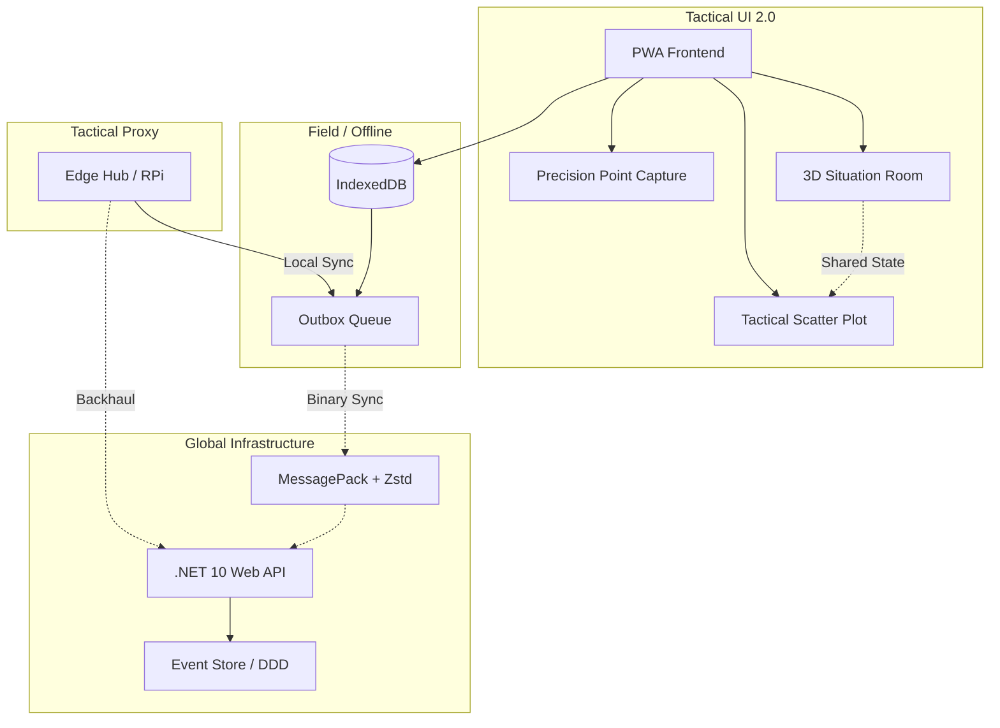

# SOS Location: Resilient Tactical Map & 3D Situation Room v2.0

> [!NOTE]
> **COMPROMISSO ÉTICO / ETHICAL COMMITMENT**
>
> Este projeto é movido pela missão de **SALVAR VIDAS** e mitigar os impactos de desastres naturais e crises humanitárias. O uso desta plataforma para fins militares, atividades bélicas ou simulações de conflito não alinha-se com nossos valores fundamentais e propósito humanitário.
>
> This project is driven by the mission to **SAVE LIVES** and mitigate the impacts of natural disasters and humanitarian crises. The use of this platform for military purposes, warfare activities, or conflict simulations does not align with our core values and humanitarian purpose.


**English** | [Português](./README.pt.md) | [日本語](./README.ja.md)

**SOS Location** is a decision support and operational coordination system for natural disaster scenarios (floods, landslides, humanitarian crises). The primary goal is to ensure **100% operational availability**, even under catastrophic network infrastructure failure.

---

## 🎯 Our Mission
To transform complex data into immediate tactical actions. SOS Location is not just a dashboard; it is a field tool designed to work where the internet does not reach.

---

## 🏗️ Resilience Architecture (v1.1)

Version 1.1 introduced the **Resilience-First** redesign, focused on four fundamental pillars:



1. **Local-first (Offline Outbox)**: The PWA app works without internet using IndexedDB. Actions are queued and automatically synchronized when connectivity is restored.
2. **Binary Protocol (MessagePack + Zstd)**: We replaced heavy JSON with MessagePack compressed with Zstandard, reducing data traffic by up to 80% — vital for radio or satellite links.
3. **Event-Souring (DDD)**: All system changes are treated as immutable events. This allows for automatic conflict reconciliation (CRDT-lite) and a full audit trail.
4. **Edge Hubs (Decentralized Command)**: Support for local servers (like Raspberry Pi) that serve as tactical proxies in isolated areas.

---

## 🚀 How It Works

### 1. 3D Situation Room (v2.0)
Immersive tactical environment using **Three.js** to visualize events as pulsing 3D beacons. Provides depth awareness and spatial clustering of disasters.

### 2. Standardized API & Health Monitoring
Robust integration with **ASPNET Core v10**. Includes specialized endpoints for high-availability monitoring:
- `GET /api/health`: Provides service status and uptime verification.

### 3. Tactical Analysis (Scatter Plot 2.0)
Advanced temporal analysis integrated with the map. Allows identifying patterns and severity trends over time across different providers (GDACS, USGS, local).
...
### Quick Start (Docker)
```bash
./dev.sh up
```
- **App**: `http://localhost:8088` (Frontend React)
- **API**: `http://localhost:8001` (.NET Backend)
- **Health**: `http://localhost:8001/api/health`

### Seed Data (Important)
To see the system populated with flood simulation data in Ubá (MG, Brazil):
```bash
./dev.sh seed
```

---

## 📂 Project Structure

```bash
├── backend-dotnet/     # ASP.NET Core 10 Web API
├── frontend-react/     # React 19 + Vite Application
├── agents/             # AI Agents & Automation
├── docs/               # Deep documentation & plans
├── dev.sh              # Tactical pocket knife for DX
└── Dockerfile.*        # Environment definitions
```

---

## 📑 Detailed Documentation
- 📖 [Domain Specification & DDD](docs/DOMAIN_SPECIFICATION.md)
- 📖 [Current Architecture](docs/ARCHITECTURE_CURRENT.md)
- 📖 [Domain Rules](docs/DOMAIN_RULES.md)
- ⚖️ [Transparency Policies](docs/PRIVACY_TRANSPARENCY_POLICY.md)
- 🧪 [Test Plan](docs/SECURITY_TEST_CHECKLIST.md)

---

**SOS Location © 2026** - Developed to save lives with resilient technology.
