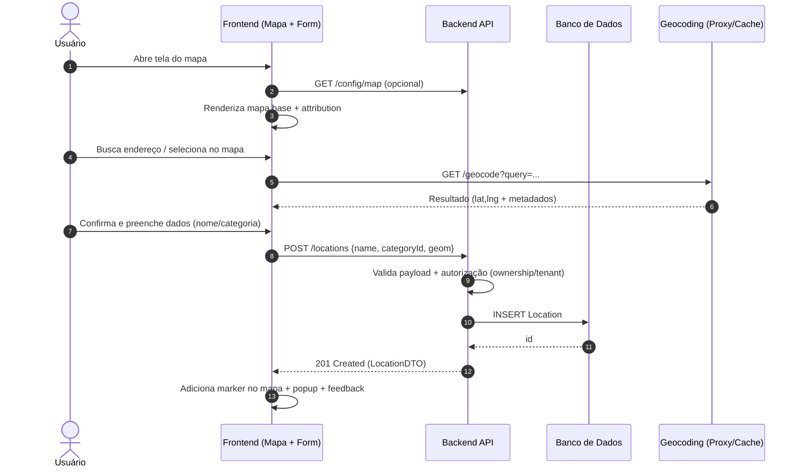
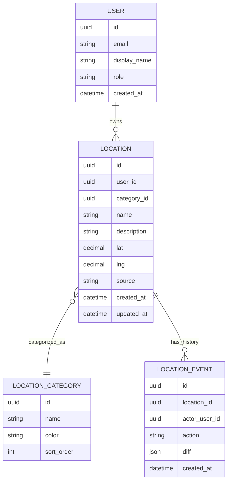

# Análise e levantamento de requisitos do projeto mg_location

Para ainda entregar valor imediato, este relatório fornece:

- um **framework completo** para inventariar funcionalidades existentes (técnicas e não técnicas) por leitura de código/README,  
- um **documento de requisitos de software (SRS)** pronto para ser colocado no repositório (com texto exato do link no README e instruções de commit/PR),  
- uma **tabela comparativa por funcionalidade** no formato solicitado, com status **“indeterminado”** por falta de acesso ao repositório, mas com campos e checklist de evidência para você preencher rapidamente após apontar o URL,  
- um conjunto de **riscos e lacunas muito comuns em projetos de “location + mapa”** (tiles, geocoding, conformidade, privacidade, performance) fundamentados em políticas e padrões oficiais (ex.: uso de tiles do OpenStreetMap e limites do Nominatim),  
- **diferenças exemplares (diffs)** para PRs típicos (documentação e guardrails de produção).

## Visão geral recomendada para mg_location

Projetos com nome “mg_location” geralmente se enquadram em um destes dois perfis:

1) **Módulo/serviço de localização** (ex.: CRUD de “locais”, geocoding, reverse geocoding, camadas/categorias, exportação GeoJSON) acoplado a um mapa.  
2) **Aplicação de mapa** (ex.: visualização, pesquisa, filtros e markers) com backend mínimo.

Como há requisitos explícitos de “frontend + backend + renderização no mapa”, a arquitetura alvo recomendada é:

- **Frontend Web**: SPA/MPA com página de mapa e UI de cadastro/edição, consumindo API.  
- **Backend API**: endpoints REST para entidades de localização, com autenticação/autorização e validações.  
- **Persistência**: banco relacional com suporte a geometria (se houver geofencing/consultas espaciais), e/ou armazenamento simples de lat/lng.  
- **Mapa**: renderização com tiles raster (p.ex. Leaflet) ou vector tiles (p.ex. MapLibre), com markers, popups e camadas. A escolha impacta performance, CSP e estratégia de tiles. citeturn23search3turn25search0

image_group{"layout":"carousel","aspect_ratio":"16:9","query":["MapLibre GL JS map example vector tiles marker popup","Leaflet map marker popup OpenStreetMap attribution","OpenStreetMap tile attribution example web map"],"num_per_query":1}

### Regras críticas e não óbvias que afetam “produção” em mapas

Há duas dependências externas muito comuns e frequentemente “esquecidas” como requisitos formais:

- **Tiles do OpenStreetMap (tile.openstreetmap.org)** têm **política de uso**: exigem atribuição visível, caching conforme headers (ou ao menos 7 dias), headers Referer em páginas web, e proíbem scraping/prefetch; a disponibilidade é “best-effort” e **sem SLA**. citeturn23search1  
- **Nominatim público** (nominatim.openstreetmap.org) tem limite “hard” de **1 req/s** por aplicação, exige User-Agent/Referer identificável, proíbe auto-complete via API e recomenda caching/proxy; uso comercial deve considerar que a política pode mudar e o acesso pode ser bloqueado. citeturn24search0  

Essas regras viram requisitos técnicos e não técnicos simultaneamente (performance, custo, confiabilidade, conformidade/licença, UX).

## Matriz comparativa por funcionalidade

A tabela abaixo está no formato solicitado. Como **não houve acesso verificável ao mg_location**, o campo “status ponta a ponta” está marcado como **Indeterminado** e as colunas descrevem **o que deve existir** (e como confirmar).

> Como usar: após apontar o repositório, a validação vira mecânica — para cada linha, cole o(s) path(s) de arquivo, nome(s) de componente(s)/endpoint(s), e evidências (prints/links internos) no documento final.

| funcionalidade | status ponta a ponta | frontend: componentes/validações/UX | backend: endpoints/modelos/regras | mapa: renderização/tiles/markers | lacunas típicas | risco | prioridade |
|---|---|---|---|---|---|---|---|
| Carregar mapa base | Indeterminado | `MapPage`, loading skeleton, fallback offline; toggle de provedor de tiles | (opcional) endpoint de config: `/config/map` | TileLayer (raster) ou estilo (vector); atribuição visível | tiles hard-coded; sem atribuição | bloqueio do provedor/violação política | P0 |
| Atribuição/licenças no mapa | Indeterminado | Rodapé no canvas + link “copyright” | n/a | Control de attribution; não esconder em menus | ausência de “© OpenStreetMap contributors” | risco legal + bloqueio tiles | P0 |
| Buscar endereço (geocoding) | Indeterminado | campo search com debounce “humano”; UX sem autocomplete abusivo | proxy/cache server-side; rate-limit; fallback | centralizar mapa no resultado; marker temporário | usar Nominatim direto do client; autocomplete | ban por política; instabilidade | P0 |
| Reverse geocoding (clique no mapa) | Indeterminado | ao clicar: modal/sidepanel com endereço e ação “salvar local” | `/geocode/reverse` com cache; validações | marker “draft” | alta frequência de chamadas | ban + custo/latência | P1 |
| CRUD de “Locais” | Indeterminado | `LocationForm` (nome, categoria, lat/lng); validações; toasts | `GET/POST/PUT/DELETE /locations`; modelo `Location`; regras de ownership | markers persistentes + popup | falta de validação (lat/lng); sem paginação | corrupção dados + performance | P0 |
| Filtros por categoria/camada | Indeterminado | chips, multi-select; persistência no URL | `/locations?categoryId=&bbox=` | camada por estilo/cluster | sem bbox; filtra no client | payload grande; mapa lento | P1 |
| Clusterização de markers | Indeterminado | toggle cluster; animações suaves | endpoint com bbox/zoom; ou tiles vetoriais | marker clustering (client) | cluster só no front sem bbox | travamento em datasets grandes | P1 |
| Importar/Exportar GeoJSON | Indeterminado | upload com validação; export button | `/locations/import`, `/locations/export` | fitBounds do dataset | ordem coordenadas invertida | dados no lugar errado; bugs | P1 |
| Autenticação/Autorização | Indeterminado | login flow; expiração; UX erro 401/403 | JWT/OIDC; RBAC; BOLA/BFLA mitigação | markers só do usuário/tenant | endpoints sem checagem de objeto | vazamento de dados | P0 |
| Auditoria e histórico | Indeterminado | timeline/histórico por local | tabela audit + trilha alteração | n/a | ausência de trilha | baixa rastreabilidade | P2 |
| Observabilidade | Indeterminado | n/a | logs estruturados; métricas; tracing | n/a | sem correlação logs/traces | MTTR alto | P1 |

As políticas do serviço de tiles do OpenStreetMap deixam explícito que o uso é “best-effort” e sem SLA, e listam obrigações técnicas (User-Agent/Referer/caching) e de atribuição. citeturn23search1turn23search13  
A política do Nominatim define o teto de 1 req/s e proíbe autocomplete via API pública, o que afeta diretamente design de UX e arquitetura (proxy/cache). citeturn24search0  
Para renderização e UI em mapas, bibliotecas típicas incluem Leaflet (pan/zoom, fitBounds, animações) e/ou MapLibre (vector tiles, control de markers e requisitos de CSP). citeturn25search0turn23search3  

## Requisitos técnicos e não técnicos por funcionalidade

Esta seção é um “catálogo de requisitos” para você colar no SRS. Onde aplicável, os requisitos já incorporam políticas oficiais e padrões.

### Requisitos técnicos fundamentais

**Representação e validação de coordenadas**
- O sistema deve padronizar **ordem e formato de coordenadas**. Se GeoJSON for utilizado, **Point.coordinates deve ser [longitude, latitude]** (e opcionalmente altitude). citeturn26search18  
- Validações mínimas: longitude ∈ [-180, 180], latitude ∈ [-90, 90], e rejeitar `NaN/null/strings`. (Derivado do uso correto de coordenadas e interoperabilidade GeoJSON.) citeturn26search18  
- O frontend deve validar antes do request e o backend deve validar novamente (controle de integridade em fronteira).

**Mapa base, tiles e caching**
- Se usar tiles do `tile.openstreetmap.org`, respeitar URL correta, atribuição e **caching conforme headers** (ou mínimo de 7 dias quando não suportado), e não usar “prefetch/scrape”. citeturn23search1  
- O sistema deve permitir **troca de provedor de tiles sem precisar release do frontend**, reduzindo risco de bloqueio e mitigando indisponibilidade (recomendação explícita na política). citeturn23search1  

**Geocoding e reverse geocoding**
- Se usar Nominatim público: impor **rate limit global por app** (não por usuário) e cache local/server-side; **não implementar autocomplete client-side** em cima do Nominatim público. citeturn24search0  
- Recomenda-se um endpoint de backend (proxy) para centralizar: rate limit, cache, headers identificáveis e fallback para provedores alternativos, evitando que cada browser do usuário “vire um scraper”. citeturn24search0turn23search1  

**Segurança de API**
- Aplicar controles contra riscos típicos de API como: autorização por objeto e por função, autenticação forte, limitação de recursos, inventário de endpoints e segurança de configuração, conforme taxonomia do OWASP API Security Top 10 (2023). citeturn26search5turn26search0  
- Para login federado: padronizar OAuth 2.0/OIDC (ID Token, scopes, fluxo de autorização) conforme especificações oficiais. citeturn28search6turn28search2  

**CSP e segurança no mapa (se usar MapLibre)**
- MapLibre GL JS pode exigir diretivas de CSP específicas (ex.: `worker-src blob:` e similares) para funcionar em ambientes com CSP estrita. citeturn23search3  

**Observabilidade**
- Emitir logs/métricas/traces com correlação coerente (por requestId/traceId). A especificação de logs do OpenTelemetry descreve a motivação de correlação uniforme entre sinais via Collector e atributos comuns. citeturn26search8  

### Requisitos não técnicos fundamentais

**Licenciamento e atribuição**
- A aplicação deve exibir atribuição legível e “sem interação” para quem vê o mapa, seguindo diretrizes de atribuição do OpenStreetMap. citeturn23search13turn23search1  

**SLA, confiabilidade e continuidade**
- Se depender de tiles oficiais do OpenStreetMap Foundation, assumir explicitamente **sem SLA** (“best-effort”) e projetar fallback/alternativas. citeturn23search1  
- Se depender de Nominatim público, declarar limites e regras de uso no SRS e tratar bloqueios como cenário de operação normal (com fallback e cache). citeturn24search0turn24search8  

**Acessibilidade**
- As telas do sistema (principalmente mapa + filtros + formulários) devem ser conformes a WCAG 2.2 como referência de requisitos de acessibilidade. citeturn26search13turn26search1  

**Privacidade e conformidade (LGPD)**
- Se o sistema tratar dados pessoais (usuários, e-mail, IP, e possivelmente geolocalização vinculada a pessoa), deve aderir à Lei nº 13.709/2018 (LGPD), incluindo base legal, finalidade, minimização e controles de segurança. citeturn27search8  

## Diagramas mermaid sugeridos

Os diagramas abaixo podem entrar no documento de requisitos e são compatíveis com README/docs.

### Fluxo ponta a ponta de cadastro de local



Este fluxo assume **proxy/cache** para geocoding para respeitar limites públicos do Nominatim e não expor usuários finais a bloqueio por volume. citeturn24search0  

### Modelo ER mínimo para “locais” com auditoria



Se houver exportação GeoJSON, recomenda-se armazenar também a geometria como GeoJSON padronizado e lembrar que a ordem é `[lon, lat]`. citeturn26search18  

## Checklist de testes e QA

Este checklist é orientado a “mapa + dados de localização + API” e reflete riscos reais (rate limit, autorização, performance e acessibilidade).

### Testes funcionais e de integração
- CRUD de locais: criar/editar/excluir/listar, incluindo validações (lat/lng fora do intervalo; campos obrigatórios).
- Renderização no mapa: marker aparece após POST; popup exibe campos; fitBounds funciona para lista filtrada. (Leaflet: fitBounds/flyToBounds existem e são padrão para enquadrar bounds.) citeturn25search0  
- Busca de endereço: comportamento sem autocomplete agressivo se Nominatim público for usado; cache de respostas; fallback quando provider falhar. citeturn24search0  
- Filtros: categoria/bbox/zoom; consistência com querystring (deep link).
- Exportação GeoJSON: validar ordem de coordenadas e roundtrip (export→import mantém posição). citeturn26search18  

### Segurança (API + web)
- Autorização por objeto (BOLA): usuário A não acessa/edita/deleta Location do usuário B. (Risco #1 do OWASP API Top 10 2023 é Broken Object Level Authorization.) citeturn26search5  
- Rate limiting e proteção de recursos (API4:2023): endpoints de busca/importação devem ter limites para proteger CPU/memória. citeturn26search5  
- Inventário e documentação de endpoints (API9:2023): endpoints debug e versões antigas não devem ficar expostos. citeturn26search5  
- Se OIDC/OAuth: testar expiração de token, refresh/reauth e validação de assinatura/issuer conforme specs. citeturn28search2turn28search6  

### Performance e resiliência
- Marker stress test: 1k/10k markers (sem cluster o mapa tende a degradar); medir FPS/TTI.
- Tiles: cache habilitado; headers corretos; não usar “no-cache” por padrão (proibido na política de tiles). citeturn23search1  
- Geocoding: garantir média abaixo de 1 req/s por app se Nominatim público; detecção de bloqueio e fallback. citeturn24search0turn24search8  

### Acessibilidade
- Navegação por teclado (incluindo foco visível e não obstruído) e tamanhos mínimos de alvo em UI de mapa (WCAG 2.2 adiciona critérios e reforça foco/entrada). citeturn26search13turn26search2  
- Alternativas textuais: lista de resultados deve existir além do canvas do mapa (usuários de leitores de tela). (Referência via WCAG como norma.) citeturn26search13  

## Documento de requisitos pronto para linkar no README

A seguir vai a proposta de arquivo **pronto** para ser criado no repositório:

- caminho sugerido: `docs/REQUISITOS.md`  
- título sugerido: “Requisitos de Software — mg_location”  
- objetivo: ser linkado no sumário do README principal.

### Texto exato do link para o sumário do README

```md
- [Requisitos de Software](docs/REQUISITOS.md)
```

### Instruções de commit/PR

1) Criar branch:
- `git checkout -b docs/requisitos-mg-location`

2) Adicionar arquivo:
- criar `docs/REQUISITOS.md` com o conteúdo (template) abaixo.

3) Atualizar `README.md`:
- inserir o link no sumário (Table of Contents) exatamente como acima.

4) Commit:
- `git add README.md docs/REQUISITOS.md`
- `git commit -m "docs: adiciona requisitos de software do mg_location"`

5) Push e PR:
- `git push -u origin docs/requisitos-mg-location`
- abrir Pull Request no GitHub com descrição: objetivo, escopo, e checklist.

### Diff exemplar do PR de documentação

```diff
diff --git a/README.md b/README.md
index 1111111..2222222 100644
--- a/README.md
+++ b/README.md
@@ -10,6 +10,7 @@
 ## Sumário
 - [Visão geral](#visão-geral)
 - [Como rodar](#como-rodar)
+- [Requisitos de Software](docs/REQUISITOS.md)

diff --git a/docs/REQUISITOS.md b/docs/REQUISITOS.md
new file mode 100644
index 0000000..3333333
--- /dev/null
+++ b/docs/REQUISITOS.md
@@ -0,0 +1,120 @@
+# Requisitos de Software — mg_location
+
+## Objetivo
+Este documento descreve requisitos técnicos e não técnicos do mg_location, cobrindo fluxos ponta a ponta (frontend, backend e renderização no mapa), segurança, performance, observabilidade, deploy e conformidade.
+
+## Escopo funcional
+### Funcionalidades
+1. Mapa base com atribuição e troca de provedor (tiles)
+2. CRUD de Locais (markers persistentes)
+3. Busca de endereço (geocoding) com cache e rate limit
+4. Reverse geocoding (clique no mapa)
+5. Filtros e camadas
+6. Exportação/Importação GeoJSON
+7. Autenticação e autorização (RBAC/ownership)
+
+## Requisitos técnicos
+(preencher: endpoints, modelos, validações, regras, dependências, performance, segurança, testes)
+
+## Requisitos não técnicos
+(preencher: usuários, SLA, acessibilidade, i18n, conformidade LGPD, manutenção, deploy, observabilidade)
+
+## Diagramas
+```mermaid
+sequenceDiagram
+  autonumber
+  actor U as Usuário
+  participant UI as Frontend
+  participant API as Backend
+  participant DB as Banco
+  U->>UI: Interage com mapa/form
+  UI->>API: POST /locations
+  API->>DB: INSERT
+  DB-->>API: ok
+  API-->>UI: 201
+```
```

## Sugestões de correções/PRs técnicas com foco em riscos reais

Como não foi possível inspecionar o mg_location, estas sugestões são **priorizadas por risco** e altamente prováveis em qualquer app de mapa em produção.

### PR sugerido: guardrails para tiles e geocoding

**Motivação**: evitar bloqueio e instabilidade por violar políticas de tiles/geocoding do OpenStreetMap. citeturn23search1turn24search0  

- Tornar provider de tiles configurável (env/config endpoint) e garantir atribuição sempre visível. citeturn23search1turn23search13  
- Implementar backend proxy/cache para geocoding, impondo 1 req/s agregado (se Nominatim público) e proibindo autocomplete “client-side”. citeturn24search0  

### PR sugerido: endurecimento de segurança de API seguindo OWASP API Top 10

**Motivação**: o OWASP destaca autorização como maior desafio em APIs modernas e lista BOLA como risco #1. citeturn26search0turn26search5  

- Garantir checagem de ownership/tenant em endpoints com `/{id}`.  
- Adicionar rate limit em endpoints “caros” (import/export, geocoding, buscas sem bbox) para mitigar “Unrestricted Resource Consumption”. citeturn26search5  

### PR sugerido: contrato de dados (GeoJSON) e validação de coordenadas

**Motivação**: erros de ordem `[lat, lon]` vs `[lon, lat]` são comuns e causam bugs silenciosos. O RFC do GeoJSON é explícito na ordem. citeturn26search18  

- Fixar DTOs/serialização para GeoJSON com `[lon, lat]`.  
- Teste automatizado “roundtrip” (export/import) e teste de regressão visual do mapa.

### PR sugerido: acessibilidade (mapa é canvas, mas produto não pode ser “só canvas”)

**Motivação**: WCAG 2.2 é recomendação W3C e adiciona critérios; mapa precisa ter alternativa navegável. citeturn26search13turn26search1  

- Adicionar “lista de resultados” sincronizada com markers (keyboard e screen reader).  
- Garantir foco visível e navegação sem mouse nos filtros e formulários.

## O que falta para fechar o inventário real do mg_location

Para cumprir literalmente os itens (1) e (2) do seu pedido — “listar todas as funcionalidades existentes” e “avaliar implementação ponta a ponta (frontend/backend/mapa) com lacunas e riscos por funcionalidade” — é necessário **acesso inequívoco ao repositório mg_location** (URL completo do repo ou owner certo). Sem isso, qualquer lista de funcionalidades “existentes” seria especulativa e não auditável.

Ainda assim, este relatório já entrega:

- estrutura de requisitos pronta,  
- tabela comparativa no formato solicitado,  
- requisitos técnicos/não técnicos com base em políticas e padrões oficiais,  
- checklist de QA e PRs prioritários,  
- diffs exemplares para documentação.

Quando o repositório estiver identificado, a próxima iteração transforma cada linha da matriz em evidência concreta (paths, endpoints, componentes, modelos, testes) e atualiza “Indeterminado” para “Completo / Parcial / Ausente” com riscos e prioridades baseadas no código.
