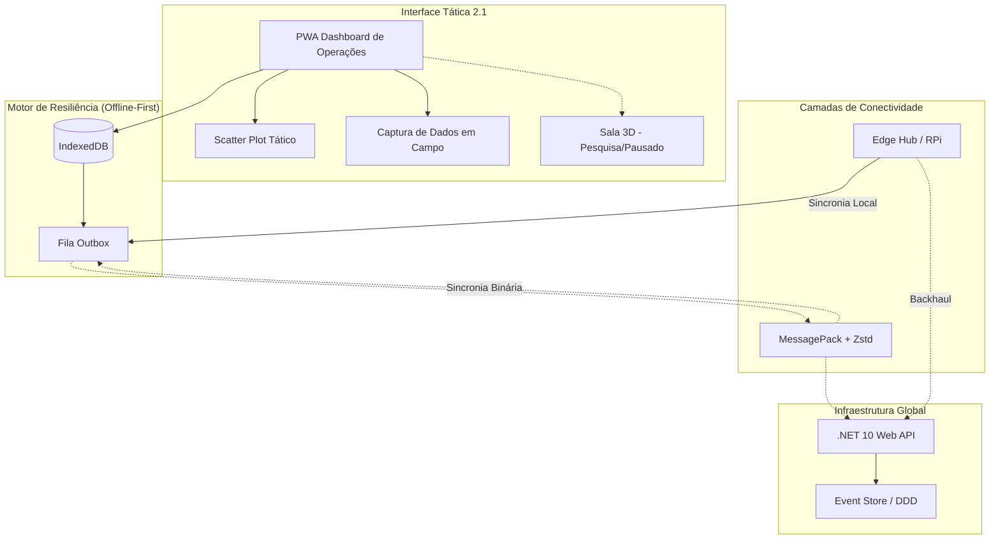

# SOS Location: Dashboard de Operações Resiliente e Gestão Tática v2.1


[English](./README.md) | [日本語](./README.ja.md) | **Português**

**SOS Location** é uma plataforma de suporte à decisão resiliente projetada para cenários de catástrofe. Nosso foco é o **Dashboard de Operações**, um centro nevrálgico de alta disponibilidade que coordena múltiplos atores humanitários mesmo quando a rede global falha.

---

## 🎯 Nossa Missão
Unir os dados de campo à coordenação estratégica. O SOS Location oferece ferramentas especializadas para cada perfil no ecossistema, garantindo que os recursos cheguem a quem precisa com precisão e agilidade.

---

## 👥 Perfis Operacionais e Funcionalidades

A plataforma é estruturada em torno de quatro perfis principais:

### 🏛️ Governo e Defesa Civil
*Focado em comando, controle e supervisão tática.*
- **Visualização Tática**: Mapa operacional em tempo real e rastreamento de eventos.
- **Gestão de Incidentes**: Suporte e coordenação de operações de resgate de alto nível.
- **Controle Estratégico**: Monitoramento do status de saúde e infraestrutura regional.

### 🧡 Voluntários e ONGs
*Focado em atividades de campo e suporte à comunidade.*
- **Gestão de Doações**: Controle de campanhas, pontos de coleta e logística de distribuição.
- **Registro em Campo**: Mapeamento de áreas de risco e registro de pessoas desaparecidas.
- **Pedidos de Ajuda**: Processamento direto e triagem de solicitações de emergência.

### 🛡️ Admins e Setor Privado
*Focado na integridade da plataforma e alocação de recursos especializados.*
- **Supervisão do Ecossistema**: Gestão de usuários, permissões e saúde do sistema.
- **Integração de Recursos**: Engajamento de recursos privados (logística, suprimentos) no esforço de socorro.

---

## 🏗️ Arquitetura de Resiliência (v2.1)



1. **Local-first (Offline Outbox)**: Totalmente funcional sem internet; sincroniza automaticamente ao recuperar a conexão.
2. **Protocolo Binário (MessagePack + Zstd)**: Otimizado para links de baixa largura de banda (rádio, satélite).
3. **Event-Sourced DDD**: Trilha de auditoria completa e resolução automática de conflitos.
4. **Edge Computing**: Suporte para hubs descentralizados em áreas isoladas.

---

## 🚀 Início Rápido (Docker)

```bash
./dev.sh up
```
- **Dashboard de Operações**: `http://localhost:8088`
- **API (Monitor de Saúde)**: `http://localhost:8001/api/health`

### Simulação de Dados
```bash
./dev.sh seed
```

---

## 📂 Organização do Projeto
- `backend-dotnet/`: API Web ASP.NET Core 10.
- `frontend-react/`: Dashboard de Operações em React 19 + Vite.
- `agents/`: Agentes de IA para coordenação automatizada.
- `sos-3d-engine/`: Motor de visualização imersiva (**Status: Pesquisa/Pausado**).

---

## ❤️ Nosso Compromisso e Valores

> [!IMPORTANT]
> **COMPROMISSO ÉTICO / ETHICAL COMMITMENT / 倫理的声明**
>
> Este projeto é movido pela missão de **SALVAR VIDAS** e mitigar os impactos de desastres naturais e crises humanitárias. O uso desta plataforma para fins militares, atividades bélicas ou simulações de conflito não alinha-se com nossos valores fundamentais e propósito humanitário.
>
> This project is driven by the mission to **SAVE LIVES** and mitigate the impacts of natural disasters and humanitarian crises. The use of this platform for military purposes, warfare activities, or conflict simulations does not align with our core values and humanitarian purpose.
>
> このプロジェクトは、自然災害や人道危機の際に**人命を救い**、その影響を軽減するというミッションの下に運営されています。本プラットフォームを軍事目的、戦闘活動、または紛争シミュレーションに使用することは、私たちの基本原則や人道的な目的とは一致しません。

---

## 📑 Documentação Detalhada
- 📖 [Arquitetura Atual](docs/ARCHITECTURE_CURRENT.md)
- ⚖️ [Políticas de Transparência](docs/PRIVACY_TRANSPARENCY_POLICY.md)
- 🧪 [Plano de Testes](docs/SECURITY_TEST_CHECKLIST.md)

---

**SOS Location © 2026** - Desenvolvido para salvar vidas com tecnologia resiliente.

