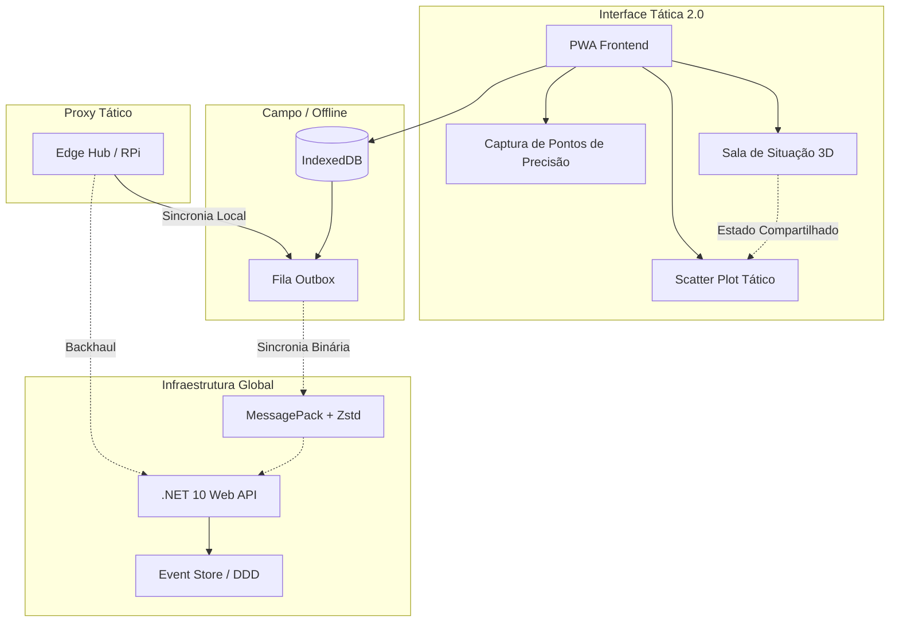

# SOS Location: Mapa Tático Resiliente e Sala de Situação 3D v2.0

> [!CAUTION]
> **AVISO ÉTICO CRÍTICO / CRITICAL ETHICAL WARNING**
>
> O uso desta plataforma para fins militares, em ambientes de guerra ou para simulações de conflito é **COMPLETAMENTE INACEITÁVEL**. Este projeto foi desenvolvido exclusivamente para **SALVAR VIDAS** e mitigar os impactos de desastres naturais e crises humanitárias. Usar esta tecnologia para fins de destruição é expressamente condenado pela organização e viola os princípios fundamentais deste software.
>
> The use of this platform for military purposes, warfare environments, or conflict simulations is **COMPLETELY UNACCEPTABLE**. This project was developed exclusively to **SAVE LIVES** and mitigate the impacts of natural disasters and humanitarian crises. Using this technology for destructive purposes is expressly condemned by the organization and violates the fundamental principles of this software.


[English](./README.md) | [日本語](./README.ja.md) | **Português**

**SOS Location** é um sistema de suporte à decisão e coordenação operacional para cenários de desastres naturais (enchentes, deslizamentos, crises humanitárias). O objetivo principal é garantir **100% de disponibilidade operacional**, mesmo sob falha catastrófica de infraestrutura de rede.

---

## 🎯 Nossa Missão
Transformar dados complexos em ações táticas imediatas. O SOS Location não é apenas um dashboard, é uma ferramenta de campo projetada para funcionar onde a internet não chega.

---

## 🏗️ Arquitetura de Resiliência (v2.0)

A versão 2.0 consolidou o redesenho **Resilience-First**, focado em quatro pilares fundamentais:



1. **Local-first (Offline Outbox)**: O app PWA funciona sem internet usando IndexedDB. Ações são enfileiradas e sincronizadas automaticamente quando houver conectividade.
2. **Protocolo Binário (MessagePack + Zstd)**: Substituímos o JSON pesado por MessagePack comprimido com Zstandard, reduzindo o tráfego de dados em até 80% — vital para rádio ou satélite.
3. **Event-Souring (DDD)**: Todas as alterações no sistema são tratadas como eventos imutáveis. Isso permite reconciliação automática de conflitos (CRDT-lite) e uma trilha de auditoria completa.
4. **Edge Hubs (Comando Descentralizado)**: Suporte para servidores locais (como Raspberry Pi) que servem como proxies táticos em áreas isoladas.

---

## 🚀 Como Funciona

### 1. Sala de Situação 3D (v2.0)
Ambiente tático imersivo usando **Three.js** para visualizar eventos como "beacons" 3D pulsantes. Oferece percepção de profundidade e clusterização espacial de desastres.

### 2. API Padronizada e Monitoramento de Saúde
Integração robusta com **ASPNET Core v10**. Inclui endpoints especializados para monitoramento de alta disponibilidade:
- `GET /api/health`: Fornece o status do serviço e verificação de uptime.

### 3. Análise Tática (Scatter Plot 2.0)
Análise temporal avançada integrada ao mapa. Permite identificar padrões e tendências de gravidade ao longo do tempo por meio de diferentes provedores (GDACS, USGS, local).

---

### Início Rápido (Docker)
```bash
./dev.sh up
```
- **App**: `http://localhost:8088` (Frontend React)
- **API**: `http://localhost:8001` (Backend .NET)
- **Saúde**: `http://localhost:8001/api/health`

### Semente de Dados (Importante)
Para ver o sistema populado com dados de simulação de enchentes em Ubá (MG, Brasil):
```bash
./dev.sh seed
```

---

## 📂 Organização do Projeto

```bash
├── backend-dotnet/     # ASP.NET Core 10 Web API
├── frontend-react/     # Aplicação React 19 + Vite
├── agents/             # Agentes de IA e Automação
├── docs/               # Documentação profunda e planos
├── dev.sh              # Canivete suíço tático para DX
└── Dockerfile.*        # Definições de ambiente
```

---

## 📑 Documentação Detalhada
- 📖 [Arquitetura Atual](docs/ARCHITECTURE_CURRENT.md)
- ⚖️ [Políticas de Transparência](docs/PRIVACY_TRANSPARENCY_POLICY.md)
- 🧪 [Plano de Testes](docs/SECURITY_TEST_CHECKLIST.md)

---

**SOS Location © 2026** - Desenvolvido para salvar vidas com tecnologia resiliente.
