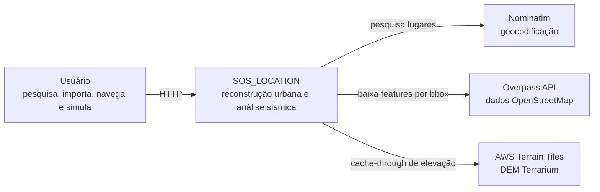
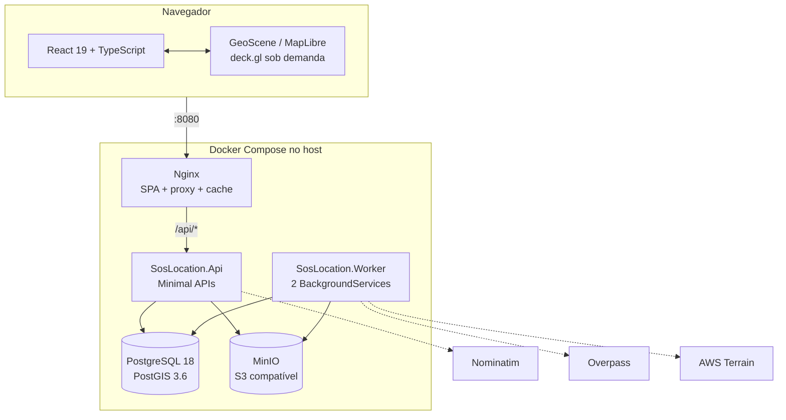
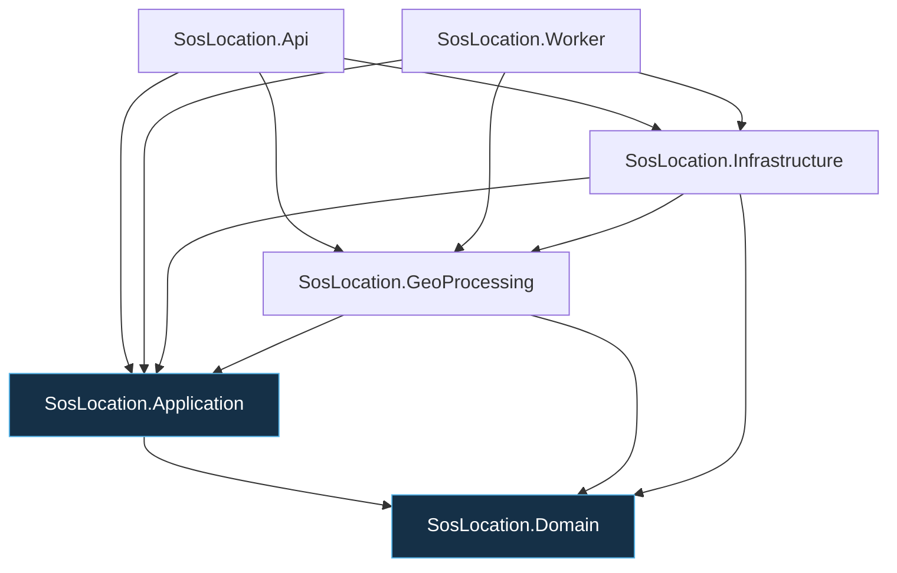
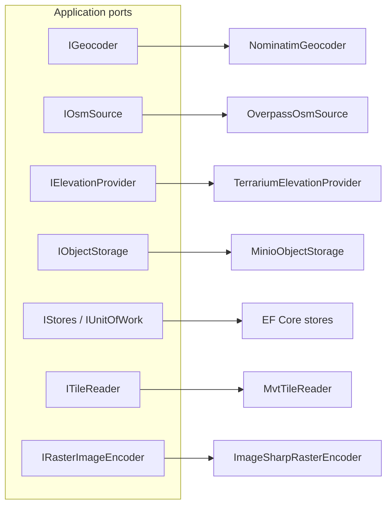
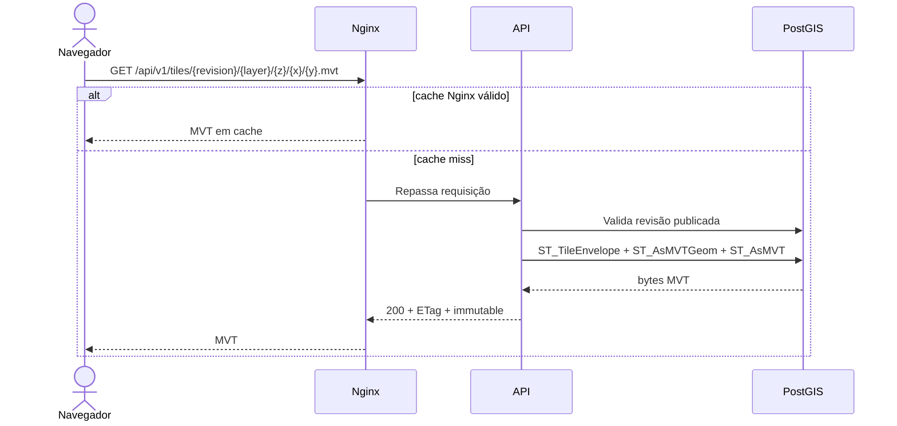
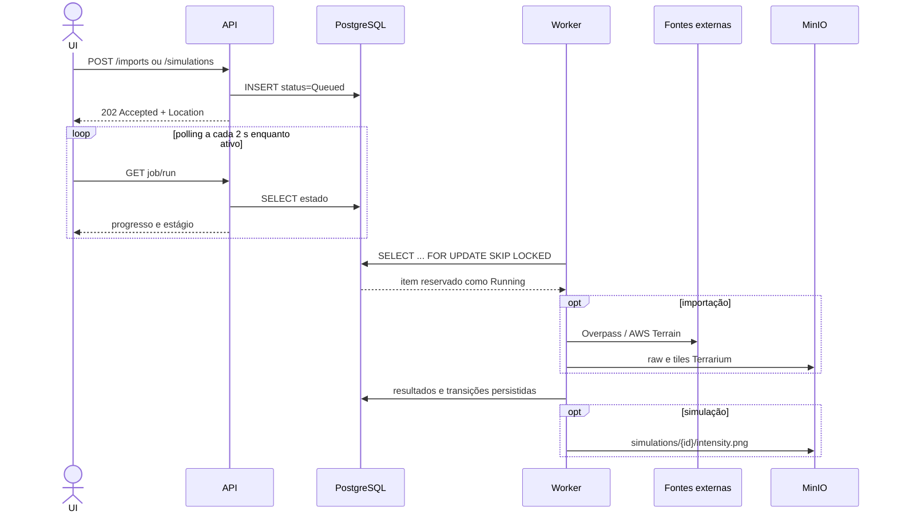

# Arquitetura do sistema

## Contexto e fronteiras

O SOS_LOCATION é um monólito modular com dois processos .NET e uma SPA. A API
serve contratos síncronos e artefatos; o worker executa importações e simulações
assíncronas; PostgreSQL/PostGIS mantém o estado transacional e geoespacial;
MinIO guarda objetos binários. Nginx publica a SPA e atua como proxy/cache.

## Containers executáveis

No `docker-compose.yml`, API, worker e web usam `network_mode: host`. PostgreSQL
e MinIO publicam portas do bridge para o host, e os processos os acessam em
`127.0.0.1`. Essa topologia foi escolhida para dar a Nominatim e Overpass o
mesmo DNS/egress da máquina. Ela pressupõe um ambiente em que host networking
esteja disponível.

## Camadas internas .NET

As regras arquiteturais automatizadas garantem que:

- Domain não conhece Application, GeoProcessing, Infrastructure, API ou Worker;
- Domain não conhece EF Core, Npgsql, MinIO ou HTTP;
- Application não conhece Infrastructure, EF Core, Npgsql ou MinIO;
- GeoProcessing não conhece Infrastructure, EF Core, Npgsql ou HTTP.

`NetTopologySuite` é uma dependência intencional do Domain porque geometrias são
parte do modelo de negócio atual. Infrastructure referencia GeoProcessing para
registrar normalizadores e o pipeline sísmico no contêiner de DI.

## Portas e adapters

O core orquestra operações por interfaces. Aquisição HTTP, serialização PNG,
SQL MVT, persistência EF e S3 ficam nos adapters.

## Fluxo síncrono de leitura

Metadados e inspeção são JSON. Vector tiles vêm do PostGIS. Tiles Terrarium e
PNG de intensidade vêm do MinIO por meio da API. A UI nunca consulta provedores
GIS diretamente.

## Fluxos assíncronos

Os dois consumidores são `JobProcessorService` e
`SimulationProcessorService`. Cada um cria um escopo DI por item reservado.

## Decisões de distribuição de responsabilidades

| Responsabilidade | Local atual | Motivo observado no código |
|---|---|---|
| Regras de estado e classificação de dano | Domain | São invariantes independentes de transporte/persistência |
| Orquestração de importação | Application | Opera apenas ports e objetos do domínio |
| Algoritmos geoespaciais e sísmicos | GeoProcessing | São computação pura, sem EF/HTTP |
| SQL, EF, HTTP externo, MinIO e PNG | Infrastructure | São detalhes de adapter |
| Validação HTTP, DTO e cache de request | API | Fronteira de transporte |
| Polling e execução longa | Worker | Não ocupa requisições HTTP |
| Renderização e interação | `apps/web` | Runtime WebGL isolado pela `GeoScene` |

## Rastreabilidade no código

- Composição da API: `src/SosLocation.Api/Program.cs`
- Composição e adapters: `src/SosLocation.Infrastructure/DependencyInjection.cs`
- Processos do worker: `src/SosLocation.Worker/*.cs`
- Regras de dependência: `tests/SosLocation.ArchitectureTests/LayerDependencyTests.cs`
- Containers: `docker-compose.yml` e `infra/docker/`
- Proxy/cache: `infra/nginx/default.conf`
