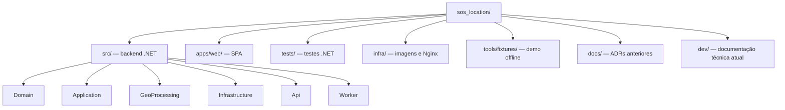
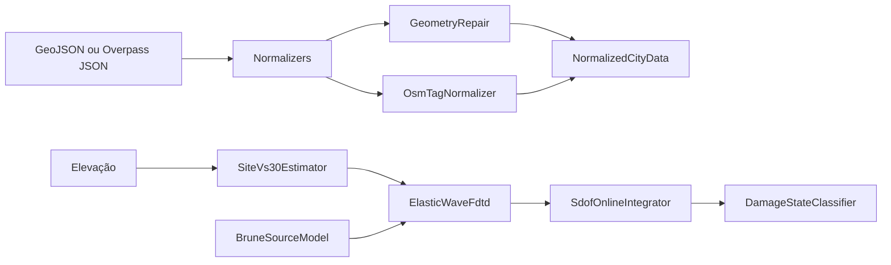
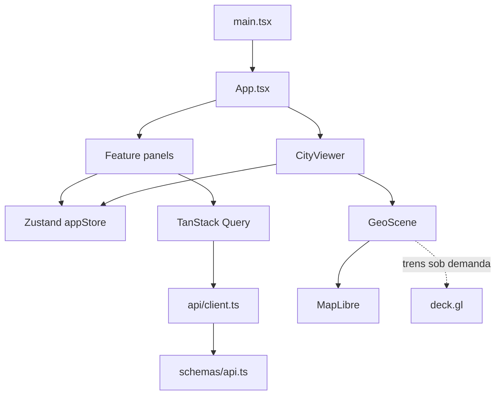

# Mapa do código

## Estrutura principal

## Projetos backend

### `SosLocation.Domain`

| Diretório | Responsabilidade |
|---|---|
| `Catalog/` | `Dataset` e snapshot `DatasetVersion` |
| `Cities/` | identidade `City`, revisão, status e nível de qualidade |
| `Features/` | edifícios, vias/ferrovias, água e uso do solo |
| `Jobs/` | job de importação, estágios, retry/cancelamento e issues |
| `Disasters/` | tipo de desastre, execução, parâmetros sísmicos e resposta estrutural |
| `Reconstruction/` | perfil versionado e precedência de cálculo de altura |
| `ValueObjects/` | bounding box WGS84 e confiança no intervalo `[0,1]` |

### `SosLocation.Application`

`Abstractions/` define as portas para stores, geocoder, OSM, elevação, storage,
tiles e encoder PNG. `Import/ImportPipeline.cs` é o caso de uso de reconstrução.
`Normalization/NormalizedFeatures.cs` define o formato canônico produzido pelos
normalizadores. `Simulation/SimulationRequest.cs` define o contrato aceito pela
simulação. `Options/` contém limites de importação e parâmetros sísmicos.

### `SosLocation.GeoProcessing`

| Arquivo/módulo | Papel |
|---|---|
| `Geometry/GeometryRepair.cs` | valida coordenadas, tipo, vértices e repara polígonos |
| `Normalizers/GeoJsonNormalizer.cs` | FeatureCollection para modelo normalizado |
| `Normalizers/OverpassNormalizer.cs` | ways/relações, multipolígonos e Simple 3D Buildings |
| `Osm/OsmTagNormalizer.cs` | unidades, níveis e taxonomias semânticas |
| `Terrain/TerrariumMath.cs` | tile/pixel Web Mercator e decoding de elevação |
| `Seismic/SeismicGrid.cs` | malha local equiretangular |
| `Seismic/SiteVs30Estimator.cs` | inclinação do DEM para campo de Vs30 |
| `Seismic/BruneSourceModel.cs` | momento, frequência de canto, pulso e spreading |
| `Seismic/ElasticWaveFdtd.cs` | propagação escalar SH em diferenças finitas |
| `Seismic/SdofResponseSolver.cs` | resposta estrutural Newmark-β batch/online |
| `Seismic/IntensityRasterEncoding.cs` | encoding numérico de PGA em R/G |
| `Seismic/SeismicSimulationPipeline.cs` | orquestra o motor sísmico |

### `SosLocation.Infrastructure`

| Diretório | Implementações |
|---|---|
| `External/` | Nominatim, Overpass, fixture, Terrarium e ImageSharp |
| `Persistence/` | `SosDbContext`, mappings, migrations e stores EF/Npgsql |
| `Storage/` | object storage MinIO/S3 |
| `Tiles/` | SQL explícito para MVT |
| `DependencyInjection.cs` | bind de options e registro de serviços |

`FeatureStore` usa EF Core para as features urbanas; as respostas sísmicas usam
`COPY ... FORMAT BINARY` via Npgsql porque o volume pode ser muito maior. Os MVT
também usam Npgsql/SQL explícito para manter a computação espacial junto ao
banco.

### `SosLocation.Api`

`Program.cs` configura Serilog, OpenAPI, ProblemDetails, compressão, CORS,
health checks e OpenTelemetry. Cada arquivo em `Endpoints/` registra um grupo
de Minimal APIs: cidades, lugares, imports, features, tiles, terreno e
simulações.

### `SosLocation.Worker`

- `JobProcessorService`: espera migrations, reserva e executa importações;
- `SimulationProcessorService`: reserva e executa simulações;
- `Program.cs`: registra ambos no mesmo processo host.

## Frontend

| Área | Função |
|---|---|
| `api/` | fetch da API e construção de URLs |
| `schemas/` | validação Zod das respostas |
| `stores/` | seleção, layers, câmera, métricas e simulação ativa |
| `features/city-*` | pesquisa, catálogo, importação e viewer |
| `features/disaster-simulation/` | formulário e polling de terremotos |
| `features/feature-inspector/` | detalhes, confiança, tags e proveniência |
| `features/deep-link/` | hash compartilhável de cidade/revisão/câmera |
| `features/trains/` | horário sintético e mesh procedural |
| `geo/GeoScene.ts` | ciclo de vida MapLibre/deck, câmera, picking e métricas |
| `geo/layers/nativeCityStyle.ts` | sources MVT e layers nativas |
| `geo/materials/theme.ts` | paleta sem imagery e estilo base |

## Testes e o que eles provam

| Suite | Escopo real |
|---|---|
| `SosLocation.UnitTests` | estados, validação, normalização, geometria, altura e algoritmos sísmicos |
| `SosLocation.ArchitectureTests` | direções de dependência entre assemblies |
| `SosLocation.IntegrationTests` | migrations/PostGIS, importação, MVT, fila e pipeline sísmico |
| `apps/web/src/tests` | store, schemas, tema, deep link, estilo e trens |
| `apps/web/e2e` | fluxo visual contra a stack executável |

Os testes sísmicos verificam invariantes numéricos e qualitativos, como
estabilidade CFL, propagação limitada, amortecimento, crescimento com magnitude
e decaimento com distância. Eles deliberadamente não certificam valores
absolutos de engenharia.
