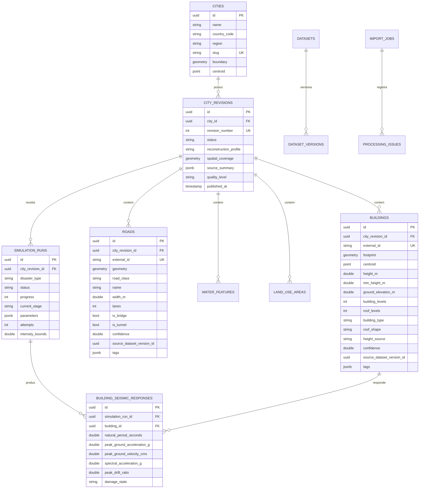
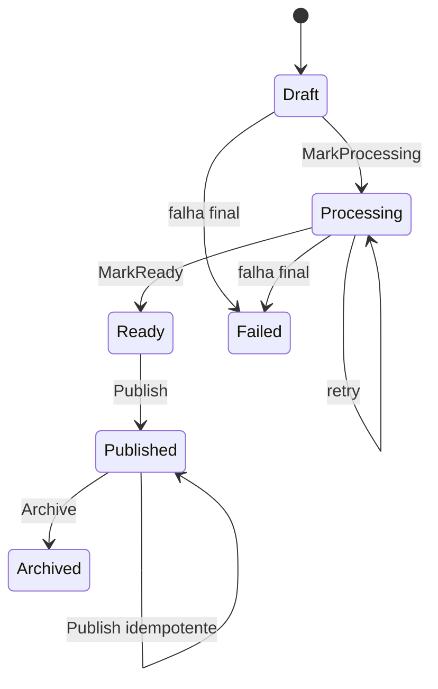
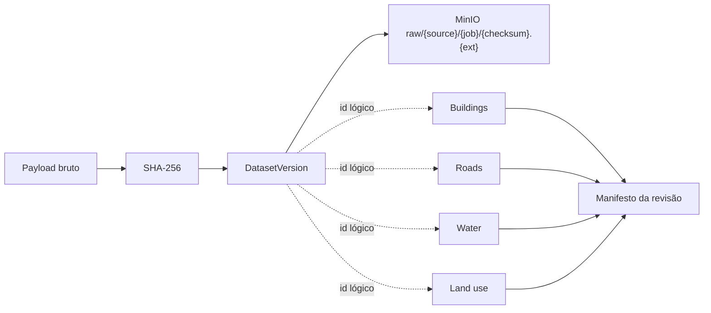
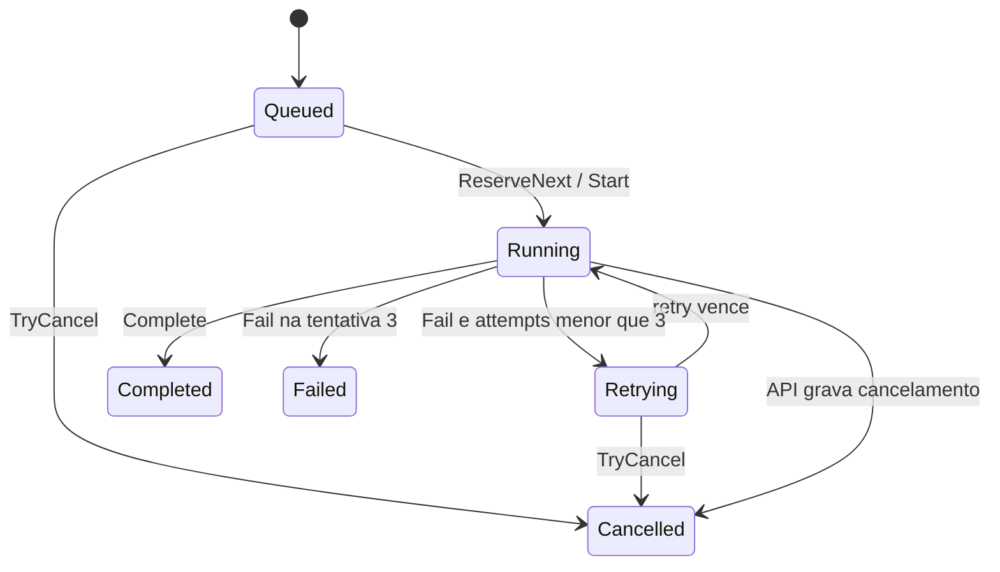
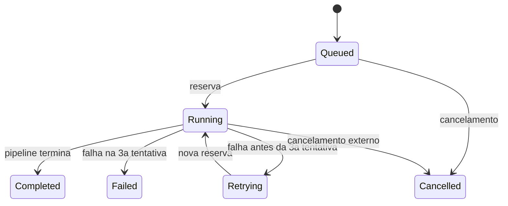

# Modelo de dados

## Convenções espaciais e de persistência

- Geometrias autoritativas: WGS84, SRID 4326.
- Geração de tiles: projeção para Web Mercator, SRID 3857, apenas na consulta.
- Nomes físicos: `snake_case`, aplicados pelo `SosDbContext`.
- IDs: UUID gerado na entidade.
- Datas: `DateTimeOffset`, persistidas como timestamp com fuso.
- Tags e payloads: JSON serializado em colunas `jsonb`.
- Geometrias: índices GiST em boundary, coverage e features.

## Diagrama relacional

As quatro tabelas de feature têm FK com cascade para `city_revisions` e
unicidade `(city_revision_id, external_id)`. `source_dataset_version_id` é uma
referência lógica usada pelo manifesto, mas o mapping atual não declara uma FK
de banco para essa coluna. Da mesma forma, `import_jobs.city_id` e
`import_jobs.city_revision_id` não têm constraints relacionais configuradas.

## Agregados urbanos

### Cidade e revisão

`City` é a identidade estável da área urbana, encontrada por `slug`. `Boundary`
e `Centroid` podem começar como o envelope solicitado e ser corrigidos pela
cobertura normalizada do GeoJSON.

`CityRevision` é a fotografia versionada. `RevisionNumber` cresce por cidade e
a tupla `(city_id, revision_number)` é única. Somente revisões publicadas são
listadas pelo catálogo e aceitas pela API de tiles/simulação.

`Publish` não altera `PublishedAt` se chamado novamente. O pipeline também
detecta uma revisão já publicada ao retomar um job e apenas conclui o job.

### Nível de qualidade

| Enum | Regra aplicada pelo pipeline atual |
|---|---|
| `L0BoundaryOnly` | zero edifícios e zero vias |
| `L1RoadsAndBasicFeatures` | zero edifícios e ao menos uma via |
| `L2FootprintsInferredHeights` | há edifícios; menos de 50% têm altura observada |
| `L3ObservedHeights` | há edifícios; ao menos 50% têm altura observada |
| `L4SimulationReady` | existe no enum, mas nunca é atribuído pelo pipeline atual |

Água, uso do solo, disponibilidade de DEM e resultado de simulação não entram no
cálculo de qualidade atual.

### Features

`Building` contém footprint, centroide, dimensões verticais, semântica e
proveniência. `Road` representa tanto vias quanto ferrovias; ferrovia é
`road_class = "rail"`. Água aceita geometrias lineares ou areais. Uso do solo é
areal.

Confianças atribuídas no pipeline:

| Dado | Confiança |
|---|---:|
| altura explícita | 1,0 |
| altura por níveis | 0,8 |
| altura apenas por níveis de telhado | 0,6 |
| altura por tipo de edifício | 0,5 |
| altura por uso do solo | 0,4 |
| altura default | 0,3 |
| via e água normalizadas | 0,9 |
| uso do solo normalizado | 0,8 |

Embora `BuildingHeightCalculator` suporte fallback por uso do solo, o pipeline
passa `LandUseType = null` ao calculá-lo. Logo, esse ramo está testado como
regra de domínio, mas não é alcançado pela importação atual.

## Catálogo e proveniência

`Dataset.name` é único. `(dataset_id, checksum)` também é único, então o mesmo
snapshot bruto é reaproveitado em retries e reimportações. O manifesto encontra
as versões referenciadas pelas features e devolve provider, licença, atribuição,
versão, checksum e data de captura.

O dataset de terreno `aws-terrain-tiles` é cadastrado quando o prefetch baixa ao
menos um tile, mas não ganha `DatasetVersion` nem referência em uma feature.
Consequentemente, ele não aparece no manifesto da revisão na implementação
atual.

## Jobs de importação

O job guarda request original, progresso, estágio, mensagem, erro, worker,
tentativas e `next_attempt_at`. A reserva ordena por data elegível e usa lock
pessimista. Retries de importação têm backoff aproximado de 5 s, 15 s e jitter
de até 3 s; a terceira falha é terminal.

## Execuções e respostas sísmicas

`SimulationRun` referencia uma revisão, guarda o tipo, parâmetros JSON, estado,
progresso e os quatro limites do raster. `(simulation_run_id, building_id)` é
único nas respostas. Antes do `COPY` binário, respostas anteriores do mesmo run
são apagadas, tornando a persistência idempotente em retry.

A fila de simulações não tem `next_attempt_at`; um item `Retrying` fica
imediatamente elegível.

## Índices e integridade

- GiST: `cities.boundary`, `city_revisions.spatial_coverage` e a geometria de
  cada tipo de feature;
- B-tree: status e created_at das filas, cidade/status de revisão e chaves de
  consulta das respostas;
- únicos: cidade/revisão, revisão/external-id por feature, dataset/checksum e
  run/edifício;
- cascades: cidade → revisões → features/simulações → respostas; job → issues;
  dataset → versões.

## Rastreabilidade no código

- Entidades: `src/SosLocation.Domain/`
- Mapping: `src/SosLocation.Infrastructure/Persistence/SosDbContext.cs`
- Schema efetivo: `src/SosLocation.Infrastructure/Persistence/Migrations/`
- Consultas/stores: `src/SosLocation.Infrastructure/Persistence/Stores.cs`
