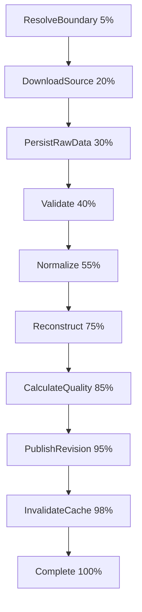
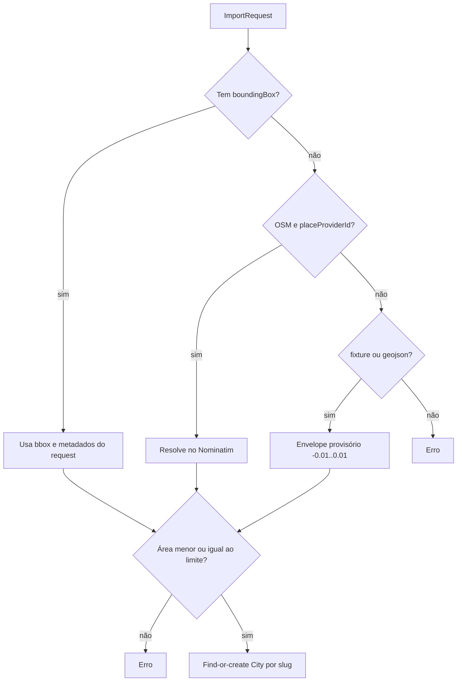
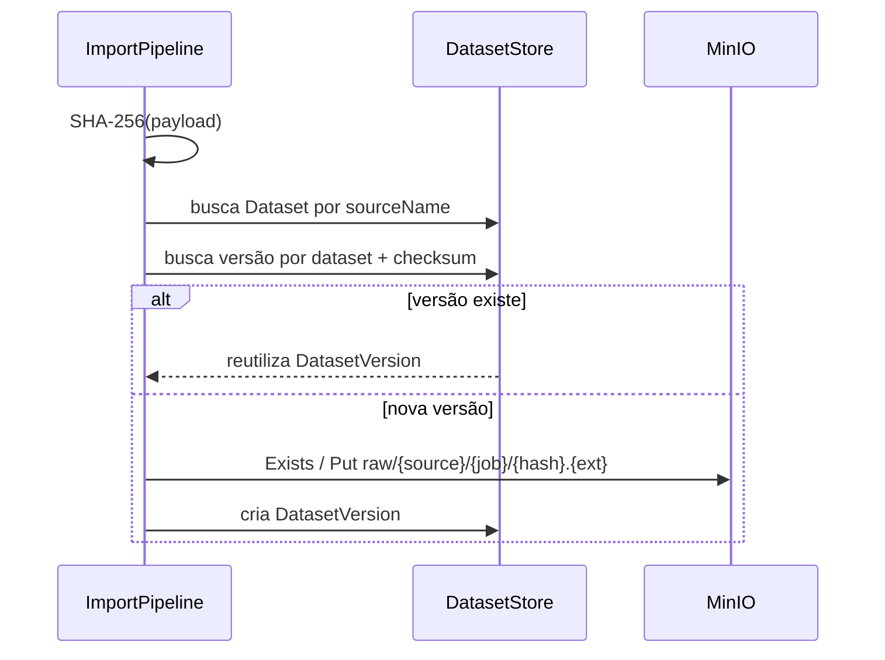
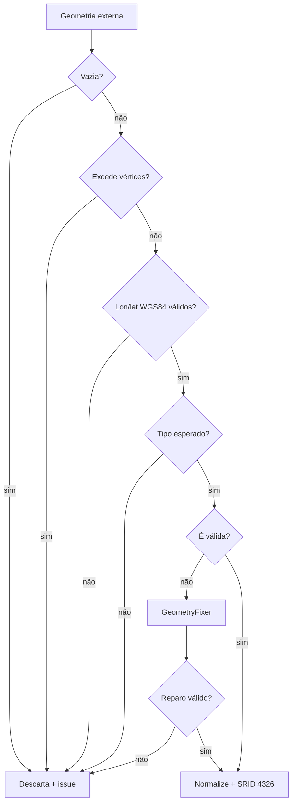
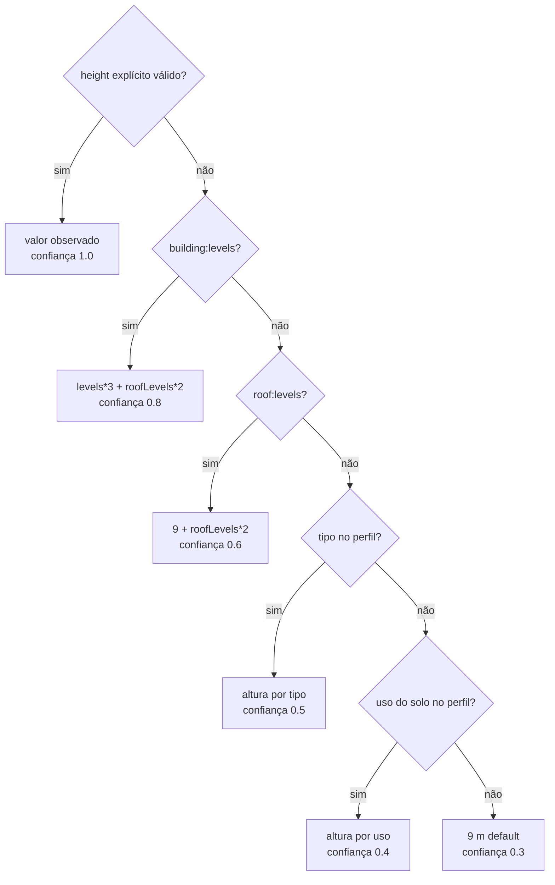
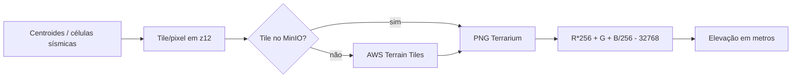

# Importação e reconstrução urbana

## Entradas suportadas

| `source` | Formato efetivo | Origem |
|---|---|---|
| `fixture` | GeoJSON | `tools/fixtures/demo-district.geojson` |
| `openstreetmap` | Overpass JSON com `out tags geom` | `OverpassOsmSource` |
| `geojson` | GeoJSON inline | propriedade `geoJson` do request |

`SourcePayloadFormat.OsmPbf` existe como valor reservado, e a mensagem de área
grande sugere PBF, mas não há downloader nem normalizador PBF implementado.

## Pipeline persistido

Cada transição é salva no banco, tornando o progresso observável por polling.
`InvalidateCache` é apenas um hook de estado: não envia uma invalidação real,
pois os ETags são derivados de IDs de revisões imutáveis.

## 1. Resolução da área

A UI normalmente envia o bbox devolvido pela pesquisa, evitando uma segunda
consulta Nominatim no worker. O limite default é 250 km², calculado por
aproximação equiretangular na latitude média. Boxes que cruzam o antimeridiano
não são aceitos.

## 2. Aquisição OSM

A consulta Overpass pede:

- edifícios e relações multipolygon de edifício;
- `building:part` e suas relações;
- highways e railways;
- waterways, água natural e relações de água;
- landuse e leisure.

O adapter tenta `BaseUrls` distintos em ordem. Cada host deve estar em
`AllowedImportHosts`. O download usa streaming e aborta ao superar
`MaximumDownloadBytes`. O timeout da query é enviado ao Overpass e o timeout
HTTP é configurado com 30 segundos adicionais.

## 3. Preservação do bruto

OpenStreetMap recebe provider, ODbL 1.0 e atribuição específicos. Fixture e
upload GeoJSON recebem licença `unknown` na ausência de metadados adicionais.

## 4. Normalização geoespacial

### Limites

| Controle | Default |
|---|---:|
| upload | 100 MiB |
| download | 200 MiB |
| features/elementos | 500.000 |
| vértices por feature | 50.000 |
| profundidade JSON | 32 |

### Saneamento

Polígonos inválidos tentam `GeometryFixer`, preservando buracos quando possível.
Linhas são validadas, mas não passam por reparo topológico. Problemas viram
`ProcessingIssue` com severidade info/warning; o pipeline limpa issues de uma
tentativa anterior antes de registrar o novo conjunto.

### GeoJSON

O normalizador exige `FeatureCollection`. A classificação usa tags OSM e a tag
especial `sos:kind=boundary` para capturar a cobertura da fixture/upload. IDs
seguem a precedência `@id`, `id`, `osm_id`, `feature-{n}`.

### Overpass

Ways fechados de categorias areais viram polígonos; ways abertos viram linhas.
Relações usam membros `outer`/`inner` para montar polígonos ou multipolígonos.
Essa montagem pressupõe que cada membro já traz um anel utilizável; o código não
costura fragmentos de ways em anéis.

Na convenção Simple 3D Buildings, um outline `building=*` que contém ao menos
um `building:part` é removido da lista renderizável para evitar volume duplicado.
O teste de cobertura usa uma STRtree e o ponto interior de cada part.

### Tags e taxonomias

- altura aceita número, `m`, `ft`, apóstrofo e vírgula decimal; apenas `(0,1000)` m;
- níveis decimais são arredondados para longe de zero; apenas `1..199`;
- edifícios: residential, commercial, industrial, public, hospital, school ou unknown;
- vias: highway, primary, secondary, tertiary, residential, service, path,
  cycleway, rail, minor ou unknown;
- água: river, canal, lake, reservoir ou water;
- uso: residential, commercial, industrial, green, agricultural ou other.

## 5. Reconstrução vertical

Os números pertencem ao perfil `osm-basic-v1`: andar 3 m, andar de telhado 2 m
e edifício default 9 m. Por tipo: residential 9, commercial/public 12,
industrial 8, hospital 18 e school 10 m. A revisão guarda o nome versionado do
perfil, não uma cópia dos parâmetros.

Como observado no modelo de dados, a importação atual não associa o edifício ao
polígono de uso do solo e passa uso `null`; por isso a precedência operacional
salta do tipo diretamente para o default.

`min_height` é preservado como base da extrusão. O footprint e seu centroide são
gravados em 4326. Vias/água recebem confiança 0,9; uso do solo, 0,8.

## 6. Elevação e terrain cache-through

O provider agrupa implicitamente amostras por tile decodificado e limita o
número de tiles distintos por chamada. Valores fora de `(-430,9000)` m viram
zero. Se nenhuma imagem for obtida, retorna `null`; a reconstrução grava zero e
uma issue `elevation-unavailable`. Se apenas parte dos tiles falha, pontos
afetados também recebem zero, sem issue individual.

Depois da amostragem, o worker pré-carrega z8..z12 com margem de um tile e teto
default de 400 objetos. O endpoint de runtime serve apenas o MinIO; nunca baixa
da AWS durante a navegação.

## 7. Persistência e publicação

Uma tentativa cria uma revisão draft ou reutiliza a revisão já vinculada ao
job. Antes de reinserir, apaga todas as features dessa revisão. Revisões
publicadas/arquivadas são recusadas como alvos de reconstrução.

O pipeline persiste features por `AddRange`/EF e `SaveChanges` por categoria.
Depois calcula a qualidade, faz `Processing → Ready → Published` e conclui o
job. Uma nova importação do mesmo conteúdo gera uma nova revisão, mas reutiliza
a mesma `DatasetVersion` pelo checksum.

## Falhas, retries e cancelamento

O worker faz no máximo três tentativas. Para importação, o atraso é
`5 * 3^(attempts-1) + jitter[0,3)` segundos. Na falha final, a revisão ainda não
publicada é marcada `Failed`.

O endpoint permite marcar qualquer job não terminal como `Cancelled`. Jobs
cancelados antes da reserva são ignorados pela fila. Para um job já em execução,
porém, o pipeline não possui watcher de status nem checagem de cancelamento
externo entre estágios; apenas o token do host percorre as operações. Portanto,
o cancelamento cooperativo de uma importação em andamento não é garantido pela
implementação atual.

## Rastreabilidade no código

- Orquestração: `src/SosLocation.Application/Import/ImportPipeline.cs`
- Request/limites: `src/SosLocation.Application/Import/ImportRequest.cs`
- Normalizadores: `src/SosLocation.GeoProcessing/Normalizers/`
- Saneamento/tags: `src/SosLocation.GeoProcessing/Geometry/` e `Osm/`
- Terreno: `src/SosLocation.Infrastructure/External/TerrariumElevationProvider.cs`
- Retry: `src/SosLocation.Worker/JobProcessorService.cs`
