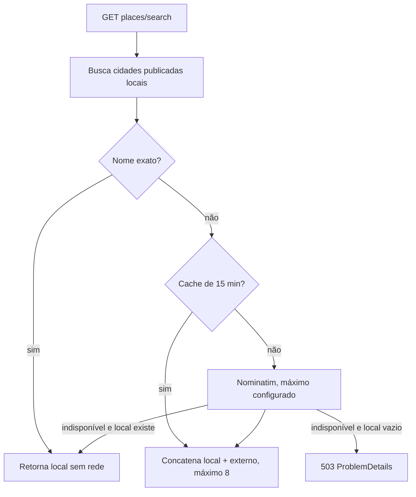
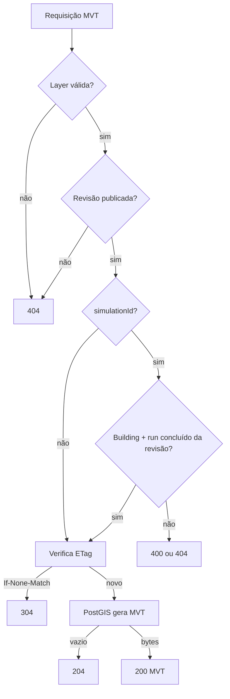

# API e contratos HTTP

## Convenções

- Prefixo funcional: `/api/v1`.
- OpenAPI gerado em runtime: `/openapi/v1.json`.
- Criação de trabalho assíncrono: `202 Accepted` e header `Location`.
- Erros de validação: `ValidationProblem`; demais erros passam por
  `ProblemDetails`/exception handler.
- JSON geoespacial: converter NetTopologySuite GeoJSON registrado globalmente.
- Compressão: Brotli e gzip para JSON, GeoJSON e MVT.
- Não há autenticação, autorização, rate limiting nem versionamento por header.

## Catálogo e pesquisa

| Método | Rota | Comportamento |
|---|---|---|
| GET | `/api/v1/places/search?q=` | pesquisa catálogo local e Nominatim; exige 2 caracteres |
| GET | `/api/v1/cities` | somente cidades com revisão publicada |
| GET | `/api/v1/cities/{cityId}` | cidade por ID, mesmo sem revisão publicada |
| GET | `/api/v1/cities/{cityId}/revisions` | somente revisões publicadas, mais recente primeiro |
| GET | `/api/v1/cities/{cityId}/revisions/{revisionId}` | valida que a revisão pertence à cidade |



A cache key normaliza a query e vive apenas na memória do processo API. Não há
deduplicação explícita entre resultados locais e externos.

## Importações

| Método | Rota | Resposta |
|---|---|---|
| POST | `/api/v1/imports` | valida, cria `ImportJob`, retorna 202 |
| GET | `/api/v1/imports` | 50 jobs mais recentes |
| GET | `/api/v1/imports/{jobId}` | estado e progresso |
| GET | `/api/v1/imports/{jobId}/issues` | issues normalizadas por data |
| POST | `/api/v1/imports/{jobId}/cancel` | 200, 404 ou 409 se já terminal |

Exemplo OSM por bbox:

```json
{
  "name": "Komaki Center",
  "countryCode": "JP",
  "region": "Aichi",
  "boundingBox": {
    "west": 136.895,
    "south": 35.275,
    "east": 136.935,
    "north": 35.305
  },
  "source": "openstreetmap",
  "reconstructionProfile": "osm-basic-v1"
}
```

Regras principais: source conhecido, perfil registrado, bbox ou place para OSM,
payload obrigatório para GeoJSON, upload/área dentro dos limites. O request é
serializado integralmente em `import_jobs.request`.

## Tiles e terreno

| Método | Rota | Detalhes |
|---|---|---|
| GET | `/api/v1/tiles/{revisionId}/{layer}/{z}/{x}/{y}.mvt` | `buildings`, `roads`, `water`, `land-use` |
| GET | `/api/v1/terrain/{z}/{x}/{y}.png` | Terrarium já presente no MinIO, z0..15 aceito |

O tile só é servido para revisão `Published`. `?simulationId={runId}` é aceito
apenas em `buildings` e exige run concluído da mesma revisão; nesse caso o SQL
inclui `damage_state` por `LEFT JOIN`.



### Orçamento por zoom

| Layer | Zoom mínimo | Atributos extras |
|---|---:|---|
| buildings | 12 | em z14+: altura, base, elevação, fonte, confiança, níveis |
| roads | 8 | abaixo de z12: apenas classes principais/rail; em z13+: nome e detalhes |
| water | 6 | em z12+: nome |
| land-use | 8 | tipo apenas |

Em z menor que 15, a geometria já projetada é simplificada com tolerância visual
de 0,5 pixel. O extent MVT é 4096. Buildings usam buffer 256; demais layers,
64. Tags completas nunca entram no tile.

### Cache

O ETag forte inclui revisão, simulação/base, layer e coordenadas. A API envia
`Cache-Control: public, max-age=2592000, immutable`. O Nginx mantém uma cache de
até 1 GiB, validade de 30 dias, lock por miss e stale em erro/timeout. O status
published/valid da API usa memória: seis horas para resultado válido e 15
segundos para inválido.

O mesmo `max-age` é usado para terrain e intensidade. Eles não têm ETag próprio
no endpoint atual.

## Inspeção e proveniência

| Método | Rota | Observações |
|---|---|---|
| GET | `/api/v1/features/buildings/{id}` | `?includeGeometry=true` inclui footprint |
| GET | `/api/v1/features/roads/{id}` | `?includeGeometry=true` inclui linha |
| GET | `/api/v1/features/water/{id}` | `?includeGeometry=true` inclui geometria |
| GET | `/api/v1/revisions/{revisionId}/railways` | FeatureCollection de roads `rail` |
| GET | `/api/v1/revisions/{revisionId}/manifest` | revisão e fontes referenciadas |

Não existe endpoint de detalhe para `land_use`. O inspetor frontend chama os
endpoints sem `includeGeometry`, portanto recebe apenas atributos. Proveniência
é calculada para toda a revisão, não apenas para a feature consultada.

## Simulações

| Método | Rota | Resposta |
|---|---|---|
| POST | `/api/v1/simulations` | valida revisão publicada e cria run, 202 |
| GET | `/api/v1/simulations` | 50 runs mais recentes |
| GET | `/api/v1/simulations/{runId}` | progresso e bounds de intensidade |
| GET | `/api/v1/simulations/{runId}/buildings` | todas as respostas do run |
| POST | `/api/v1/simulations/{runId}/cancel` | 200, 404 ou 409 |
| GET | `/api/v1/simulations/{runId}/intensity.png` | somente run concluído |

Request efetivamente aceito:

```json
{
  "cityRevisionId": "00000000-0000-0000-0000-000000000000",
  "disasterType": "earthquake",
  "epicenterLon": 139.0,
  "epicenterLat": 35.0,
  "depthKm": 10.0,
  "momentMagnitude": 6.5
}
```

Intervalos: longitude `[-180,180]`, latitude `[-90,90]`, profundidade
`[0,700]` km e magnitude Mw `[3,9.5]`. `flood` e `fire` pertencem à lista de
nomes do domínio, mas recebem erro de validação “no simulation engine”.

O DTO público do run não devolve os parâmetros originais. As respostas por
edifício devolvem período, PGA, PGV, aceleração espectral, drift e estado de
dano, mas a UI atual não baixa essa lista; ela recebe o dano incorporado nos
tiles MVT quando uma simulação fica ativa.

## Health, CORS e telemetria

| Rota | Semântica |
|---|---|
| `/health` | todos os health checks registrados |
| `/health/ready` | apenas checks com tag `ready`; hoje PostgreSQL |
| `/health/live` | predicate vazio; indica que o processo HTTP responde |

CORS permite origins configuradas e qualquer método/header. Serilog registra
requests. OpenTelemetry instrumenta ASP.NET Core e HttpClient e exporta OTLP
somente se `OTEL_EXPORTER_OTLP_ENDPOINT` estiver configurado. MinIO e o worker
não participam do readiness da API.

## Rastreabilidade no código

- Registro global: `src/SosLocation.Api/Program.cs`
- Rotas: `src/SosLocation.Api/Endpoints/`
- DTOs: `src/SosLocation.Application/Dto/ApiDtos.cs`
- Validadores: `src/SosLocation.Application/Import/ImportRequest.cs` e
  `src/SosLocation.Application/Simulation/SimulationRequest.cs`
- SQL MVT: `src/SosLocation.Infrastructure/Tiles/MvtTileReader.cs`
- Nginx: `infra/nginx/default.conf`
