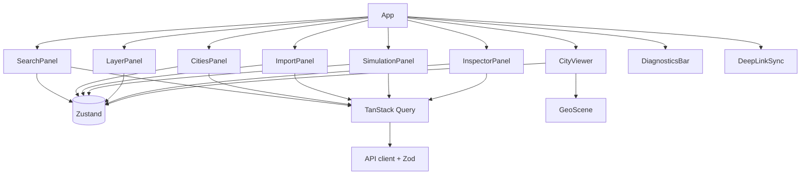
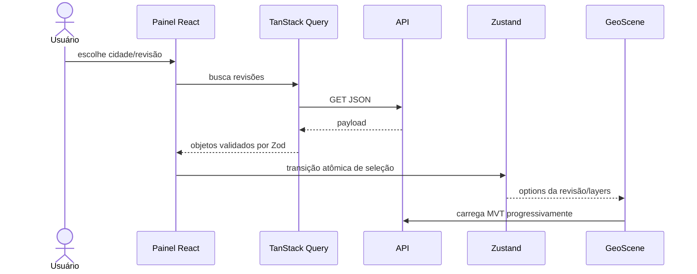
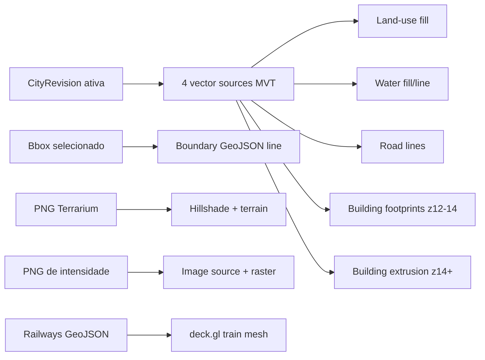
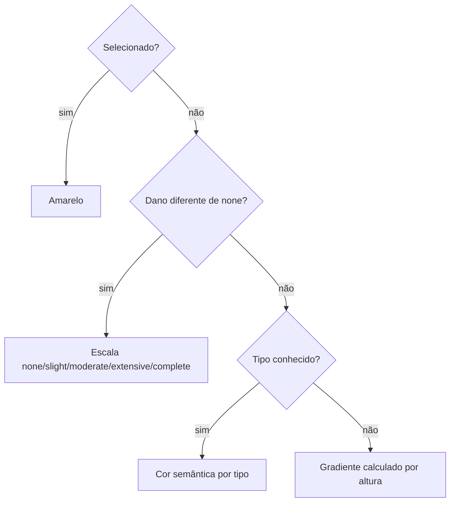
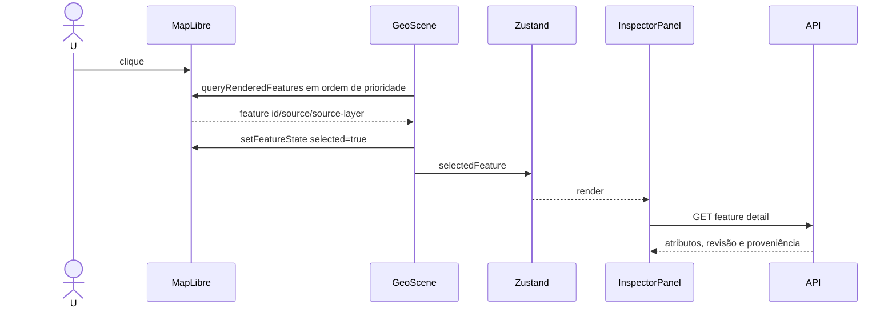

# Frontend e renderização geoespacial

## Composição da aplicação

A SPA usa React 19, TypeScript strict, Vite, Tailwind, TanStack Query, Zustand,
Zod, MapLibre GL e deck.gl. React controla painéis e estado declarativo; a classe
`GeoScene` possui o runtime WebGL e seu ciclo de vida.



## Estado e cache de dados

Zustand guarda seleção de lugar/cidade/revisão/feature, visibilidade das layers,
job/run observado, simulação ativa, câmera, câmera pendente, FPS e estatística de
tiles. Selecionar nova revisão limpa feature, simulação e métricas de tile.

TanStack Query gerencia dados remotos. Defaults globais: uma tentativa de retry
e sem refetch ao focar a janela. Cidades atualizam em 15 s; jobs e runs, em 2 s
enquanto algum item está ativo e 10 s em repouso. Toda resposta consumida pelos
fluxos principais passa por schema Zod.



## GeoScene

`GeoScene` inicializa um mapa MapLibre com projeção globe, background sólido,
céu/nevoeiro procedurais e luz direcional. É responsável por:

- câmera, navegação, top view e reset norte;
- sources e layers da revisão ativa;
- terreno e overlay de intensidade;
- picking e seleção com `feature-state`;
- métricas de render/tile;
- overlay deck.gl carregado dinamicamente;
- destruição de timers, RAF, controls e recursos do mapa.

O perfil de GPU é adaptativo. Dispositivos com até quatro cores ou até 4 GiB de
memória reportada usam pixel ratio menor, cache de menos níveis, sem antialias e
preferência de baixa energia. `prefers-reduced-motion` zera transições.

## Pipeline visual



As sources MVT do frontend declaram maxzoom 16; acima disso o MapLibre faz
overzoom. O backend aceita até z22, mas a configuração atual da UI não solicita
tiles nativos acima de z16.

### Edifícios

Em z12–14, footprints 2D preservam contexto com menor custo. A partir de z14,
`fill-extrusion-height = height_m` e `fill-extrusion-base = min_height_m`.
Quando terrain está ativo, o próprio MapLibre desloca a geometria; por isso
`ground_elevation_m` não é somado à base.

A cor segue esta precedência:



Não há textura de fachada, satélite ou ortofoto. `raster-dem` é dado de elevação,
e a imagem sísmica é um artefato analítico local, não imagery do mundo real.

### Vias, água e uso do solo

Vias variam cor por classe e espessura por zoom/classe. Água usa fill ou line
segundo o tipo geométrico. Uso do solo recebe preenchimento translúcido por
categoria. A boundary exibida é o retângulo do lugar/cidade selecionado, não o
polígono `spatial_coverage` lido do PostGIS.

## Picking e inspeção



Prioridade: edifício 3D, footprint, via, água areal e água linear. O hover é
limitado a um `requestAnimationFrame`. Fechar o inspetor remove o destaque. O
inspetor não exibe respostas sísmicas numéricas; a severidade aparece apenas na
cor do edifício.

## Terrain e intensidade sísmica

Terrain cria source `raster-dem` Terrarium, hillshade e `setTerrain` somente
quando ativado; vem desligado por default.

Uma simulação concluída ativa duas coisas numa única transição:

1. os MVT de edifício passam a incluir `?simulationId`, trazendo `damage_state`;
2. o PNG de intensidade é posicionado pelos quatro bounds do run como source
   `image`, exibido por layer `raster` com opacidade 0,55.

O backend codifica PGA numericamente nos canais R/G. O frontend atual entrega o
PNG diretamente ao raster MapLibre e não implementa um shader/expressão para
decodificar `(R*256+G)/1000` e aplicar uma escala de cores. Portanto, a imagem é
uma representação RGB do encoding, não um heatmap calibrado/legendado.

## Trens

A simulação de trens é visual e independente do motor de desastres. A API envia
roads com `road_class=rail` em GeoJSON. O cliente:

- separa LineString/MultiLineString em rotas com ao menos 300 m;
- calcula distância Haversine acumulada;
- usa 16,7 m/s (~60 km/h) e headway de 240 s por default;
- move serviços de ida e volta como função determinística do relógio Unix;
- atualiza a layer a cada 100 ms;
- desenha vagões como cubos procedurais deck.gl, sem asset externo.

Não existe feed GTFS/GTFS-RT, paradas, horários reais, sinalização ou interação
com dano sísmico. O texto “timetable” é sintético.

## Deep links

O hash tem formato:

```text
#c=<citySlug>&r=<revisionNumber>&v=<lon>,<lat>,<zoom>,<pitch>,<bearing>
```

No boot, cidade/revisão/câmera são restauradas. Durante navegação, o hash é
atualizado com debounce de 400 ms via `replaceState`. Slug, ranges de câmera e
números são validados. Layers visíveis, feature selecionada e simulação ativa
não pertencem ao deep link.

## Métricas do cliente

FPS é contado em eventos `render` por janela de um segundo e zerado em `idle`.
Tiles “loaded” são contagens acumuladas de eventos `sourcedata` com tile; podem
contar o mesmo tile em mais de uma atualização e não representam tiles únicos.
“Pending” é o número de sources `sos-*` ainda não carregados, não o número exato
de requests.

## Rastreabilidade no código

- Composição: `apps/web/src/app/App.tsx`
- Estado: `apps/web/src/stores/appStore.ts`
- API/schemas: `apps/web/src/api/` e `apps/web/src/schemas/`
- Runtime: `apps/web/src/geo/GeoScene.ts`
- Layers: `apps/web/src/geo/layers/nativeCityStyle.ts`
- Materiais: `apps/web/src/geo/materials/theme.ts`
- Trens: `apps/web/src/features/trains/`
- Deep links: `apps/web/src/features/deep-link/`
