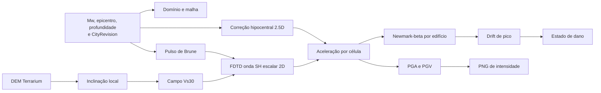
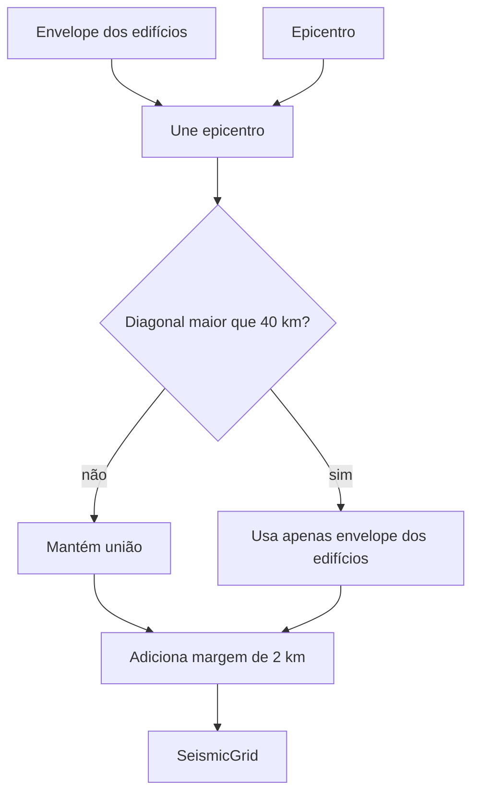
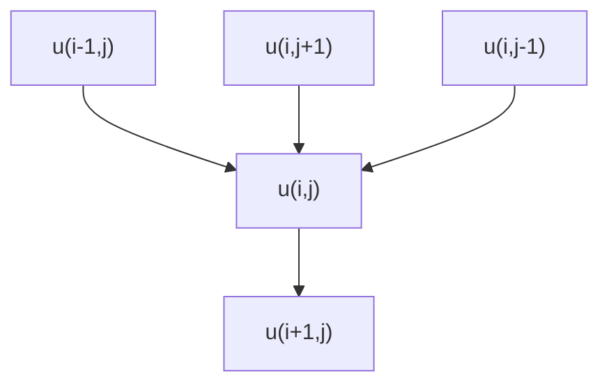
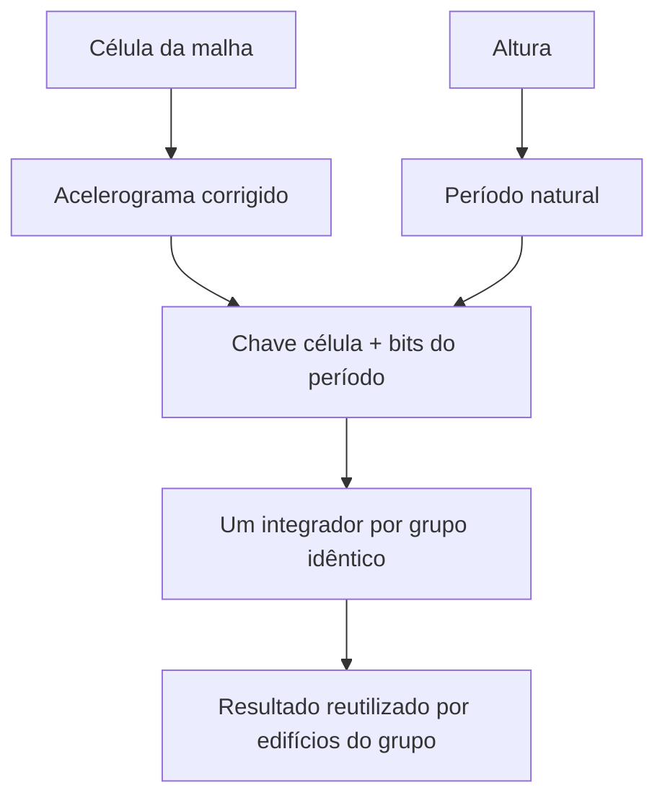
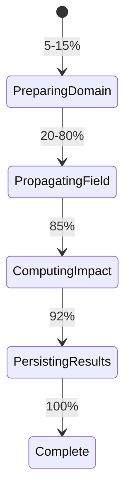

# Ciência da análise sísmica

## Escopo científico real

O motor implementa uma aproximação urbana de terremoto composta por fonte
pontual de Brune, campo de Vs derivado de topografia, propagação escalar 2D por
FDTD, correção analítica de espalhamento 3D e resposta estrutural SDOF. Ele
produz medidas determinísticas por edifício e um raster de PGA.

Não é um ShakeMap oficial, GMPE calibrada, análise de elemento finito estrutural
nem modelo probabilístico de perdas. O próprio teste de integração declara que
não valida amplitudes físicas absolutas: valida apenas invariantes como aumento
com magnitude e decaimento com distância. Os resultados não devem ser usados
como laudo ou decisão de segurança de vida.

## Visão ponta a ponta



## 1. Entradas e domínio computacional

Entradas aceitas:

| Parâmetro | Intervalo HTTP |
|---|---:|
| longitude do epicentro | -180 a 180° |
| latitude do epicentro | -90 a 90° |
| profundidade | 0 a 700 km |
| magnitude de momento | Mw 3,0 a 9,5 |

O domínio começa pelo envelope dos centroides dos edifícios unido ao epicentro.
Se essa união ultrapassa a diagonal default de 40 km, o epicentro deixa de
esticar o retângulo e o domínio volta ao envelope dos edifícios. Em ambos os
casos entra margem default de 2 km. Se não há edifícios, o epicentro é o único
ponto e a margem cria a área.



Para epicentro externo, `LonLatToCell` prende a fonte à célula da borda mais
próxima. A distância usada no spreading continua sendo calculada até o epicentro
real.

### Projeção local e malha

`SeismicGrid` usa aproximação equiretangular na latitude média:

```text
metrosPorGrauLat = R * pi / 180
metrosPorGrauLon = metrosPorGrauLat * cos(latitudeMedia)
```

com `R = 6.371.008,8 m`. O espaçamento começa em 30 m. Se a estimativa de
células ultrapassa 40.000, ele cresce por:

```text
dxNovo = dxMin * sqrt(celulasEstimadas / maxCelulas)
```

A grade tem no mínimo 2 × 2 células. A aproximação é declarada no código como
adequada a domínios urbanos da ordem de 10–20 km; o teto de diagonal protege a
aplicação, não transforma o método em projeção geodésica de grande escala.

## 2. Elevação, inclinação e Vs30

Elevações são amostradas em cada célula via tiles Terrarium. O slope local é a
magnitude do gradiente calculado por diferenças centrais; nas bordas o divisor
usa um intervalo em vez de dois:

```text
slope = sqrt((dz/dx)^2 + (dz/dy)^2)
```

O método `SiteVs30Estimator` mapeia slope para Vs30 com breakpoints atribuídos no
código a Wald & Allen (2007), usando a tabela para regiões tectonicamente ativas:

| `abs(slope)` máximo | Vs30 (m/s) |
|---:|---:|
| 0,0001 | 180 |
| 0,0022 | 240 |
| 0,0063 | 300 |
| 0,018 | 360 |
| 0,05 | 490 |
| 0,1 | 620 |
| acima | 760 |

O valor é limitado por configuração, default `[150,1500]` m/s. Se o provider
inteiro falha, o pipeline usa elevação zero em todas as células; slope zero
resulta em campo uniforme de 180 m/s com os defaults. Falhas parciais colocam
zero nas células sem tile e podem criar gradientes artificiais nas transições.

Vs30 é um proxy dos 30 m superiores, mas o solver usa diretamente esse campo
como velocidade de cisalhamento 2D em toda a propagação. Não existe modelo de
profundidade, estratigrafia, densidade, módulo elástico ou sondagem local.

## 3. Fonte sísmica de Brune

### Momento sísmico

O código usa a relação atribuída a Kanamori (1977):

```text
M0 [N m] = 10^(1,5 Mw + 9,1)
```

Uma unidade de magnitude multiplica o momento por aproximadamente `10^1,5`, ou
31,6.

### Frequência de canto

Com stress drop fixo de 30 bar e velocidade da fonte de 3,5 km/s:

```text
M0_dyne_cm = M0_Nm * 10^7
fc = 4,9*10^6 * 3,5 * cbrt(30 / M0_dyne_cm)
omegaC = 2*pi*fc
```

Eventos maiores têm frequência de canto menor. Não há mecanismo focal,
orientação de falha, área de ruptura finita ou heterogeneidade de slip.

### Função no tempo

Para `t >= 0`:

```text
source(t) = M0 * omegaC^2 * t * exp(-omegaC*t)
```

Antes de entrar no FDTD, a amplitude é multiplicada por
`SourceAmplitudeScale = 1e-18`. O comentário de configuração a define como
calibração de engenharia entre taxa de momento e força do solver, não conversão
dimensional rigorosa.

O método `MoveoutSeconds(r/Vs)` existe e é testado, mas não é usado pelo pipeline.
A fonte começa em `t=0` na célula fonte; profundidade não atrasa a injeção.

## 4. Propagação FDTD

O solver resolve a equação escalar:

```text
d2u/dt2 = Vs(x,y)^2 * laplaciano(u)
```

É um análogo acústico para onda SH horizontal, com densidade constante, stencil
de cinco pontos e segunda ordem no tempo/espaço:

```text
uProx = 2*uAtual - uAnterior
        + (dt^2 * Vs^2 / dx^2)
          * (uEsq + uDir + uBaixo + uCima - 4*uAtual)
        + dt^2*fonte
```



O passo de tempo satisfaz a condição CFL 2D:

```text
dt = Courant * dx / (VsMax * sqrt(2))
```

com Courant default 0,5. Uma camada esponja de 12 células multiplica o campo
próximo às bordas por `exp(-4*fraction^2)` a cada passo, reduzindo reflexões.

O tempo total é o menor entre 40 s e `1,5 * diagonal / VsMax + 5 s`, e os passos
são limitados a 6.000. Portanto, a janela pode terminar antes de fases tardias,
ondas de superfície ou resposta completa em domínios/velocidades extremos.

O modelo não resolve ondas P, acoplamento P–SV, não linearidade do solo,
atenuação anelástica Q, dispersão física, topografia da superfície livre ou
interface fluido-sólido. O campo variável aparece como `Vs^2 * laplaciano(u)`,
não como forma conservativa de fluxo para coeficientes variáveis.

## 5. Profundidade e espalhamento geométrico

Para cada célula amostrada:

```text
rHip = sqrt(rHorizontal^2 + profundidade^2)
correcao = sqrt(1000 / max(rHip, 1))
```

O racional do código é converter o decaimento cilíndrico aproximado `1/sqrt(r)`
do campo 2D em decaimento esférico `1/r`. A correção multiplica a aceleração
extraída, tanto para edifícios quanto para raster.

Isso é a parte “2.5D”: propagação lateral na malha 2D e correção analítica pela
distância hipocentral. Profundidade não cria uma dimensão vertical no FDTD.

## 6. Acelerograma, PGA e PGV

O pipeline guarda somente dois deslocamentos anteriores nas células que serão
consultadas e deriva aceleração por diferença central:

```text
a(t) = (u(t) - 2*u(t-dt) + u(t-2dt)) / dt^2 * correcao
```

PGA é `max(abs(a))/g`, com `g = 9,80665 m/s²`. PGV integra aceleração pelo
trapézio e converte m/s para cm/s:

```text
v(t) = v(t-dt) + 0,5*(a(t)+a(t-dt))*dt
PGV = max(abs(v))*100
```

Não há remoção de baseline, filtro de alta/baixa frequência ou correção de
deriva antes da integração de PGV. Os dois primeiros buffers começam em zero,
portanto o início do sinal depende dessa condição numérica.

## 7. Resposta estrutural SDOF

Cada edifício vira um oscilador linear de um grau de liberdade, massa unitária,
com amortecimento crítico default de 5%. O período depende apenas da altura:

```text
T [s] = 0,05 * max(H, 0,1)^0,75
omegaN = 2*pi/T
k = omegaN^2
c = 2*zeta*omegaN
```

A excitação de base segue:

```text
x'' + c*x' + k*x = -ag(t)
```

e é integrada por Newmark-β com `gamma=1/2`, `beta=1/4` (aceleração média
constante). O integrador online mantém apenas estado anterior e picos, reduzindo
memória de `O(edifícios*passos)` para `O(edifícios)`.



Edifícios na mesma célula e com período bit a bit igual compartilham integração
sem aproximação adicional. A saída é deslocamento relativo máximo e aceleração
absoluta máxima. A “aceleração espectral” armazenada é a aceleração absoluta de
pico do SDOF dividida por `g`.

O modelo não usa material, idade, sistema estrutural, número de pavimentos,
ductilidade, irregularidade, fundação ou interação solo-estrutura. Edifícios de
mesma altura na mesma célula têm exatamente a mesma resposta.

## 8. Drift e estado de dano

```text
peakDriftRatio = peakRelativeDisplacement / buildingHeight
```

| Drift de pico | Estado |
|---:|---|
| `< 0,004` | none |
| `>= 0,004` e `< 0,01` | slight |
| `>= 0,01` e `< 0,02` | moderate |
| `>= 0,02` e `< 0,04` | extensive |
| `>= 0,04` | complete |

Os comentários do domínio dizem que os bins são genéricos, “no espírito” das
faixas HAZUS-MH, e não específicos de tipologia. Não são curvas de fragilidade
probabilísticas: não há dispersão, probabilidade condicional nem amostragem. Um
valor de drift cai deterministicamente em uma classe.

Além disso, o código divide deslocamento do SDOF pela altura total, embora drift
de pavimento de engenharia normalmente exija deslocamento relativo entre
pavimentos. Esse indicador deve ser lido como proxy agregado do modelo.

## 9. Raster de intensidade

O raster amostra a malha em strides para limitar cada dimensão a 512 pixels e
guarda o PGA máximo. O encoding é:

```text
scaled = round(max(PGA_g, 0) * 1000), limitado a uint16
R = highByte(scaled)
G = lowByte(scaled)
B = 0
PGA_g = (R*256 + G) / 1000
```

Isso dá resolução de 0,001 g. ImageSharp grava o buffer como PNG RGB no objeto
`simulations/{runId}/intensity.png`. Como detalhado na documentação frontend, a
UI ainda não decodifica esses canais para uma color ramp física.

## 10. Persistência, execução e cancelamento



O worker atualiza progresso a cada décimo dos passos. Respostas são inseridas
via `COPY BINARY`; o raster vai ao MinIO. Um watcher consulta o status do run em
outro scope/DbContext a cada 3 s. Se a API marcar `Cancelled` ou `Failed`, ele
cancela o token vinculado e interrompe rede/CPU cooperativamente.

## O que os testes científicos garantem

- momento de Mw 6 está na ordem esperada e cresce ~31,6× por magnitude;
- frequência de canto diminui com magnitude;
- CFL usa a fórmula esperada;
- frente numérica se propaga na ordem de Vs e o campo permanece limitado;
- Newmark fica em repouso sem excitação, amortece vibração livre e um oscilador
  rígido acompanha aproximadamente a aceleração do solo;
- Vs30 é monotônico com slope e o stencil da borda não reduz slope pela metade;
- encoding PGA faz round-trip com resolução de 0,001 g;
- pipeline produz uma resposta por edifício, PGA mais forte para magnitude maior
  e PGA do mais próximo não menor que a do mais distante no cenário testado.

Eles não comparam o resultado a registros reais, ShakeMap, espectros normativos,
fragilidades por tipologia ou inventário de danos observado.

## Rastreabilidade no código

- Pipeline: `src/SosLocation.GeoProcessing/Seismic/SeismicSimulationPipeline.cs`
- Fonte: `BruneSourceModel.cs`
- Malha/solver: `SeismicGrid.cs` e `ElasticWaveFdtd.cs`
- Sítio: `SiteVs30Estimator.cs`
- Estrutura: `SdofResponseSolver.cs`
- Dano: `src/SosLocation.Domain/Disasters/BuildingSeismicResponse.cs`
- Options: `src/SosLocation.Application/Options/SeismicOptions.cs`
- Testes: `tests/SosLocation.UnitTests/*Seismic*`, `*Brune*`, `*Sdof*`,
  `*Vs30*`, `*Damage*`, `*Intensity*` e
  `tests/SosLocation.IntegrationTests/SeismicSimulationPipelineTests.cs`
