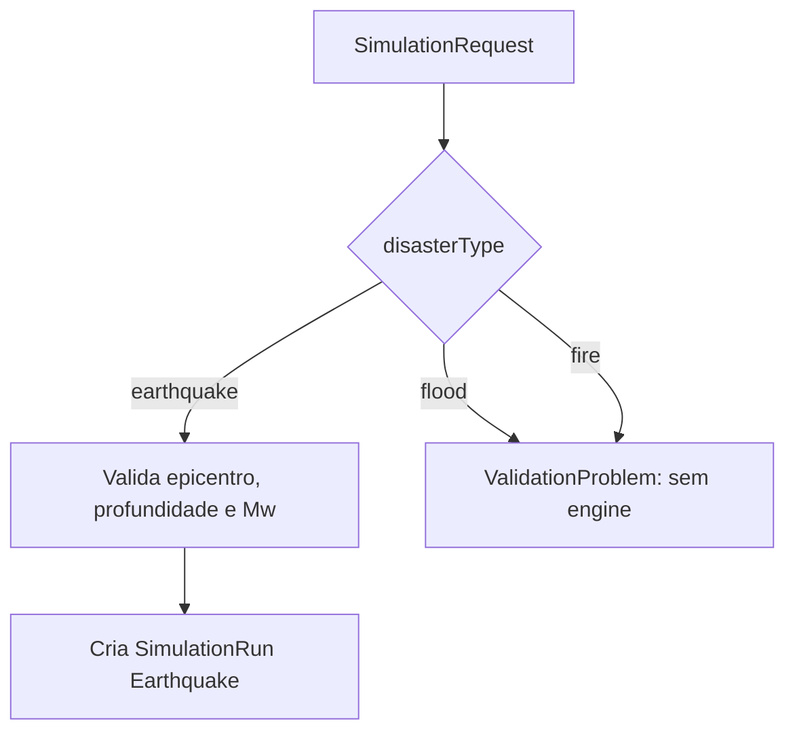
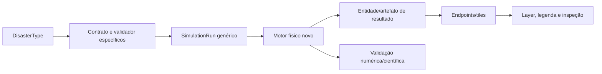

# Cobertura de desastres

## Matriz de implementação

| Desastre | Enum de domínio | Request reconhece nome | Validação aceita | Motor | Resultado |
|---|---:|---:|---:|---:|---|
| Terremoto | sim | sim | sim | sim | PGA/PGV/SA/drift/dano + raster |
| Enchente | sim | sim | não | não | nenhum |
| Incêndio | sim | sim | não | não | nenhum |

## Terremoto

É a única análise de desastre completa no código. O fluxo inclui:

1. revisão de cidade publicada;
2. epicentro, profundidade e magnitude;
3. malha urbana, DEM e proxy Vs30;
4. fonte de Brune e propagação FDTD escalar;
5. PGA/PGV em centroides;
6. SDOF por altura, drift e classe de dano;
7. respostas no PostGIS, intensidade no MinIO e dano incorporado no MVT.

As equações, defaults e limitações estão em
[07 — Ciência da análise sísmica](07-ciencia-da-analise-sismica.md).

## Enchente

`DisasterType.Flood` e a string `"flood"` existem apenas como vocabulário
reservado. Não há no repositório:

- parâmetros hidrológicos ou request específico;
- chuva, vazão, nível d'água, maré ou condição de contorno;
- DEM hidrologicamente corrigido, direção/acumulação de fluxo;
- solver de águas rasas, inundação estática ou propagação de onda;
- rugosidade de Manning, drenagem, infiltração ou barragens;
- exposição/dano por profundidade e velocidade;
- pipeline, tabela de resposta, raster ou layer de resultado.

O fato de existir `WaterFeature` não constitui um modelo de enchente; essa
entidade apenas representa geometrias OSM de água.

## Incêndio

`DisasterType.Fire` e a string `"fire"` também são apenas contratos reservados.
Não há:

- ignição, combustível, carga de incêndio ou material construtivo;
- vento, umidade, temperatura ou propagação térmica;
- modelo de fogo estrutural, urbano ou florestal;
- distância entre fachadas, compartimentação ou resposta de bombeiros;
- emissão de fumaça, toxicidade ou evacuação;
- pipeline, tabela de resposta, raster ou layer de resultado.

As categorias `fire_station`/`public` na normalização OSM são semântica urbana,
não capacidade operacional de combate a incêndio.

## Evacuação e outros fenômenos

Evacuação é citada na visão do projeto, mas não pertence a `DisasterType` e não
tem motor. A animação de trens também não é evacuação: é um timetable sintético
sem passageiros, capacidade, rotas de fuga, congestionamento ou interação com
o dano.

Não existem motores de tsunami, deslizamento, ciclone, vulcão, seca ou acidente
tecnológico.

## Como interpretar a extensibilidade existente

`SimulationRun` e seus estágios são genéricos o bastante para filas futuras,
mas isso é apenas infraestrutura. Implementar outro desastre exige modelo de
entrada, ciência, persistência, endpoints, visualização e validação próprios.
Não é correto reutilizar automaticamente parâmetros ou classes de dano
sísmicas.

## Critério de documentação

Até existir um pipeline executável, testes e saída observável, enchente e
incêndio devem permanecer descritos como “não implementados”. Essa distinção é
garantida hoje por `SimulationRequestValidator`, que reconhece os nomes mas
aceita apenas `DisasterTypes.Implemented = ["earthquake"]`.

## Rastreabilidade no código

- Enum: `src/SosLocation.Domain/Disasters/DisasterType.cs`
- Request/validador: `src/SosLocation.Application/Simulation/SimulationRequest.cs`
- Entidade genérica: `src/SosLocation.Domain/Disasters/SimulationRun.cs`
- Worker atual: `src/SosLocation.Worker/SimulationProcessorService.cs`
