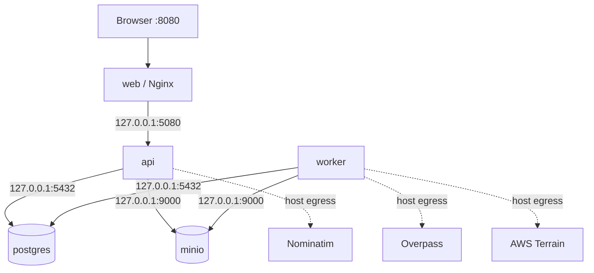
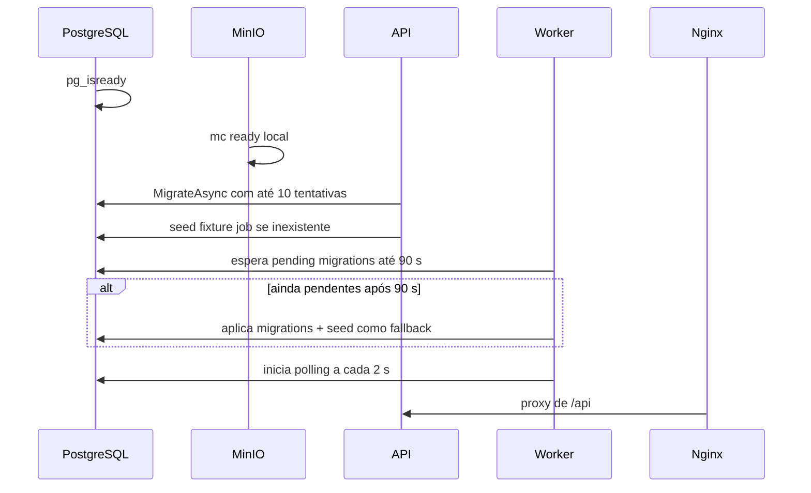
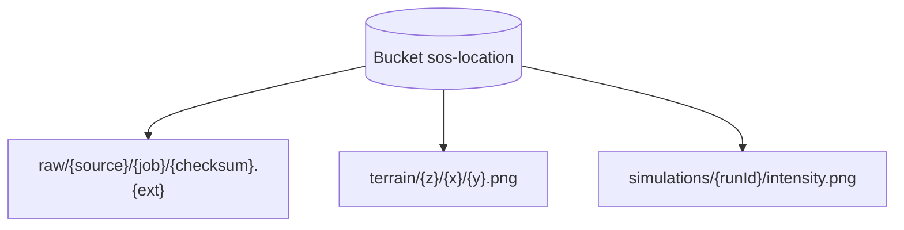

# Infraestrutura e operação

## Topologia Docker Compose



| Serviço | Imagem/runtime | Porta default | Persistência |
|---|---|---:|---|
| postgres | `postgis/postgis:18-3.6` | 5432 | volume `postgres-data` |
| minio | `minio/minio:latest` | 9000/9001 | `MINIO_DATA_PATH` ou `minio-data` |
| api | build .NET ASP.NET 10 | 5080 | Postgres + MinIO |
| worker | build .NET runtime 10 | nenhuma | Postgres + MinIO |
| web | Node 24 build + Nginx 1.29 | 8080 | cache efêmera Nginx |

API, worker e web usam host networking. PostgreSQL e MinIO ficam na rede bridge
e publicam suas portas no host. O resultado funciona como descrito em Linux;
semântica/suporte de host networking deve ser verificada em Docker Desktop.

## Boot



O seed verifica apenas a existência de qualquer `fixture-import`; não recria a
demo se o job antigo existir mas seus dados tiverem sido removidos.

## Configuração

### Ambiente Compose

| Variável | Default | Uso |
|---|---|---|
| `POSTGRES_DB` | `sos_location` | database |
| `POSTGRES_USER` | `sos` | usuário |
| `POSTGRES_PASSWORD` | `sos_dev_password` | senha de desenvolvimento |
| `POSTGRES_PORT` | `5432` | publicação e connection string |
| `MINIO_ROOT_USER` | `sos-minio` | credencial |
| `MINIO_ROOT_PASSWORD` | `sos_minio_dev_password` | credencial |
| `MINIO_BUCKET` | `sos-location` | bucket |
| `MINIO_DATA_PATH` | `minio-data` | volume/caminho de objetos |
| `API_PORT` | `5080` | API |
| `WEB_PORT` | `8080` | Nginx |
| `OTEL_EXPORTER_OTLP_ENDPOINT` | ausente | exportação OpenTelemetry opcional |

Defaults são adequados somente a desenvolvimento. Não há secret manager,
rotação ou geração automática de credenciais.

### Options da aplicação

As seções `ImportLimits`, `Terrain`, `Seismic`, `Nominatim`, `Overpass`,
`Fixture` e `ObjectStorage` são ligadas uma vez no startup e registradas como
singletons. Alterar `appsettings.json` durante o processo não recarrega os
valores.

Uma nuance importante: `SeismicOptions.MaxDomainDiagonalKm` e
`TerrainOptions.MaxPrefetchTiles` não aparecem nos `appsettings.json` atuais,
mas seus initializers de classe aplicam defaults de 40 km e 400 tiles.

## Persistência PostgreSQL/PostGIS

EF Core aplica migrations automaticamente no startup da API, salvo
`SkipMigrations=true`. O connection pool pertence ao provider Npgsql. Features
urbanas usam EF; tiles e locks de fila usam SQL explícito; respostas sísmicas
usam `COPY BINARY`.

Não há no repositório automação de backup, PITR, replicação, retenção, vacuum,
particionamento ou limpeza de revisões/runs/jobs antigos. O crescimento é
permanente até ação operacional externa.

## Object storage



`MinioObjectStorage` cria o bucket sob demanda. O primeiro acesso verifica sua
existência; depois uma flag em memória evita repetir a consulta. Dados brutos e
artefatos não têm política de retenção ou lifecycle configurada no repositório.

`MINIO_DATA_PATH` pode ser caminho absoluto para evitar falta de espaço na
partição Docker. Se permanecer como nome, o Compose usa volume nomeado.

## Nginx

Nginx executa quatro funções:

1. serve arquivos estáticos da build Vite;
2. faz fallback de SPA para `index.html`;
3. encaminha `/api/` e `/health` à API;
4. mantém cache de tiles, terrain e intensidade.

Vector/terrain compartilham uma cache `tiles` de 16 MiB de keys, até 1 GiB de
conteúdo e 30 dias de inatividade. Há `proxy_cache_lock` e stale em erro,
timeout ou atualização. Gzip inclui MVT, JSON, JS e CSS. Não existe TLS,
redirect HTTPS, CSP ou headers de hardening nessa configuração.

## Desenvolvimento local

```bash
docker compose up postgres minio -d
make api-dev
make worker-dev
make web-dev
```

- API: `http://localhost:5080`;
- Vite: `http://localhost:5173`, com proxy `/api` para a API;
- stack completa: `docker compose up --build`, UI em `:8080`.

O SDK está fixado em .NET `10.0.100` com `rollForward=latestFeature`. O frontend
usa lockfile npm e `npm ci` na imagem.

## Health e observabilidade

```mermaid
flowchart LR
    API --> SERI[Serilog console]
    API --> OTEL[Tracing + metrics ASP.NET/HttpClient]
    WORKER --> WLOG[Serilog console]
    WORKER --> WOTEL[OTLP configurável pelo pacote/host]
    HEALTH[/health/ready] --> PG[(PostgreSQL)]
```

A API tem healthcheck de container baseado em TCP/HTTP e readiness do Postgres.
O web tem healthcheck `wget`; Postgres e MinIO têm checks próprios. O worker não
tem healthcheck no Compose. O readiness da API não testa MinIO, Overpass,
Nominatim, terrain nem worker.

Serilog produz logs estruturados no console com propriedade `service`. A API
configura traces e metrics de ASP.NET Core/HttpClient. O worker adiciona os
pacotes OpenTelemetry e configuração comum, mas seu `Program.cs` não chama
`AddOpenTelemetry`; portanto, no estado atual, não cria pipeline OTLP próprio.

## Operação de filas

Ambos os serviços consultam o banco a cada 2 s quando ociosos. Uma exceção no
loop causa backoff de 5 s. A reserva é transacional e segura para múltiplos
workers por `FOR UPDATE SKIP LOCKED`.

Não há lease, heartbeat ou reaper de itens `Running`. Se o processo morrer
depois de reservar e antes de concluir/falhar, o registro fica `Running` e não é
automaticamente retomado. `worker_id` e `started_at` existem, mas não são usados
para recuperação de órfãos.

## Capacidade e custos dominantes

- importação carrega o payload completo em `byte[]` após o streaming limitado;
- normalizadores materializam todas as features em listas;
- features são inseridas com EF `AddRange`, categoria por categoria;
- simulação limita a malha a aproximadamente 40 mil células e 6 mil passos;
- o FDTD custa `O(células * passos)`;
- a resposta estrutural agrupa célula+período e usa memória linear;
- o endpoint `/simulations/{id}/buildings` devolve todas as respostas sem
  paginação, embora a UI prefira dano em MVT.

## Rastreabilidade no código

- Topologia: `docker-compose.yml`
- Imagens: `infra/docker/`
- Proxy: `infra/nginx/default.conf`
- Configuração: `src/*/appsettings.json`, `.env.example`
- Startup/migrations: `src/SosLocation.Infrastructure/Persistence/DbInitializer.cs`
- Storage: `src/SosLocation.Infrastructure/Storage/MinioObjectStorage.cs`
