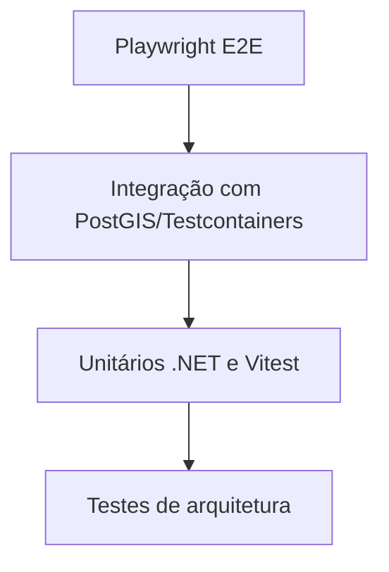
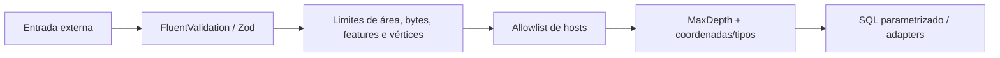
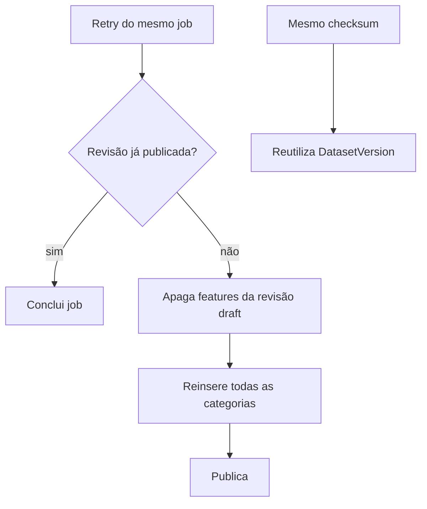

# Testes, segurança e confiabilidade

## Estratégia de testes



### Backend unitário

Os testes cobrem:

- `BoundingBox`, validação de request e máquina de estados de jobs/runs;
- parser de alturas/níveis e classificação de tags OSM;
- reparo/limite/tipo de geometrias;
- GeoJSON, Overpass, multiparts e fixture offline;
- precedência e confiança de altura;
- Terrarium e encoding de intensidade;
- fonte de Brune, grid/Vs30, CFL/FDTD, Newmark SDOF e dano.

### Arquitetura

NetArchTest inspeciona assemblies e impede dependências proibidas do Domain,
Application e GeoProcessing. Isso protege a direção de dependência, mas não
verifica arquitetura do frontend ou limites entre namespaces dentro de um mesmo
assembly.

### Integração

Testcontainers sobe `postgis/postgis:18-3.6`, aplica migrations e verifica:

- pipeline fixture → revisão publicada → features;
- idempotência entre revisões e deduplicação de snapshots;
- constraints de external ID;
- MVT real, tamanho inferior a 1 MiB no cenário e filtros de zoom/posição;
- reserva da fila e backoff;
- pipeline sísmico, persistência, raster e MVT enriquecido com dano.

### Frontend

Vitest/jsdom cobre schemas Zod, Zustand, deep links, fluxo pesquisa/importação,
tema/material, estilo urbano e timetable de trens. Playwright usa um worker e
reduced motion porque SwiftShader degrada com múltiplos contextos WebGL.

## Comandos

```bash
make test-unit
make test-arch
make test-integration
make test-web
make e2e
```

`make test` executa unitários .NET, arquitetura e frontend, mas não integração
nem E2E. Integração requer Docker; E2E requer stack e browsers Playwright.

## Controles de segurança implementados



### Entrada e geoespacial

- bbox valida ranges, ordem e área;
- GeoJSON exige conteúdo, limite de caracteres e parser com profundidade 32;
- respostas Overpass são lidas com limite de bytes;
- contagem de features e vértices é limitada;
- coordenadas devem caber em WGS84;
- geometrias inesperadas, vazias ou irreparáveis são descartadas com issue;
- inputs numéricos sísmicos têm ranges explícitos.

### SSRF e chamadas externas

Overpass e AWS Terrain constroem URI de configuração e verificam o host em
`AllowedImportHosts`. O browser nunca recebe URL livre para download backend.
Overpass usa endpoints conhecidos, POST e timeout. O User-Agent identifica o
projeto.

O adapter Nominatim usa `BaseUrl` configurável e não aplica a allowlist que
protege Overpass/Terrain. Em ambiente onde configuração não é confiável, essa é
uma fronteira SSRF ainda aberta.

### Banco e transporte

- MVT usa SQL fixo e parâmetros Npgsql para IDs/coordenadas;
- stores LINQ parametrizam consultas EF;
- respostas de erro não incluem stack trace por default;
- CORS restringe origins, mas permite qualquer método/header para essas origins;
- não há credenciais no browser para provedores externos.

## Controles ausentes ou incompletos

| Área | Estado atual |
|---|---|
| autenticação/autorização | ausente; qualquer cliente alcançável pode importar/simular/cancelar |
| rate limiting/quota | ausente |
| TLS | ausente no Nginx do repositório |
| CSRF | sem proteção específica; API não usa sessão, mas endpoints mutáveis são públicos |
| headers CSP/HSTS/frame | ausentes |
| secrets de produção | defaults de desenvolvimento em env/appsettings |
| auditoria de usuário | não há identidade de usuário |
| antivírus/content scan | ausente para GeoJSON/raw |
| paginação | ausente em respostas sísmicas; listas gerais limitam a 50 |
| concorrência otimista | sem rowversion/concurrency token |
| recovery de jobs órfãos | ausente |
| backup/retention | fora do repositório |

## Idempotência e consistência

### Importação



Constraints impedem external IDs duplicados por revisão e versões duplicadas
por dataset/checksum. Como o pipeline tem vários commits, uma falha pode deixar
estado parcial; o retry limpa a revisão e reconstrói.

Há uma janela de concorrência em `NextRevisionNumberAsync`: dois imports novos
da mesma cidade podem ler o mesmo máximo e disputar o índice único. A exceção
entra no retry, mas não há lock específico para alocação do número.

### Simulação

Antes do `COPY`, respostas antigas do run são apagadas. A imagem de intensidade
usa a mesma chave, então um retry a sobrescreve. A fila suporta três tentativas,
mas sem backoff. O watcher de cancelamento reduz desperdício em runs cancelados.

### Imutabilidade e cache

A API só serve MVT para revisão publicada e só aceita simulação sobre revisão
publicada. Essa regra sustenta ETag/cache immutable. O domínio, entretanto, não
impede setters públicos como `QualityLevel`, `SpatialCoverage` e
`SourceSummary` de serem alterados após publicação; a imutabilidade depende do
fluxo de aplicação e de não existir endpoint de mutação.

## Tolerância a falhas externas

- pesquisa devolve catálogo local quando Nominatim falha e 503 se não houver
  fallback;
- Overpass tenta múltiplos endpoints para falhas HTTP/timeout;
- terreno usa MinIO primeiro e cai para zero/plano em erro;
- tiles já cacheados no Nginx podem ser servidos stale em erro/timeout;
- MinIO indisponível faz operações de raw/terrain/intensidade falharem; não há
  health readiness nem circuit breaker específico;
- retries de importação cobrem falhas transitórias até três tentativas.

## Cancelamento

Simulações têm watcher de banco a cada 3 s e cancelamento cooperativo dentro do
loop FDTD. Importações não têm watcher equivalente; cancelamento seguro antes da
reserva funciona, mas durante execução não é garantido. Downloads recebem token
do host, não um token ligado à mudança de status do job.

## Lacunas dos testes

Com base nas suites existentes, não há teste dedicado para:

- autenticação/rate limiting, pois não existem;
- recuperação de process death com registro `Running`;
- duas importações concorrentes da mesma cidade;
- falha parcial de MinIO/Postgres durante cada estágio;
- valores sísmicos absolutos contra observação;
- terreno real em integração (testes usam `NullElevationProvider`);
- enchente/incêndio;
- carga de centenas de milhares de features/edifícios;
- decodificação/colorização do raster PGA no browser.

## Rastreabilidade no código

- Suites: `tests/` e `apps/web/src/tests/`
- E2E: `apps/web/e2e/`
- Limites: `src/SosLocation.Application/Options/ImportLimits.cs`
- Filas: `src/SosLocation.Infrastructure/Persistence/Stores.cs`
- Erros/telemetria: `src/SosLocation.Api/Program.cs`
