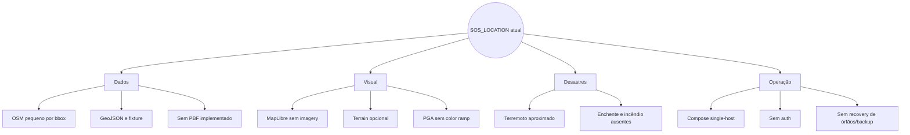
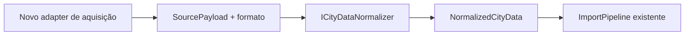
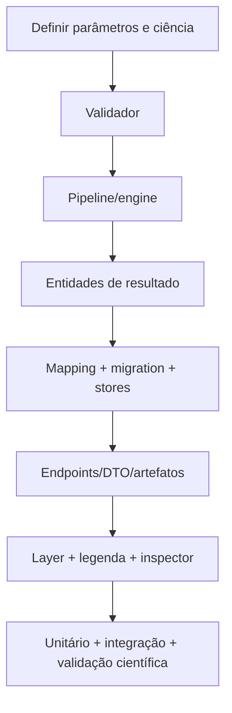

# Limitações e pontos de extensão

## Resumo de fronteiras atuais

## Limitações geográficas e de dados

- bbox máximo default de 250 km² e sem cruzamento do antimeridiano;
- OSM somente via Overpass, materializado em memória;
- PBF aparece no enum, mas não possui pipeline;
- relações multipolygon pressupõem anéis completos nos membros e não costuram
  ways fragmentados;
- o boundary visual é bbox, ainda que o banco possa guardar geometria real;
- somente edifícios, vias/ferrovias, água e uso do solo são normalizados;
- não há endereços, população, ocupação, utilidades, pontes como entidades,
  hospitais como capacidade, sensores ou cadastro estrutural;
- proveniência do terrain não entra no manifesto da revisão;
- fallback por uso do solo do cálculo de altura não é conectado ao pipeline.

## Limitações de renderização e UX

- nenhuma imagery por decisão; terrain e intensidade são exceções analíticas;
- maxzoom de sources MVT do cliente é 16, embora backend aceite z22;
- intensidade PGA é exibida como RGB encoded, sem decoding, legenda ou unidades;
- inspector não apresenta métricas sísmicas por edifício;
- deep link não preserva layers, feature ou simulação ativa;
- estatística “tiles loaded” conta eventos, não tiles únicos;
- trains são sintéticos e sem ligação com desastres;
- a mensagem de elevação no frontend sempre acrescenta “estimated” e o painel
  de cidade ainda afirma terreno plano, mesmo quando DEM real foi amostrado.

## Limitações científicas

- fonte pontual isotrópica e stress drop fixo;
- amplitude global por constante calibratória não rigorosa;
- FDTD escalar 2D, sem P/P–SV, Q, densidade ou profundidade de camadas;
- Vs30 inferido apenas por slope de DEM;
- epicentro distante é clampado à borda da malha;
- sem moveout de profundidade na função fonte;
- PGV sem baseline correction/filtro;
- SDOF linear por altura, sem tipologia/material/idade;
- drift agregado dividido por altura total;
- dano por thresholds determinísticos genéricos;
- sem incerteza, probabilidades, exposição humana, fatalidades ou perdas;
- testes não validam amplitudes absolutas contra dados observados.

## Limitações operacionais

- deploy single-host e host networking;
- sem autenticação, quota, TLS ou secret manager;
- readiness verifica apenas PostgreSQL;
- worker sem healthcheck;
- jobs/runs `Running` não têm lease/recovery após crash;
- import cancelado durante execução não tem watcher;
- simulação retry sem backoff;
- sem backup, retenção e limpeza de dados;
- cache Nginx é local/efêmera e não coordenada entre réplicas;
- sem broker ou notificação; UI e workers usam polling;
- listas/respostas grandes não são paginadas.

## Pontos de extensão já existentes

### Novas fontes urbanas

Para PBF/CityGML/PLATEAU, seria necessário implementar aquisição/parser e
eventualmente ampliar o modelo canônico. `IObjectStorage`, catálogo, revisão e
proveniência podem continuar.

### Novos perfis de reconstrução

`ReconstructionProfileRegistry` aceita perfis extras. Um perfil pode mudar
altura de andar, telhado, default e mapas por tipo/uso. Como a revisão guarda
somente o nome, a reprodutibilidade histórica exige que versões antigas do
perfil permaneçam registradas e imutáveis.

### Novos providers de elevação/storage/geocoder

As portas `IElevationProvider`, `IObjectStorage` e `IGeocoder` permitem trocar
AWS Terrain/MinIO/Nominatim sem alterar o pipeline. Implementações devem manter
os fallbacks e limites esperados pelos casos de uso.

### Novos desastres

`SimulationRun` pode servir de envelope de fila, mas o worker atual sempre
resolve `SeismicSimulationPipeline`, independentemente de `DisasterType`.
Antes de habilitar flood/fire no validador, o `SimulationProcessorService` deve
despachar por engine; caso contrário, parâmetros seriam desserializados
incorretamente como terremoto.

### Escala de filas

`SKIP LOCKED` permite múltiplos workers concorrentes. Para operação robusta, o
próximo passo compatível é adicionar lease/heartbeat, recuperação de órfãos,
backoff de simulação e limites por tenant/usuário. Um broker só é necessário se
os requisitos ultrapassarem o polling/estado transacional do Postgres.

### Visualização

`GeoScene.setSimulationLayers` aceita layers deck.gl sob demanda. Layers urbanas
continuam nativas MapLibre. Um heatmap PGA correto pode usar shader/layer custom
que decodifique R/G ou, mais simples, o backend pode emitir um PNG já colorizado
junto a uma legenda versionada, preservando o raster numérico separadamente.

## Ordem técnica sugerida pelo risco atual

Esta lista não afirma roadmap do produto; ela ordena lacunas observadas pelo
impacto técnico:

1. recuperar jobs/runs órfãos e tornar cancelamento de importação cooperativo;
2. autenticar e limitar operações que consomem CPU/rede/storage;
3. separar raster PGA numérico de visualização colorizada e expor legenda;
4. validar/calibrar o motor sísmico contra dados ou declarar um modo apenas
   demonstrativo de forma ainda mais visível na UI;
5. paginar resultados e medir capacidade com datasets grandes;
6. conectar land use/proveniência terrain e corrigir mensagens de elevação;
7. só então habilitar novos desastres com engines e validação próprias.

## Regra para preservar fidelidade

Uma feature passa de “ponto de extensão” a “implementada” apenas quando houver:

- contrato aceito pelo validador;
- caminho executável completo;
- persistência/artefato observável;
- consumo pela API/UI quando aplicável;
- testes que cubram invariantes e falhas relevantes.
