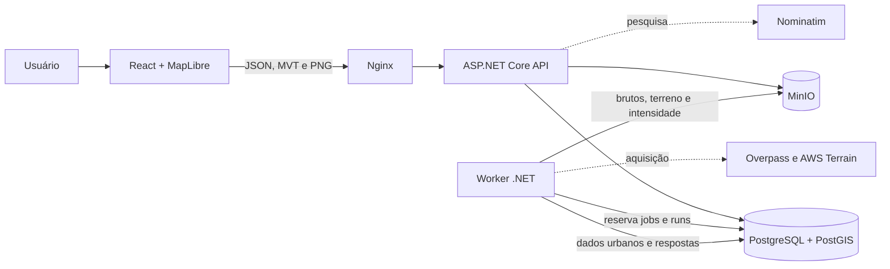
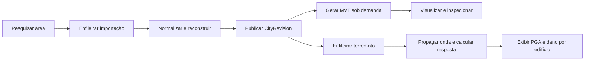

# Documentação técnica do SOS_LOCATION

Esta pasta descreve o sistema que existe neste repositório em 22 de julho de
2026. O código-fonte é a referência normativa: quando há diferença entre uma
ideia de produto e a implementação, este documento registra a implementação.

O projeto reconstrói cidades a partir de dados geoespaciais, publica revisões
urbanas imutáveis, entrega a geometria em vector tiles e executa uma simulação
sísmica sobre os edifícios. O domínio também enumera enchente e incêndio, mas
esses dois motores ainda não existem e são rejeitados pela validação da API.

## Mapa da documentação

| Documento | Conteúdo |
|---|---|
| [01 — Arquitetura do sistema](01-arquitetura-do-sistema.md) | Contexto, containers, camadas .NET, dependências e fluxos principais |
| [02 — Mapa do código](02-mapa-do-codigo.md) | Responsabilidade de cada projeto, módulo e adapter |
| [03 — Modelo de dados](03-modelo-de-dados.md) | Entidades, relações, estados, índices, SRIDs e imutabilidade |
| [04 — Importação e reconstrução](04-importacao-e-reconstrucao.md) | Aquisição, normalização, geometria, alturas, terreno, qualidade e retries |
| [05 — API e contratos](05-api-e-contratos.md) | Rotas HTTP, validações, respostas, cache e lacunas atuais |
| [06 — Frontend e renderização](06-frontend-e-renderizacao.md) | Estado React, GeoScene, MapLibre, deck.gl, picking, deep links e trens |
| [07 — Ciência da análise sísmica](07-ciencia-da-analise-sismica.md) | Hipóteses, equações, FDTD, Vs30, SDOF, dano, raster e limites científicos |
| [08 — Cobertura de desastres](08-cobertura-de-desastres.md) | O que existe para terremoto, enchente e incêndio, sem extrapolar o código |
| [09 — Infraestrutura e operação](09-infraestrutura-e-operacao.md) | Docker Compose, rede, storage, banco, configuração e observabilidade |
| [10 — Testes, segurança e confiabilidade](10-testes-seguranca-e-confiabilidade.md) | Pirâmide de testes, controles, filas, idempotência e riscos conhecidos |
| [11 — Limitações e pontos de extensão](11-limitacoes-e-extensoes.md) | Fronteiras técnicas e científicas e interfaces disponíveis para evolução |

## Leitura rápida do sistema

O fluxo urbano é:

## Princípios comprováveis no código

- O PostGIS é a fonte autoritativa das geometrias urbanas em SRID 4326.
- Uma revisão publicada só é lida; novas importações geram novas revisões.
- Os dados brutos são preservados no MinIO com checksum SHA-256.
- API e worker dependem de ports da camada Application; Domain não depende de
  EF Core, Npgsql, HTTP ou adapters externos.
- A fila de importação e a fila de simulação vivem no PostgreSQL e usam
  `FOR UPDATE SKIP LOCKED`.
- O mapa base não usa imagery. Terreno é um `raster-dem` Terrarium e a
  intensidade sísmica é uma imagem numérica gerada pelo próprio sistema.
- O único motor de desastre executável é o sísmico. Seus resultados são uma
  aproximação de engenharia e não constituem laudo, previsão ou sistema de
  decisão para segurança de vida.

## Como manter estes documentos

Ao alterar contratos, estados, equações, defaults ou infraestrutura, atualize o
documento temático e as tabelas de rastreabilidade nele contidas. Não documente
como implementada uma opção apenas enumerada. Para decisões históricas, consulte
também `docs/adr/`; esta pasta `dev/` descreve o estado operacional atual.
