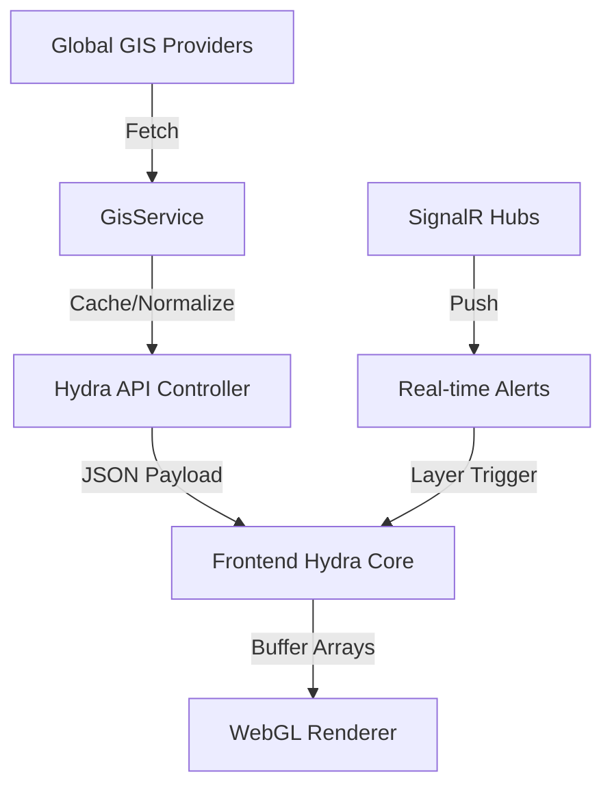

# 🛡️ MG Location Architecture: HYDRA Engine v3

This document outlines the high-level architecture of the **SOS_LOCATION** project, focusing on the mission-critical pillars of real-time GIS rendering, risk analysis, and distributed simulation.

---

## 🏗️ System Overview

The system operates on an orchestrated micro-orchestration model, where data flows from global GIS providers into a specialized pure WebGL rendering pipeline.

### 1. Backend Core (SOSLocation.API)
- **Domain Driven Design (DDD)**: Logic is isolated in `SOSLocation.Domain`.
- **Infrastructure Layer**: Handles persistence (PostgreSQL/Dapper) and GIS integration.
- **Resilience**: Implements standard HTTP resilience patterns (Retries, Circuit Breakers) for external providers like OpenTopography and Overpass.

### 2. Frontend Viz Engine (Hydra Core)
- **Pure WebGL 2.0**: Bypasses heavy frameworks (like Three.js) for raw GPU control.
- **First-Person Tactical (FPT)**: Implemented via custom view-matrix calculations (`GISMath.ts`).
- **Data-Driven Shaders**:
  - `CITY_TERRAIN_VS/FS`: Displacement mapping from elevation grids.
  - `INFRA_VS/FS`: Procedural growth of urban masses from height maps.
  - `FLOOD_VS/FS`: Dynamic water level simulation with sine-wave physics.
33: 
+### 3. Feature-Based Architecture
+The frontend is organized by **Feature-Based Modules** to ensure scalability:
+- `src/components/features/`: Domain-specific logic (Maps, Rescue, Volunteer, Gamification).
+- `src/components/ui/` & `src/components/atoms/`: Design system primitives.

---

## 🗺️ Path Toward Resilience

### Quality Pillars
1. **Circuit Breaking**: All external GIS calls are protected. If a provider (e.g., Overpass) hits rate limits, the system falls back to cached or synthetic data.
2. **Observability**: **OpenTelemetry** for distributed tracing and enhanced **HealthChecks** for dependency monitoring.
3. **Automated Verification**:
   - **Backend**: xUnit for service logic.
   - **Frontend**: Vitest for hooks/calculators and Playwright for coordinate validation.

### Data Pipelines
1. **Alert Indexer**: Background services poll INMET, CEMADEN, and DEFESA CIVIL.
2. **Spatial Correlation**: Alerts are mapped to geographic polygons to trigger UI "Area Highlight" warnings.

---

## 🔒 Security & Performance
- **Keycloak SSO**: Identity management for operational roles (Approver, Tactical, Guest).
- **GPU Optimization**: Point-cloud rendering for buildings minimize draw calls, keeping FPS high even on low-end hardware.
