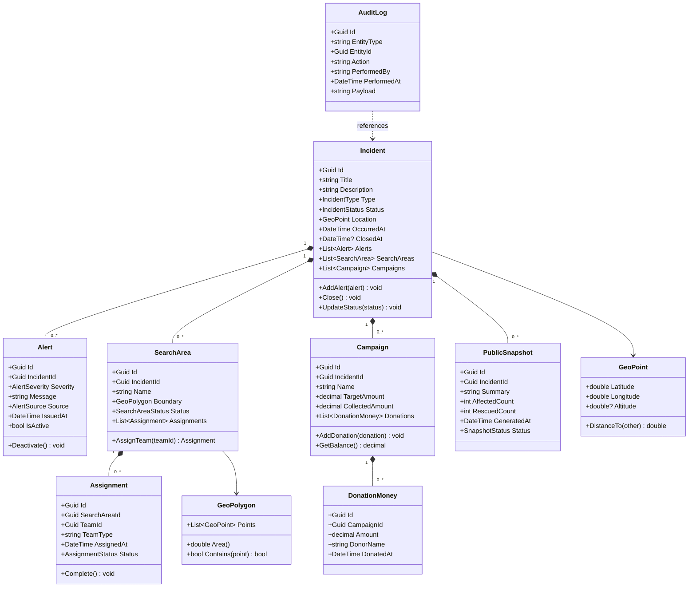
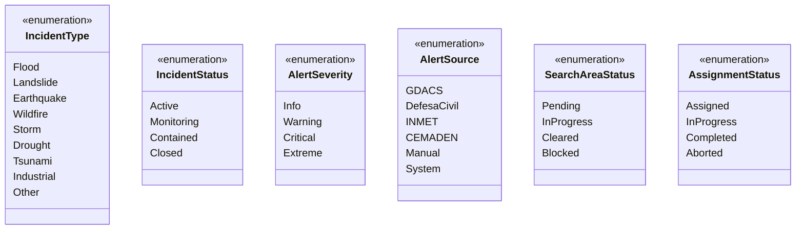
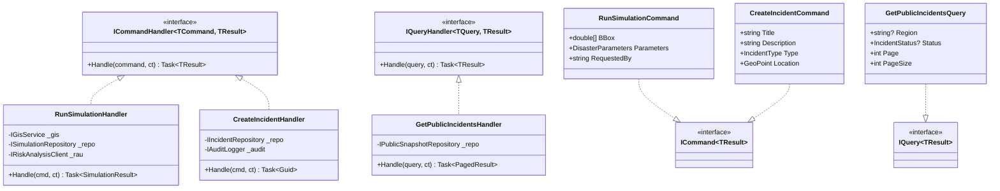
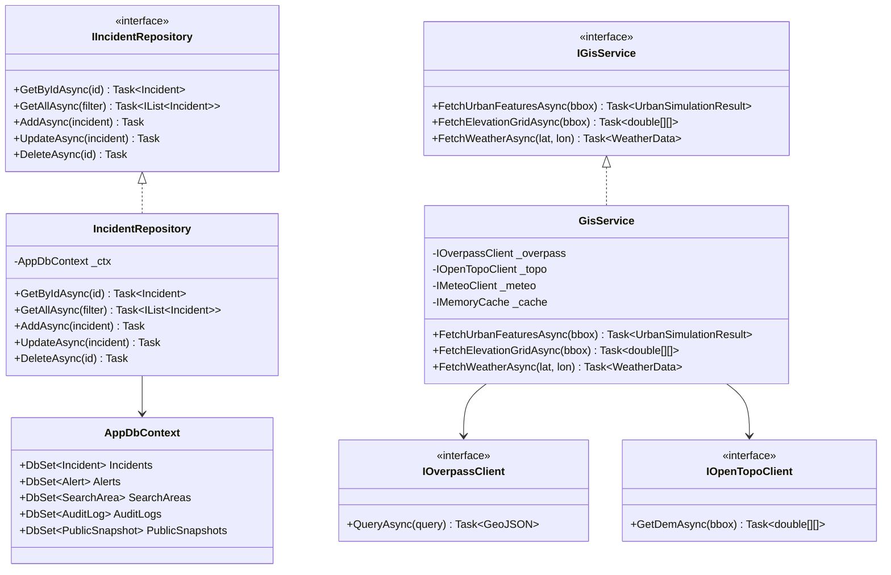
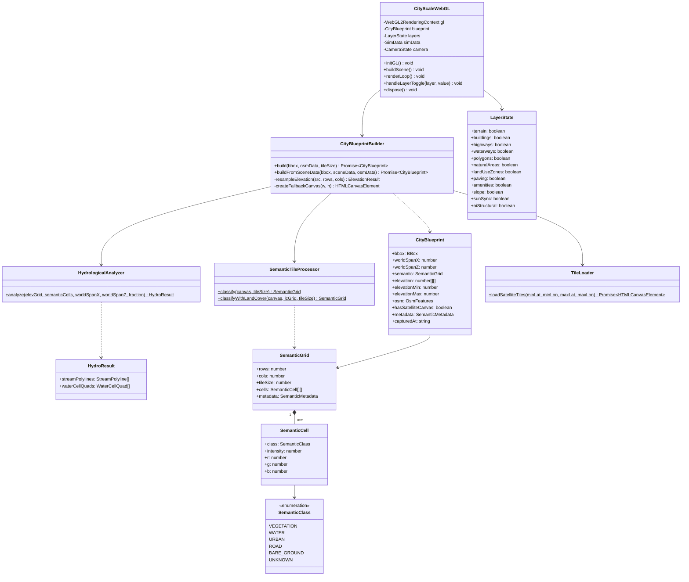
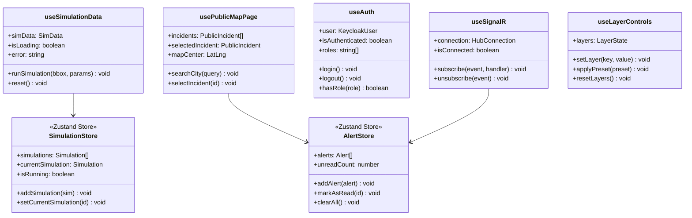
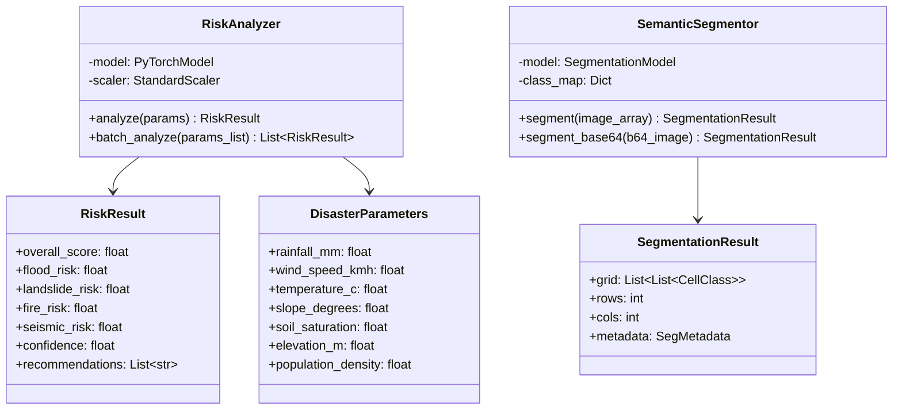

# SOS Location — Diagramas de Classe

> Versão: 1.0 | Data: 2026-03-22

---

## 1. Domain Layer — Aggregates e Entities

---

## 2. Domain — Enumerações e Value Objects

---

## 3. Application Layer — Commands e Queries (CQRS)

---

## 4. Infrastructure Layer — Repositórios e Serviços GIS

---

## 5. Frontend — WebGL Pipeline (Classes TypeScript)

---

## 6. Frontend — Hooks e State Management

---

## 7. Risk Analysis Unit — Python Classes

