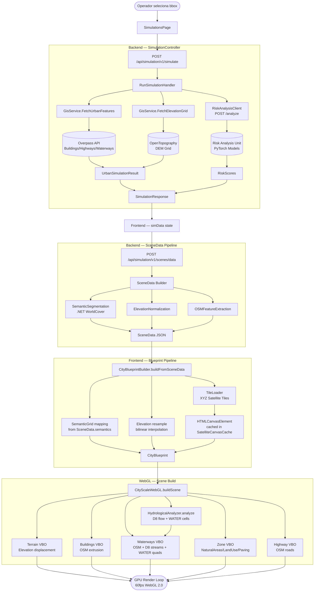
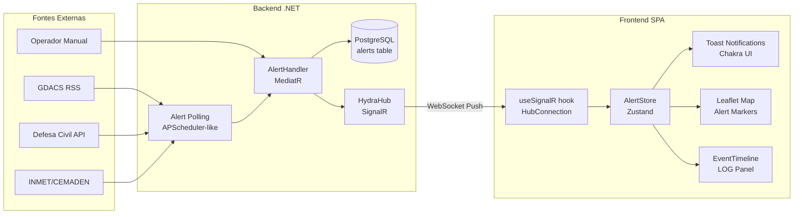
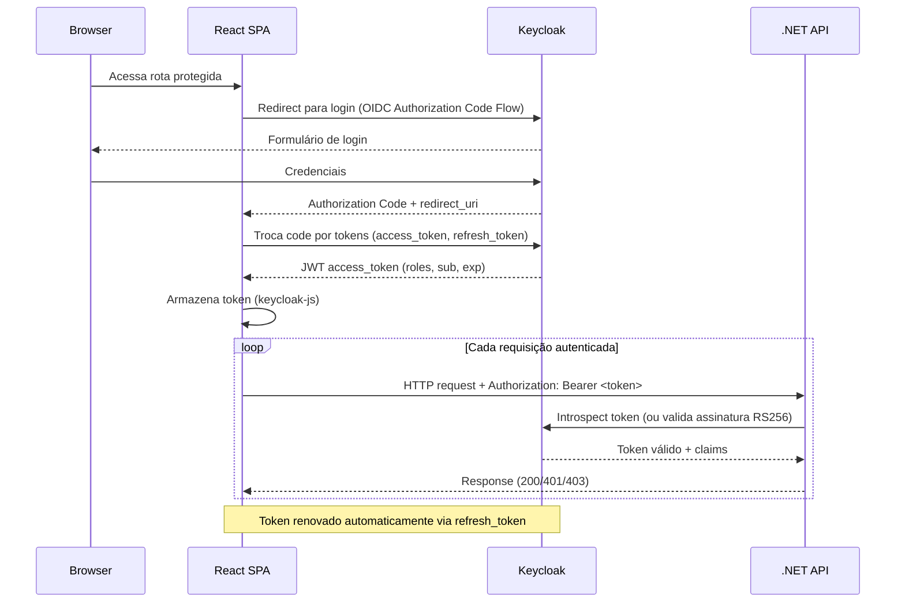
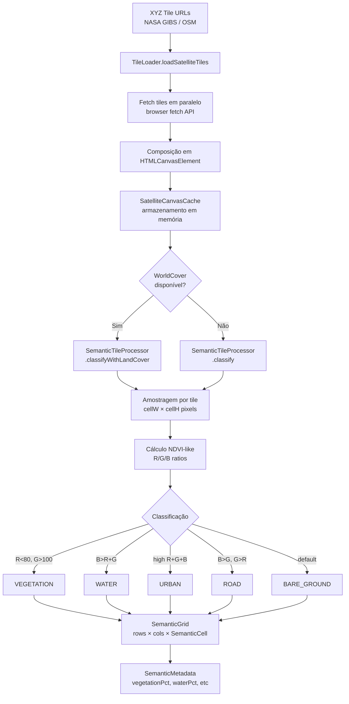
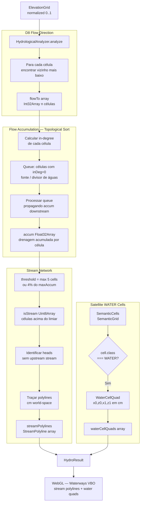
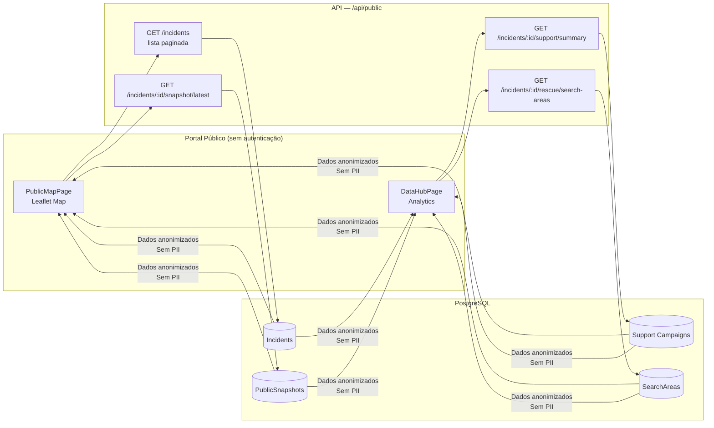
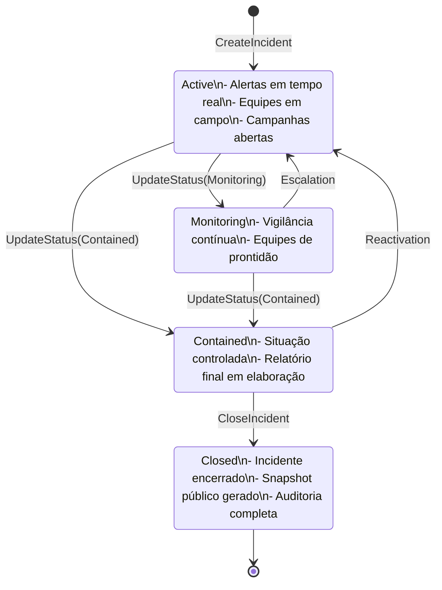

# SOS Location — Fluxos de Dados

> Versão: 1.0 | Data: 2026-03-22

---

## 1. Pipeline GIS — Da Requisição ao Blueprint 3D

---

## 2. Fluxo de Dados — Alertas em Tempo Real

---

## 3. Fluxo de Autenticação — OIDC com Keycloak

---

## 4. Pipeline de Segmentação Semântica de Satélite

---

## 5. Fluxo de Análise Hidrológica (D8)

---

## 6. Fluxo de Dados — Portal Público

---

## 7. Ciclo de Vida de um Incidente

