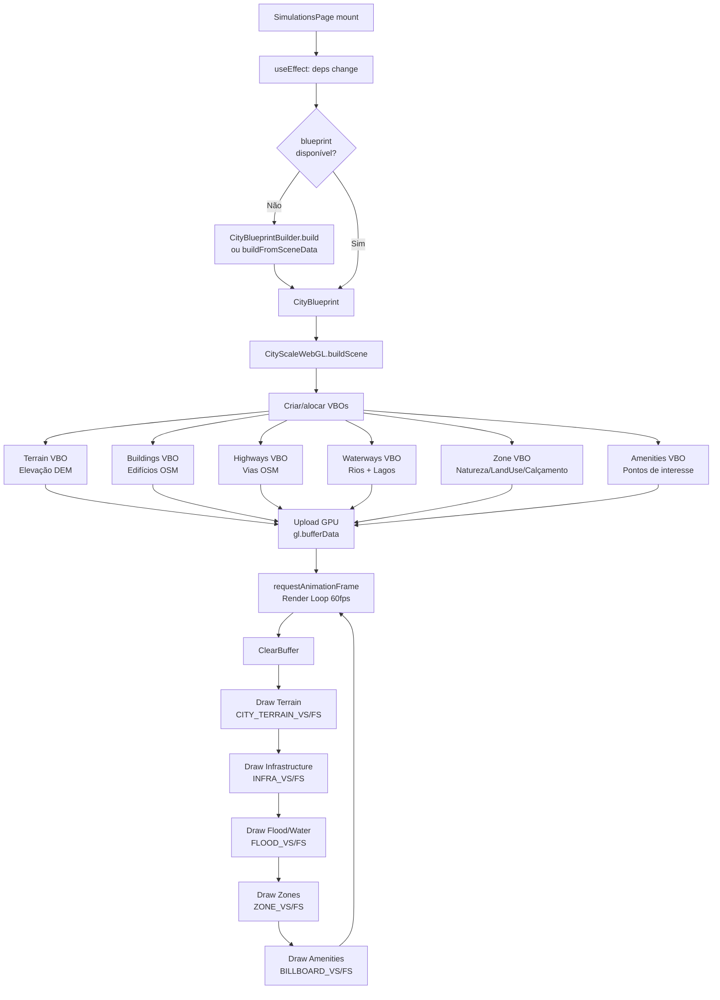

# SOS Location — Frontend Architecture Guide

> Versão: 1.0 | Data: 2026-03-22

---

## 1. Visão Geral

O frontend do SOS Location é uma Single Page Application construída com **React 19 + TypeScript 5 + Vite 7**. No estado atual do repositório, a aplicação combina:

- shell operacional em React;
- mapas 2D em Leaflet;
- pipelines WebGL customizados para terreno, slope, semântica e overlays;
- dependências ainda ativas de **Three.js / @react-three/fiber** em partes da implementação.

O repositório nao esta mais em um estado "WebGL puro sem Three.js". A direcao de consolidação e reorganização de rotas, domínios e acessos está em [FRONTEND_TOTAL_REFACTOR_PLAN.md](/home/nhmatsumoto/sos_location/docs/FRONTEND_TOTAL_REFACTOR_PLAN.md), enquanto a base matemática dos modelos está em [ANALYTICAL_MODELS_AND_PHYSICS.md](/home/nhmatsumoto/sos_location/docs/ANALYTICAL_MODELS_AND_PHYSICS.md).

---

## 2. Estrutura de Diretórios

```
frontend-react/src/
├── pages/                    # 28 rotas de página
│   ├── SimulationsPage.tsx   # Motor 3D + controles de camadas
│   ├── PublicMapPage.tsx     # Portal público Leaflet
│   ├── DataHubPage.tsx       # Analytics e KPIs
│   ├── AdminPage.tsx         # Painel administrativo
│   └── ...
├── components/
│   ├── ui/
│   │   ├── CityScaleWebGL.tsx  # Renderizador 3D (componente principal)
│   │   └── ...
│   ├── public/
│   │   └── PublicPortalMap.tsx # Mapa Leaflet público
│   ├── features/
│   │   ├── rescue/            # Módulo de resgate
│   │   ├── volunteer/         # Módulo de voluntários
│   │   ├── maps/              # Componentes de mapa
│   │   └── gamification/      # Módulo de gamificação
│   └── atoms/                 # Componentes primitivos (design system)
├── hooks/                     # 23 hooks personalizados
│   ├── useSimulationData.ts
│   ├── usePublicMapPage.ts
│   ├── useAuth.ts
│   └── ...
├── lib/                       # Núcleo da engine e análise
│   ├── webgl/
│   │   ├── shaders/
│   │   │   └── cityShaders.ts # GLSL shaders compilados
│   │   ├── TileLoader.ts      # Carregamento de tiles XYZ
│   │   └── GISMath.ts         # Conversão lat/lon ↔ world-space
│   ├── blueprint/
│   │   ├── CityBlueprintBuilder.ts  # Orquestrador do pipeline
│   │   ├── CityBlueprintTypes.ts    # Tipos do blueprint
│   │   └── SatelliteCanvasCache.ts  # Cache de canvas satélite
│   ├── analysis/
│   │   └── HydrologicalAnalyzer.ts  # D8 flow + water cells
│   └── segmentation/
│       ├── SemanticTileProcessor.ts # Classificação de satélite
│       └── SemanticTypes.ts         # Enums e tipos semânticos
├── services/                  # 30+ clientes de API (Axios)
│   ├── sceneDataApi.ts
│   ├── simulationApi.ts
│   ├── publicApi.ts
│   └── ...
├── store/                     # Zustand stores
├── styles/                    # CSS global + camadas de mapa
│   └── MapLayerStyles.css
└── types/                     # Tipos TypeScript globais
```

---

## 3. Pipeline WebGL e Analytics

### Ciclo de Vida da Cena



### Shaders Implementados

| Shader | Arquivo | Função |
|--------|---------|--------|
| `CITY_TERRAIN_VS/FS` | cityShaders.ts | Deslocamento do terreno por heightmap, coloração por elevação |
| `INFRA_VS/FS` | cityShaders.ts | Extrusão de edifícios e vias com sombra procedural |
| `FLOOD_VS/FS` | cityShaders.ts | Simulação de nível de água com ondas senoidais |
| `ZONE_VS/FS` | cityShaders.ts | Zonas de uso do solo com controle por tipo (discard) |
| `BILLBOARD_VS/FS` | cityShaders.ts | Sprites de amenidades (face-camera) |

### Uniforms Globais de Simulação

```typescript
// Parâmetros passados a todos os shaders via SimData
u_time           // float — tempo em segundos (anima flood, sunSync)
u_floodLevel     // float 0..1 — nível de inundação atual
u_windSpeed      // float km/h
u_rainfall       // float mm/h
u_slopeMode      // float 0/1 — habilita coloração por inclinação
u_showNatural    // float 0/1 — ZONE shader: naturalAreas on/off
u_showLandUse    // float 0/1 — ZONE shader: landUseZones on/off
u_showPaving     // float 0/1 — ZONE shader: paving on/off
```

---

## 4. Segmentação Semântica e Análise Hidrológica

### Classificação de Satélite

`SemanticTileProcessor` amosta o canvas de satélite em uma grade de `tileSize × tileSize` pixels por célula e classifica cada célula usando heurísticas de cor RGB:

| Condição | Classe |
|----------|--------|
| G > 100 e G > R*1.2 e B < 120 | VEGETATION |
| B > R+30 e B > G | WATER |
| (R+G+B)/3 > 160, R ≈ G ≈ B | URBAN |
| B > G > R (cinza escuro) | ROAD |
| Default | BARE_GROUND |

### D8 Flow Accumulation

`HydrologicalAnalyzer` implementa o algoritmo D8 para identificar canais fluviais:

1. **Flow Direction**: cada célula aponta para o vizinho (8-conectado) de menor elevação.
2. **Topological Sort**: in-degree counting + BFS para propagar acumulação sem recursão.
3. **Threshold**: células com acumulação ≥ max(5, maxAccum × 4%) são canais.
4. **Polyline Tracing**: canais são traçados como polylines em coordenadas world-space (cm).

---

## 5. Controles de Camadas — LayerState

```typescript
interface LayerState {
  // Geometria
  terrain:      boolean;  // DEM heightmap
  buildings:    boolean;  // OSM buildings
  highways:     boolean;  // OSM roads
  polygons:     boolean;  // Waterways + water areas (rios, lagos)
  naturalAreas: boolean;  // Zonas naturais (tipo 0-7)
  landUseZones: boolean;  // Zonas de uso do solo (tipo 8-15)
  paving:       boolean;  // Calçadas / estacionamentos (tipo 16-17)
  amenities:    boolean;  // POIs

  // Análise
  slope:        boolean;  // Mapa de inclinação
  sunSync:      boolean;  // Iluminação solar dinâmica
  aiStructural: boolean;  // Overlay de análise estrutural AI
}
```

### Presets de Camadas

| Preset | Camadas Ativas |
|--------|---------------|
| `analise_gis` | terrain, buildings, highways, polygons, naturalAreas, landUseZones, aiStructural, sunSync |
| `cidade_limpa` | terrain, buildings, highways, polygons |
| `desastre` | terrain, buildings, highways, polygons, slope |

---

## 6. Gerenciamento de Estado

### Zustand Stores

| Store | Responsabilidade |
|-------|-----------------|
| `SimulationStore` | Simulações em execução, parâmetros, histórico |
| `AlertStore` | Alertas recebidos via SignalR, contagem não-lida |
| `MapStore` | Centro do mapa, zoom, camadas ativas Leaflet |
| `AuthStore` | Usuário autenticado, roles, token |
| `IncidentStore` | Incidentes carregados, seleção, filtros |

### Hooks Principais

| Hook | Fonte de Dados | Uso |
|------|---------------|-----|
| `useSimulationData` | API + Zustand | Busca e executa simulações |
| `usePublicMapPage` | API REST | Dados do portal público |
| `useAuth` | keycloak-js | Autenticação e autorização |
| `useSignalR` | SignalR HubConnection | Alertas em tempo real |
| `useLayerControls` | Local state | Controle de camadas 3D |
| `useBlueprintBuilder` | API + WebGL | Construção do blueprint 3D |

---

## 7. Comunicação com o Backend

### Clientes de API (Axios)

Todos os clientes de API usam uma instância Axios configurada com:
- `baseURL` a partir de variáveis de ambiente (`VITE_API_URL`)
- Interceptor de request: injeta `Authorization: Bearer <token>`
- Interceptor de response: refresh automático de token expirado
- Timeout: 30s (GIS endpoints: 60s)

### Endpoints Principais

| Serviço | Endpoint | Uso |
|---------|---------|-----|
| `sceneDataApi` | `POST /api/simulation/v1/scenes/data` | SceneData pré-processado |
| `simulationApi` | `POST /api/simulation/v1/simulate` | Simulação completa |
| `publicApi` | `GET /api/public/incidents` | Portal público |
| `alertApi` | `GET /api/alerts` | Lista de alertas |
| `incidentApi` | `CRUD /api/incidents` | Gestão de incidentes |

### SignalR (Tempo Real)

```typescript
// Conexão ao HydraHub
const connection = new HubConnectionBuilder()
  .withUrl('/hubs/hydra', { accessTokenFactory: () => token })
  .withAutomaticReconnect()
  .build();

// Eventos
connection.on('NewAlert', (alert: Alert) => store.addAlert(alert));
connection.on('IncidentUpdated', (incident) => store.update(incident));
connection.on('SimulationProgress', (progress) => store.setProgress(progress));
```

---

## 8. Internacionalização (i18n)

Configuração via `i18next` com detecção automática do idioma do browser:

```
src/
├── locales/
│   ├── pt-BR/
│   │   ├── common.json
│   │   ├── disasters.json
│   │   └── layers.json
│   └── en/
│       ├── common.json
│       ├── disasters.json
│       └── layers.json
```

---

## 9. Padrões de Qualidade

### TypeScript
- `strict: true` em `tsconfig.json`.
- Zero erros em `tsc --noEmit` obrigatório na CI.
- Tipos explícitos para todos os props e retornos de hooks.

### Testes
- Unit: Vitest para hooks, calculators, analyzers.
- Integration: Playwright para fluxos E2E críticos (login, simulação, mapa público).
- Cobertura mínima: 60%.

### Performance
- Code splitting por rota (React.lazy + Suspense).
- WebGL VBOs re-alocados apenas quando dependências de camada mudam.
- TileLoader: fetches de tiles XYZ em paralelo (Promise.all).
- SatelliteCanvasCache: canvas de satélite re-utilizado entre rebuilds do blueprint.

---

## 10. Variáveis de Ambiente

```bash
VITE_API_URL=http://localhost:5000          # URL da .NET API
VITE_RISK_API_URL=http://localhost:8001     # URL do Risk Analysis Unit
VITE_KEYCLOAK_URL=http://localhost:8080     # URL do Keycloak
VITE_KEYCLOAK_REALM=sos-location           # Realm do Keycloak
VITE_KEYCLOAK_CLIENT_ID=frontend           # Client ID OAuth2
VITE_MAP_TILE_URL=https://{s}.tile.openstreetmap.org/{z}/{x}/{y}.png
VITE_SATELLITE_TILE_URL=                   # URL dos tiles de satélite (NASA GIBS)
```
