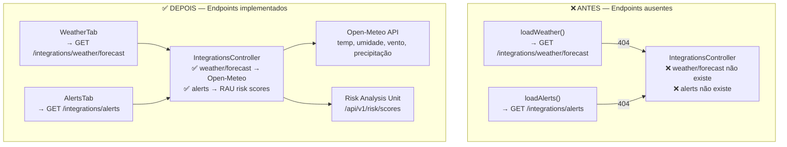
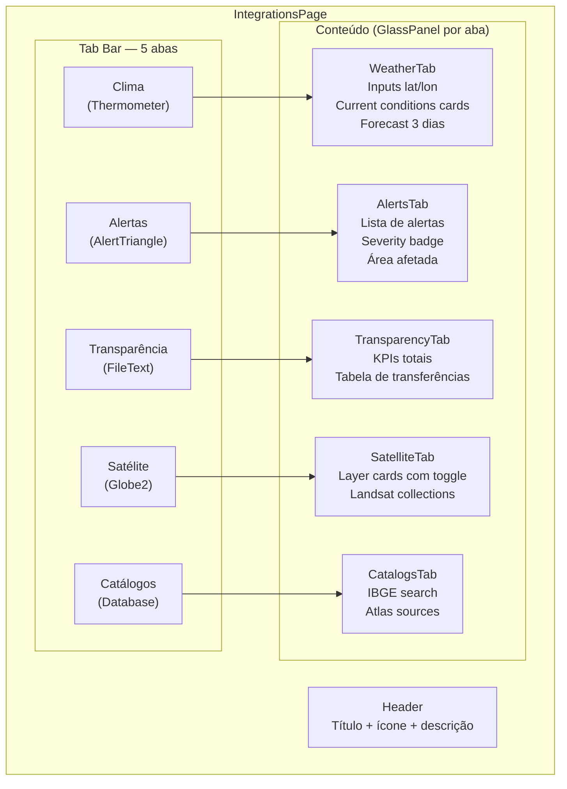
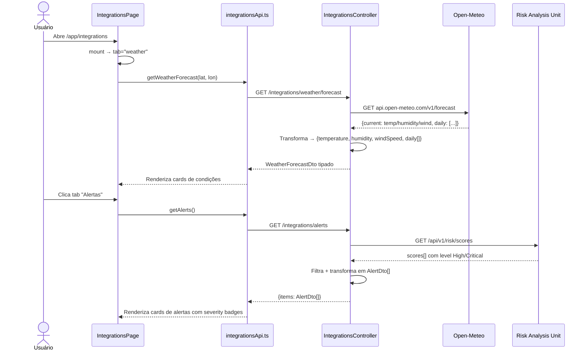

# Plano de Implementação — Tela de Integrações

> Data: 2026-03-22 | Status: Implementado

---

## 1. Diagnóstico — Bugs e Problemas

### Frontend — `IntegrationsPage.tsx`

| # | Bug | Impacto |
|---|-----|---------|
| F-01 | Toda a página usa Tailwind + `Button`/`TextInput` custom — fora do padrão da plataforma | Visual completamente inconsistente |
| F-02 | Dados exibidos como `<pre>JSON.stringify(...)</pre>` bruto | Completamente ilegível em produção |
| F-03 | `activeLayers` nunca consumido — toggle de camadas não faz nada | Funcionalidade de satélite é decorativa |
| F-04 | Tabs sem estado ativo visual — todos os botões idênticos | Usuário não sabe qual aba está aberta |
| F-05 | Nenhuma aba auto-carrega dados — usuário precisa clicar manualmente | UX muito pobre; aba abre vazia |
| F-06 | Sem loading state em nenhuma aba | Sem feedback durante requisição |
| F-07 | `getAtlasSources`, `getGeeAnalysis`, `getDisasterIntelligence` existem no serviço mas nunca são exibidos | Funcionalidades completamente ocultas |
| F-08 | `loadTransparency` não passa `uf`/`municipio` para o endpoint | Filtros do backend nunca usados |

### Backend — `IntegrationsController.cs`

| # | Bug | Impacto |
|---|-----|---------|
| B-01 | **`GET /integrations/weather/forecast` não existe** | `loadWeather()` sempre retorna 404 — clima completamente quebrado |
| B-02 | **`GET /integrations/alerts` não existe** | `loadAlerts()` sempre retorna 404 — alertas completamente quebrados |
| B-03 | `GetTransparencySummary` retorna valores hardcoded | Exibe dados fictícios como se fossem reais |
| B-04 | `GetAlertsIntelligence` retorna valores hardcoded | Análise de inteligência sempre igual |

---

## 2. Arquitetura — Estado Atual vs Corrigido



---

## 3. Diagrama de Componentes — Página Corrigida



---

## 4. Sequência — Fluxo de Dados



---

## 5. Contrato de Dados — Tipos Corrigidos

```typescript
// WeatherForecastDto — antes era Record<string, unknown>, agora tipado
interface WeatherCurrent {
  temperature:   number;
  humidity:      number;
  windSpeed:     number;
  precipitation: number;
  weatherCode:   number;
}

interface WeatherDay {
  date:             string;
  maxTemp:          number;
  minTemp:          number;
  precipitationSum: number;
  weatherCode:      number;
}

interface WeatherForecastDto {
  source:    string;
  lat:       number;
  lon:       number;
  timezone?: string;
  current?:  WeatherCurrent;
  daily?:    WeatherDay[];
  error?:    string;
}
```

---

## 6. Checklist

- [x] **B-01** — Adicionar `GET /integrations/weather/forecast` → Open-Meteo
- [x] **B-02** — Adicionar `GET /integrations/alerts` → RAU risk scores High/Critical
- [x] **F-01** — Reescrever com Chakra UI + GlassPanel + TacticalText + TacticalButton
- [x] **F-02** — Substituir `<pre>JSON</pre>` por UI estruturada (cards, tabelas, badges)
- [x] **F-03** — Toggle de camadas com estado visual real
- [x] **F-04** — Tab ativa com highlight visual
- [x] **F-05** — Auto-load ao trocar de aba
- [x] **F-06** — Loading state com Spinner inline
- [x] **F-07** — Expor Atlas Sources na aba Catálogos
- [x] **F-08** — Passagem correta de todos os filtros
