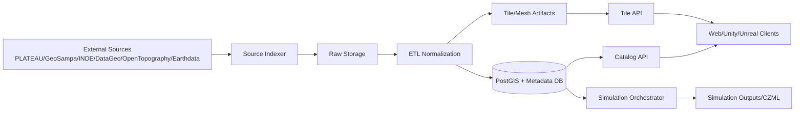
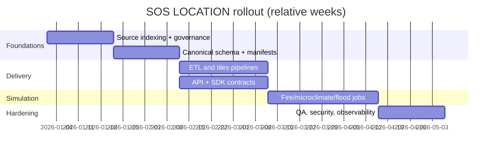

# SOS LOCATION × PLATEAU Integration Master Spec

## A) Executive summary (pt-BR)

O **SOS LOCATION** será a plataforma municipal de gêmeo digital operacional para risco, resposta e planejamento urbano, com ingestão padronizada de dados PLATEAU (Japão), bases brasileiras (GeoSampa, DataGeo, INDE) e fontes globais (OpenTopography, NASA Earthdata, Atlas).

### Entregas principais
- Pipeline de ingestão e indexação de fontes oficiais (HTML/PDF/APIs/OGC).
- Modelo canônico para feições urbanas 3D (edificações, terreno, vegetação, risco).
- APIs de catálogo/consulta/streaming 2D/3D para web, Unity e Unreal.
- Integrações de simulação (incêndio, microclima, inundação/chuva, neve).
- QA automatizado (XSD, CRS, `gml:id`, codelists, geometria, LOD).
- Governança de licenças, trilha de auditoria e rastreabilidade de origem.

### Decisões de gestão (TBD)
- Modelo de hospedagem (on-prem, nuvem pública, híbrido).
- Política de compartilhamento entre secretarias e defesa civil.
- Classificação de dados sensíveis e controle de acesso por nível operacional.
- Estratégia de custódia de chaves (OpenTopography, Earthdata e outros provedores).

### Riscos críticos
- Regras de licenciamento e atribuição (ex.: GeoSampa com CC BY-SA 4.0).
- Limites de API/rate limit e autenticação OAuth2/token (Earthdata/OpenTopography).
- Diferenças de CRS entre fontes locais e globais.
- Custo computacional de ETL 3D, tiling e simulações físicas.

Referências principais: PLATEAU docs (https://www.mlit.go.jp/plateaudocument/), procedures (https://www.mlit.go.jp/plateaudocument02/), OpenTopography developers (https://opentopography.org/developers), Earthdata URS (https://urs.earthdata.nasa.gov/), GeoSampa licença (https://prefeitura.sp.gov.br/web/licenciamento/w/licen%C3%A7a-para-uso-de-dados-do-geosampa), INDE catálogo (https://inde.gov.br/CatalogoGeoservicos).

---

## B) Developer-oriented specification (English)

### 1. Data model and PLATEAU compliance
- Canonical entities:
  - `Dataset`, `Layer`, `Feature`, `Geometry3D`, `Attribute`, `CodeListRef`, `SourceCitation`, `LicensePolicy`, `SimulationRun`.
- PLATEAU-specific constraints:
  - preserve CityGML packaging and folder semantics (`udx`, `codelists`, `metadata`, `schemas`, `specification`), and `_op` open-data suffix.
  - enforce `gml:id` pattern `prefix_uuid` and uniqueness per dataset version.
  - resolve coded values through `codeSpace` + code list reference.
  - preserve PLATEAU-native CRS (`EPSG:6697`) while storing transformed cache geometries in project CRS.

### 2. Canonical storage
- PostgreSQL/PostGIS as canonical query store.
- Object storage layout:

```text
s3://sos-location/
  raw/{source}/{dataset}/{version}/...
  normalized/{dataset}/{version}/...
  tiles/{dataset}/{version}/{z}/{x}/{y}...
  meshes/{dataset}/{version}/...
  manifests/{dataset}/{version}.json
```

- Manifest fields:
  - `dataset_id`, `version`, `source_urls[]`, `license`, `crs_native`, `crs_canonical`, `hash`, `generated_at`, `qa_status`.

### 3. ETL pipelines
- CityGML → PostGIS/GeoJSON/glTF/STL/CZML/3D Tiles.
- Raster: GeoTIFF ingestion + terrain derivatives (hillshade/slope).
- Point cloud: LAS/LAZ → Entwine/LASzip tiling.

Python ETL snippet:

```python
# etl/citygml_to_postgis.py
import uuid
from lxml import etree

def normalize_gml_id(prefix: str) -> str:
    return f"{prefix}_{uuid.uuid4()}"

# parse CityGML, extract solids/surfaces, insert via COPY into PostGIS staging
```

Node API stub:

```ts
// services/catalog/src/routes/atlas.ts
router.get('/api/integrations/atlas/sources', async (_req, res) => {
  res.json({ items: [] });
});
```

C# Unity SDK client snippet:

```csharp
public async Task<string> FetchTilesetAsync(string dataset)
{
    return await _http.GetStringAsync($"/api/tiles/3d/{dataset}/tileset.json");
}
```

### 4. APIs (core)
- `GET /api/catalog/datasets`
- `GET /api/catalog/datasets/{id}/versions`
- `GET /api/features?bbox=&layer=&lod=`
- `GET /api/tiles/mvt/{layer}/{z}/{x}/{y}.pbf`
- `GET /api/tiles/3d/{dataset}/tileset.json`
- `POST /api/simulations/fire`
- `POST /api/simulations/microclimate`
- `POST /api/simulations/flood`

Auth patterns:
- internal JWT/OIDC for municipal users.
- provider credentials stored in secret manager.
- signed URLs for large mesh/raster artifacts.

### 5. Simulation integration
- Fire: scenario builder from building height/floor/usage; time-step output in CZML overlays.
- Microclimate: orchestration to OpenFOAM runners; terrain/building/vegetation meshing pipeline.
- Flood/rain-garden: hydrology mesh + roughness + boundary condition generation from terrain and land cover.
- Snow-priority: building-level snow load ranking + route optimization feed for field teams.

### 6. QA and validation
- schema/XSD checks for CityGML/i-UR.
- `gml:id` uniqueness + format.
- CRS compliance (`EPSG:6697` rule for PLATEAU datasets).
- geometry validity (`ST_IsValid`, self-intersection checks).
- LOD consistency and attribute completeness checks.

### 7. Security and governance
- license registry by dataset/layer.
- restricted-object flags and access policy matrix.
- immutable ingestion audit logs (`source_url`, hash, operator, timestamp).
- external constraints registry (`rate_limit`, `auth_mode`, `key_rotation_days`).

### 8. Performance and scalability
- async ETL queues, chunked processing, resumable jobs.
- CDN for tiles and immutable artifacts.
- hot cache: Redis for catalog/metadata.
- precomputed generalized geometries by zoom.

### 9. Migration strategy
- versioned imports per municipal release cycle.
- delta/partial updates by meshcode/municipality tiles.
- rollback by manifest pointer.
- provenance graph from source → transform → artifact.

---

## C) Prioritized backlog (epics)

1. **Ingestion/indexing** (SP: 13)
   - AC: source index JSON with status/hash/title for all listed portals.
2. **Canonical model** (SP: 8)
   - AC: PostGIS schema + migration + validation constraints.
3. **ETL CityGML/raster/point cloud** (SP: 21)
   - AC: reproducible pipeline and sample fixtures.
4. **APIs and SDKs** (SP: 13)
   - AC: REST contracts + TS/C#/C++ SDK stubs.
5. **Simulation orchestrator** (SP: 21)
   - AC: fire/microclimate/flood jobs with persisted outputs.
6. **QA automation** (SP: 8)
   - AC: CI gates for schema/CRS/gml:id.
7. **Governance and licensing** (SP: 5)
   - AC: machine-readable policy manifest per dataset.
8. **Ops and observability** (SP: 8)
   - AC: dashboards + retry/backoff + incident runbook.

---

## D) Mermaid diagrams





---

## E) Comparative tables

### Formats
| Format | Purpose | Pros | Cons | Validation | Streaming |
|---|---|---|---|---|---|
| CityGML | Semantic 3D city model | rich semantics | heavy XML | XSD + custom rules | medium |
| GeoJSON | Web vector exchange | simple | limited 3D semantics | JSON schema | medium |
| GeoPackage | Portable geodata DB | compact, SQL | not native web stream | OGC checks | low |
| LAS/LAZ | Point cloud | high fidelity | large and heavy processing | LAS headers + stats | medium |
| GeoTIFF | Raster/DEM | standard GIS raster | large files | GDAL checks | medium |
| 3D Tiles | 3D streaming | optimized web/engine stream | preprocessing complexity | tileset schema | high |
| MVT | Vector tiles | efficient map delivery | generalized geometry | tile schema checks | high |
| CZML | Time-dynamic scenes | temporal visualization | niche ecosystem | schema checks | medium |
| glTF | 3D asset exchange | broad rendering support | semantics externalized | glTF validator | high |
| STL | mesh fabrication/simple model | simple geometry | no semantics/textures | mesh validity tools | low |

### Identifiers and key fields
| Field | Meaning | Source | Rule |
|---|---|---|---|
| `gml:id` | Feature identifier | CityGML/PLATEAU | `prefix_uuid`, unique per dataset version |
| `meshcode` | Tile partition | PLATEAU naming | preserve in filename and manifest |
| `codeSpace` | Codelist namespace ref | PLATEAU attributes | must resolve to catalog entry |
| `crs` | Spatial reference | all sources | keep native + canonical transform |
| `dataset_version` | release lineage | internal governance | immutable once published |
| `license_tag` | usage policy | source/license docs | mandatory for publication |

### Endpoint comparison
| Source | Protocol | Example |
|---|---|---|
| GeoSampa | WMS/WFS | municipal geoservice endpoints |
| DataGeo | CSW + OGC | CSW GetCapabilities + layer transfer links |
| INDE | Catalog + OGC services | WMS/WFS/WCS registry |
| OpenTopography | REST | `/API/globaldem?...&API_Key=` |
| Earthdata | OAuth2 + token API | `/api/users/*token*` |
| SOS LOCATION | REST + Tiles | `/api/catalog/*`, `/api/tiles/*`, `/api/simulations/*` |

---

## F) Municipal adoption checklist

- **Legal**: licensing matrix validated; attribution template; share-alike obligations.
- **Data**: inventory complete; CRS harmonization policy; metadata completeness gates.
- **Technical**: infra baseline, CI/CD, backup/restore, RPO/RTO targets (TBD).
- **Stakeholders**: governance board, data stewards, simulation owners, field operators.

---

## G) Test cases and QA scripts (matrix)

- Ingestion tests: reachability, hash determinism, title extraction, language detection fallback.
- ETL tests: fixture CityGML → PostGIS row counts and geometry validity.
- API tests: catalog pagination/filtering, tile endpoint status/content-type.
- Simulation tests: accepted jobs, status lifecycle, artifact links.
- Load tests: concurrent tile requests + simulation queue stress.

Sample CI checks:

```bash
python scripts/build_source_index.py --timeout 20
pytest -q tests/
```

