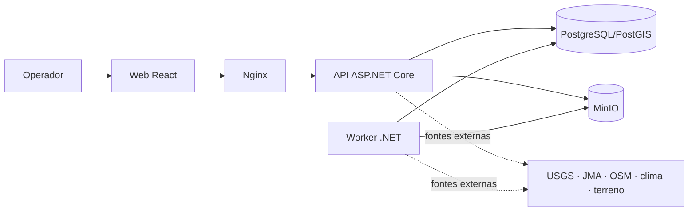

# Documentação do SOS_LOCATION

Esta é a entrada única da documentação do sistema. O código-fonte é a referência normativa: quando um texto e o código divergirem, o comportamento implementado prevalece.

## Documentos

| Documento | Para quem | Conteúdo |
|---|---|---|
| [Catálogo de serviços](services.md) | Operação e desenvolvimento | Responsabilidade, entradas, saídas e dependências de cada processo e módulo |
| [Guia do usuário](user-guide.md) | Operadores de defesa civil | Fluxos do mapa, toolbox, análise científica e leitura de resultados |
| [Arquitetura](architecture/system.md) | Arquitetos e desenvolvedores | Containers, camadas, dados, filas, extensões e diagramas Mermaid |
| [Testes](testing.md) | Engenharia e QA | Pirâmide de testes, comandos, fixtures e critérios de aceitação |
| [Segurança](security.md) | DevSecOps e operação | Fronteiras, controles presentes, riscos e checklist de produção |

## Referências técnicas existentes

- [Visão arquitetural](architecture/overview.md)
- [Ferramentas científicas](architecture/scientific-tools.md)
- [Operações de desastre](disaster-operations.md)
- [Pipeline de importação](data-pipeline/import-pipeline.md)
- [Dados sísmicos do USGS](data-sources/usgs-earthquake-data.md)
- [Mapa do código](../dev/02-mapa-do-codigo.md)
- [API e contratos](../dev/05-api-e-contratos.md)
- [Testes, segurança e confiabilidade](../dev/10-testes-seguranca-e-confiabilidade.md)

## Visão em uma figura

