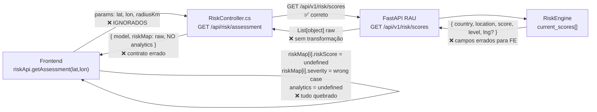
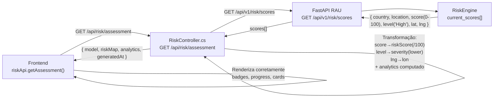
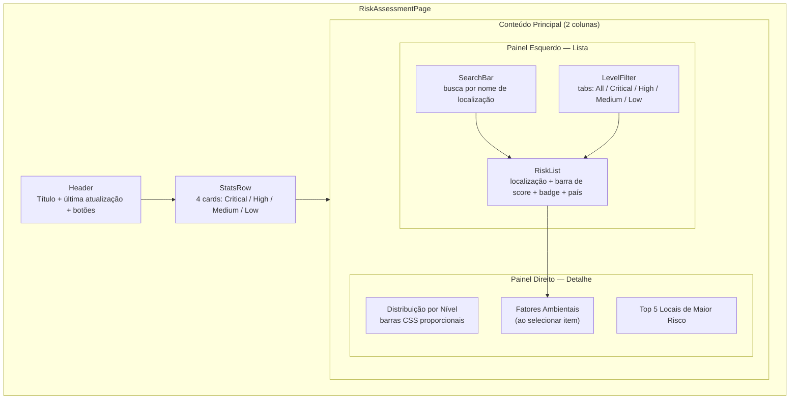
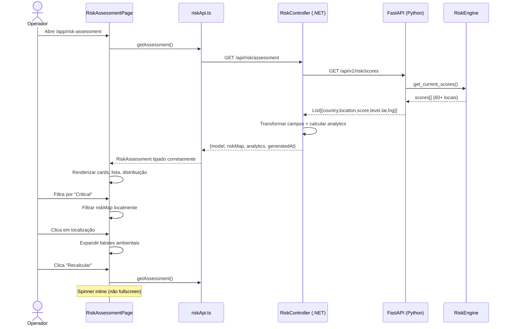

# Plano de Implementação — Análise de Risco (Risk Assessment)

> Data: 2026-03-22 | Status: Implementado

---

## 1. Diagnóstico — Bugs e Problemas Encontrados

### Frontend — `RiskAssessmentPage.tsx`

| # | Bug | Impacto |
|---|-----|---------|
| F-01 | `VStack align="right"` inválido — Chakra não aceita "right" | Quebra layout CSS silenciosamente |
| F-02 | `severity` vs `level` — `getSeverityColor` compara minúsculas mas backend retorna capitalizado ("High"/"Critical") | Todos os pontos aparecem com cor verde (baixo risco) |
| F-03 | Campo `riskScore` não existe — Python retorna `score` (0-100 int), tipo TS espera `riskScore` (float 0-1) | Progress bar sempre 0% ou NaN |
| F-04 | Campo `lon` vs `lng` — Python retorna `lng`, TS declara `lon` | Coordenadas sempre `undefined`, mapa sem pontos |
| F-05 | `analytics` sempre `undefined` — backend nunca retorna este objeto | Cards mostram "N/A" e "0" eternamente |
| F-06 | `coords` hardcoded e sem UI — fixo em Muriaé-MG, usuário não pode mudar | Pesquisa sempre falha / ignora localização real |
| F-07 | `className="animate-pulse"` / `"custom-scrollbar"` — Tailwind misturado com Chakra | Inconsistente; `custom-scrollbar` provavelmente sem efeito |
| F-08 | `LoadingOverlay variant="fullscreen"` durante recalculate | Bloqueia tela inteira em cada refresh |
| F-09 | Painel direito completamente estático | 50% da tela com zero informação útil |
| F-10 | Sem empty state quando `riskMap` vazio | Lista em branco, usuário não entende o que aconteceu |

### Frontend — `riskApi.ts`

| # | Bug | Impacto |
|---|-----|---------|
| R-01 | Interface `RiskAssessment` desatualizada | Tipos TS incompatíveis com dados reais |
| R-02 | `riskMap` item declara `lon`/`severity`/`riskScore` — nunca corresponde ao backend | TypeScript não avisa, runtime silenciosamente falha |

### Backend — `RiskController.cs`

| # | Bug | Impacto |
|---|-----|---------|
| B-01 | `GetAssessment()` ignora `lat`/`lon`/`radiusKm` query params | Filtro por área geográfica nunca funciona |
| B-02 | Passa `List<object>` raw do Python sem transformação | Contrato de campos totalmente errado para o frontend |
| B-03 | `analytics` nunca computado | Cards sempre mostram N/A |
| B-04 | `PipelineSync` é stub (retorna zeros, não faz nada) | Botão "Sinc Pipeline" é decorativo |

---

## 2. Fluxo de Dados — Estado Atual (Quebrado)



## 3. Fluxo de Dados — Estado Corrigido



---

## 4. Diagrama de Componentes — Página Corrigida



---

## 5. Diagrama de Sequência — Ciclo Completo



---

## 6. Contrato de Dados — Tipos Corrigidos

```typescript
interface RiskScore {
  lat:       number | null;
  lon:       number | null;          // mapeado de "lng" do Python
  severity:  'critical' | 'high' | 'medium' | 'low';  // lowercase de "level"
  riskScore: number;                 // score / 100.0 → float 0..1
  country:   string;
  location:  string;
  factors?: {
    alert_count: number;
    environmental: { humidity: number; temp: number; seismic: number };
    alerts_sample: string[];
  };
}

interface RiskAssessment {
  model: { name: string; version: string };
  riskMap: RiskScore[];
  analytics: {
    totalLocations:            number;
    criticalCount:             number;
    highCount:                 number;
    mediumCount:               number;
    lowCount:                  number;
    affectedPopulation:        number;
    criticalInfrastructureCount: number;
  };
  generatedAt: string;
}
```

---

## 7. Checklist de Implementação

- [x] **B-01/B-02/B-03** — `RiskController.cs`: transformar campos, computar analytics, aceitar params
- [x] **B-04** — `RiskController.cs`: `PipelineSync` dispara ciclo no RAU
- [x] **R-01/R-02** — `riskApi.ts`: interfaces atualizadas
- [x] **F-01** — `VStack align="right"` → `align="flex-end"`
- [x] **F-02** — `severity` case insensitive fix
- [x] **F-03** — `riskScore` field correto
- [x] **F-04** — `lon`/`lng` alinhados
- [x] **F-05** — `analytics` computado no backend
- [x] **F-06** — coordenadas removidas da UI (análise global)
- [x] **F-07** — Tailwind removido, Chakra usado consistentemente
- [x] **F-08** — Spinner inline, não fullscreen overlay
- [x] **F-09** — Painel direito com distribuição + top risks + fatores
- [x] **F-10** — Empty state para lista vazia
