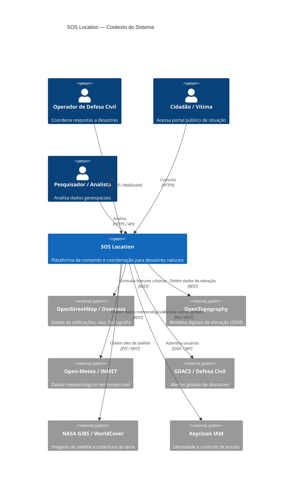
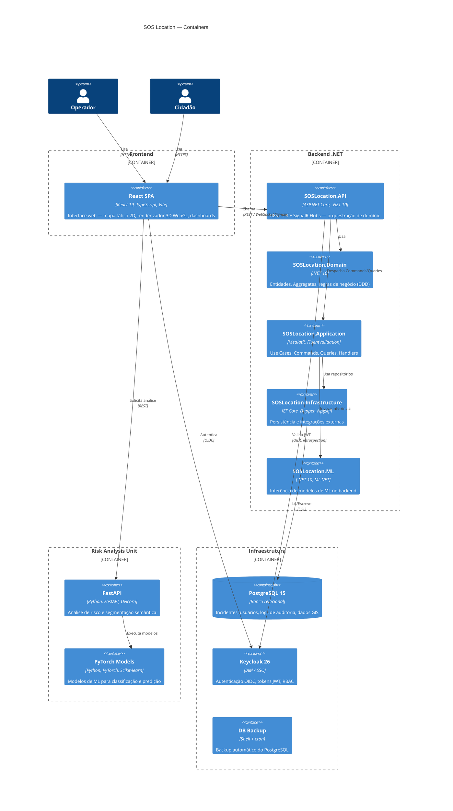
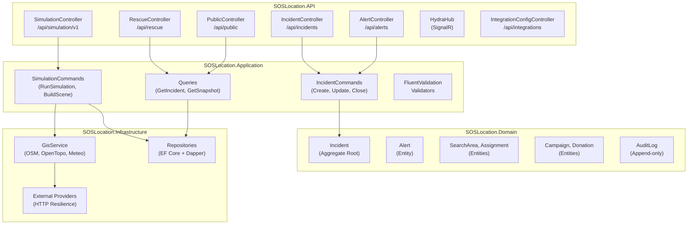
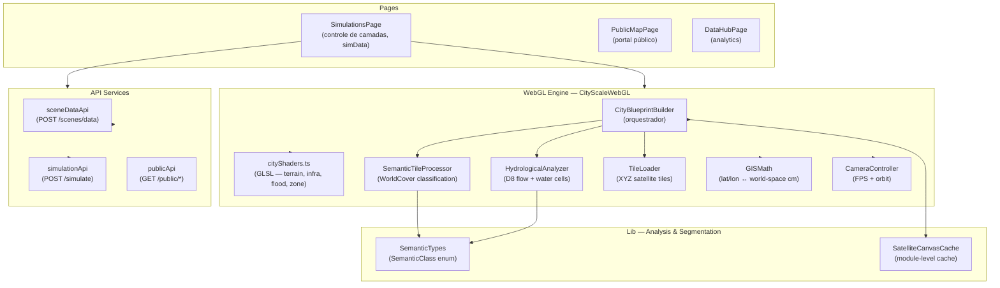
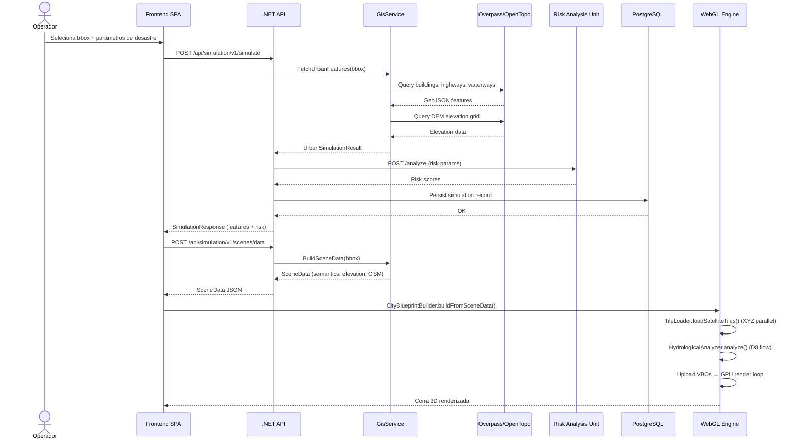
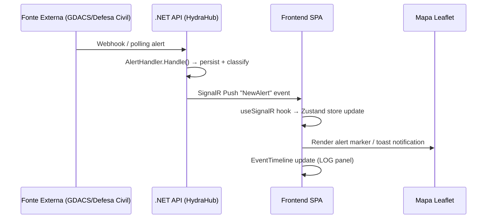

# SOS Location — Arquitetura do Sistema

> Versão: 2.0 | Data: 2026-03-22

---

## 1. Visão Geral — Diagrama C4 (Nível 1: Contexto)



---

## 2. Diagrama de Containers (Nível 2)



---

## 3. Diagrama de Componentes — Backend API (Nível 3)



---

## 4. Diagrama de Componentes — Frontend WebGL Pipeline (Nível 3)



---

## 5. Sequência — Pipeline Completo de Simulação



---

## 6. Sequência — Alertas em Tempo Real (SignalR)



---

## 7. Arquitetura de Deploy (Docker Compose)

```mermaid
graph LR
    subgraph Docker["Docker Compose Network"]
        FE["frontend\n:5173\n(Vite + React)"]
        BE["backend\n:5000\n(ASP.NET Core)"]
        RAU["risk-analysis\n:8001\n(FastAPI)"]
        PG["postgres\n:5432\n(PostgreSQL 15)"]
        KC["keycloak\n:8080\n(Keycloak 26)"]
        BK["db-backup\n(cron diário)"]
        DZ["dozzle\n:8888\n(log viewer)"]
    end

    FE -->|REST/WS| BE
    FE -->|OIDC| KC
    FE -->|REST| RAU
    BE -->|SQL| PG
    BE -->|OIDC introspect| KC
    RAU -->|REST (opcional)| BE
    BK -->|pg_dump| PG
    DZ -->|Docker API| Docker
```

---

## 8. Princípios Arquiteturais

| Princípio | Implementação |
|-----------|--------------|
| **Clean Architecture** | Backend em camadas: Domain → Application → Infrastructure → API |
| **Domain-Driven Design** | Aggregates, Entities, Value Objects, Domain Events em `SOSLocation.Domain` |
| **CQRS** | Commands (escrita) e Queries (leitura) separados via MediatR |
| **Resilience by Default** | Circuit breakers e retries para todos os provedores GIS externos |
| **Offline-First** | IndexedDB + service worker para operação sem conectividade |
| **Pure WebGL 2.0** | Sem Three.js no pipeline 3D — controle total de shaders e buffers |
| **Satellite-Driven Semantics** | Posicionamento de features (árvores, água) baseado em análise de imagem real |
| **Zero-Trust Auth** | JWT validado a cada request; Keycloak como IdP centralizado |
