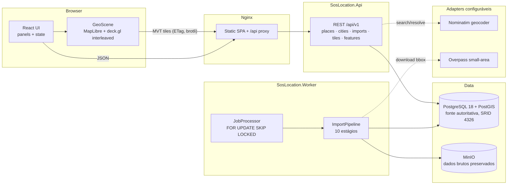
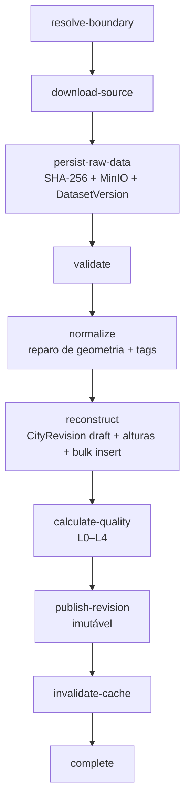

# Arquitetura — SOS_LOCATION City Reconstruction Platform

## Visão geral



Camadas .NET (dependências verificadas por NetArchTest):

```text
Api / Worker  →  Infrastructure  →  Application  →  Domain
                     ↘ GeoProcessing ↗
```

- **Domain**: entidades da linguagem ubíqua, value objects, cálculo de altura.
  Zero dependência de EF/Npgsql/HTTP.
- **Application**: ports (stores, geocoder, OSM, storage, tiles), pipeline de
  importação, validação, perfis de reconstrução.
- **GeoProcessing**: reparo de geometria (NTS), normalização de tags OSM,
  normalizadores GeoJSON/Overpass.
- **Infrastructure**: EF Core + PostGIS, fila SKIP LOCKED, gerador MVT,
  Nominatim/Overpass/MinIO adapters.

## Pipeline de importação



Regras de resiliência: cada estágio persiste progresso no job; falha antes de
3 tentativas → `retrying`; reexecução cria nova revisão draft e limpa resíduos
(idempotência); revisão publicada nunca é alterada.

## Fluxo do usuário

```text
pesquisa (Nominatim via backend)
→ seleção → câmera voa até a área
→ POST /imports → job na fila
→ worker: download OSM → normaliza → reconstrói → publica revisão
→ UI abre a revisão → MVTLayers carregam tiles progressivamente
→ clique em edifício → painel de inspeção (altura, fonte, confiança, proveniência)
```

## Performance

- Tiles MVT com simplificação por zoom e atributos reduzidos (tags completas nunca).
- ETag + `Cache-Control: public, immutable` (revisões imutáveis) + brotli/gzip.
- Edifícios só a partir do zoom 12; vias filtradas por classe abaixo do zoom 12.
- Painel de diagnóstico: FPS, tiles loaded/pending, zoom, lon/lat, pitch, bearing.

## Limitações conhecidas (registradas, não escondidas)

- Elevação: terreno plano (`ground_elevation_m = 0`, declarado "estimated") até
  haver suporte DEM.
- `min_height` não desloca a base da extrusão no deck.gl (limitação da
  GeoJsonLayer); registrado para a fase de terreno.
- Boundary desenhada a partir do bounding box (o polígono administrativo real
  fica no banco, ainda não exposto como camada).
- Cancelamento de job em execução tem efeito entre estágios, não no meio de um
  download.
- PLATEAU/CityGML/3D Tiles: adapters previstos (fase 6), domínio já comporta
  (`Dataset.DatasetType`, `SourcePayloadFormat.OsmPbf` reservado).
