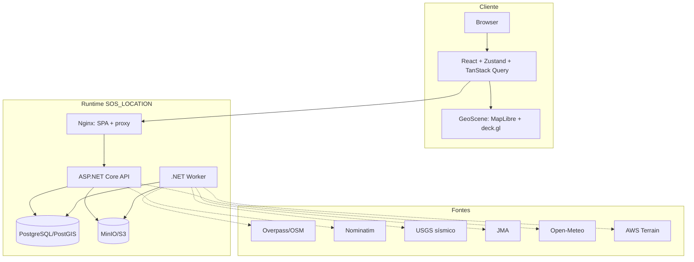
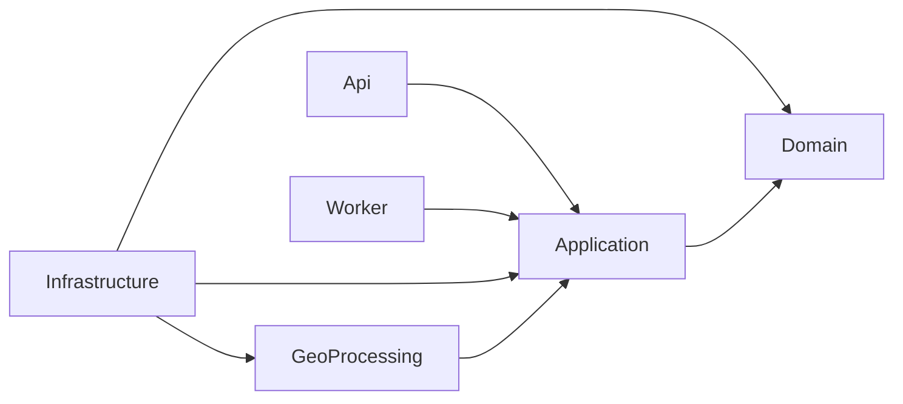
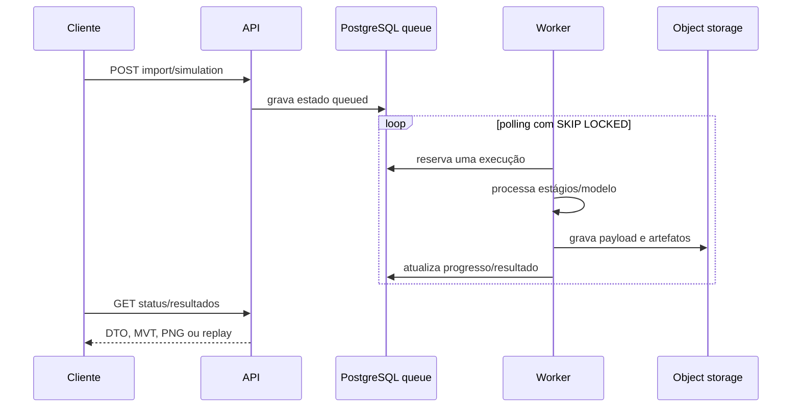

# Arquitetura do sistema

## Contexto e containers

## Dependências de camadas

O domínio não conhece EF Core, Npgsql, HTTP ou providers. Application define ports (`IStores`, `IObjectStorage`, `IOsmSource`, `IGeocoder`, `IElevationProvider`, `IDisasterSimulationEngine`); Infrastructure fornece adapters; API e Worker apenas compõem casos de uso.

## Filas e processamento

## Extensão científica

Um novo desastre fornece um `IDisasterSimulationEngine` com `DisasterType`, validação, execução e manifesto. O registry resolve o motor sem `if` espalhado; a UI registra ferramentas por tipo em `scientificToolRegistry`. Assim o mesmo workspace pode receber enchente, incêndio ou outros motores quando implementados.

## Imutabilidade e cache

City revisions publicadas e artefatos concluídos não são sobrescritos. MVT usa revisão/camada/zoom/x/y; rasters e frames são identificados por `runId`. O cache público só deve ser aplicado a objetos efetivamente imutáveis.
