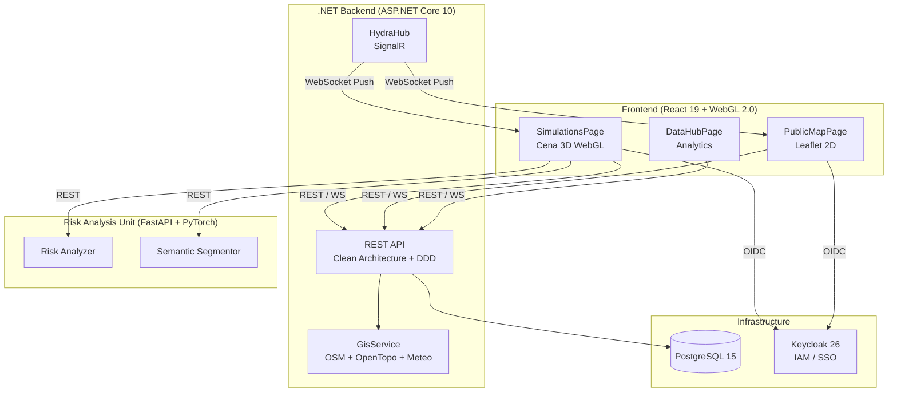

# Arquitetura SOS Location

> **Este arquivo foi consolidado.** Consulte a documentação atualizada:
>
> - [SYSTEM_ARCHITECTURE.md](../SYSTEM_ARCHITECTURE.md) — Diagramas C4, componentes e sequências
> - [CLASS_DIAGRAMS.md](../CLASS_DIAGRAMS.md) — Diagramas de classe (Domain, Application, Frontend)
> - [DATA_FLOW.md](../DATA_FLOW.md) — Fluxos de dados GIS, simulação e tempo real
> - [INDEX.md](../INDEX.md) — Índice completo da documentação

---

## Visão de Alto Nível (resumo)

