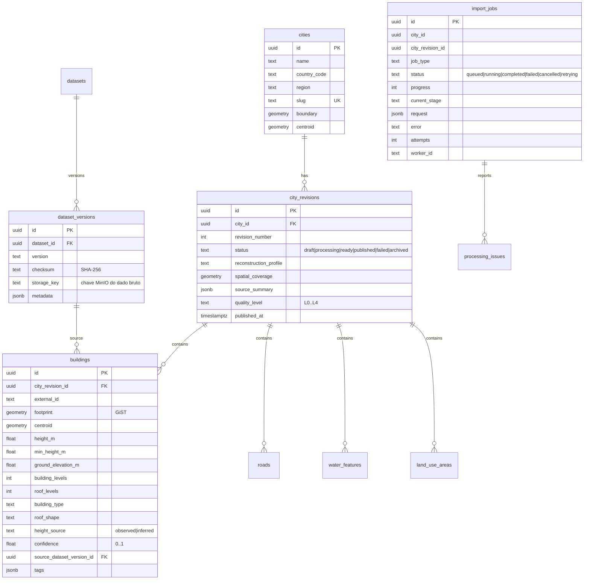

# Modelo de dados

Geometrias autoritativas: **WGS84 (SRID 4326)**. Tiles: transformação para
3857 somente na consulta. Índices GiST em todas as geometrias; unicidade
`(city_revision_id, external_id)` nas features; `(city_id, revision_number)`
nas revisões.

`roads` (geometry, road_class, name, width_m, lanes, is_bridge, is_tunnel),
`water_features` (geometry, water_type, name) e `land_use_areas`
(geometry, land_use_type) seguem o mesmo padrão de proveniência
(`confidence`, `source_dataset_version_id`, `tags jsonb`).

## Cálculo de altura (perfil `osm-basic-v1`)

Precedência: `height` → `building:levels` (+`roof:levels`) → `roof:levels` →
altura por `building:type` → altura por uso do solo → padrão do perfil.

| Parâmetro | Valor |
|---|---|
| defaultLevelHeight | 3.0 m |
| defaultRoofLevelHeight | 2.0 m |
| defaultBuildingHeight | 9.0 m |

Altura explícita ⇒ `height_source = observed`, `confidence = 1.0`.
Inferida ⇒ `inferred`, confiança 0.8 (levels) / 0.6 (roof) / 0.5 (type) /
0.4 (land use) / 0.3 (default). Valores vivem no perfil versionado
(`ReconstructionProfile`), nunca fixos no código.
