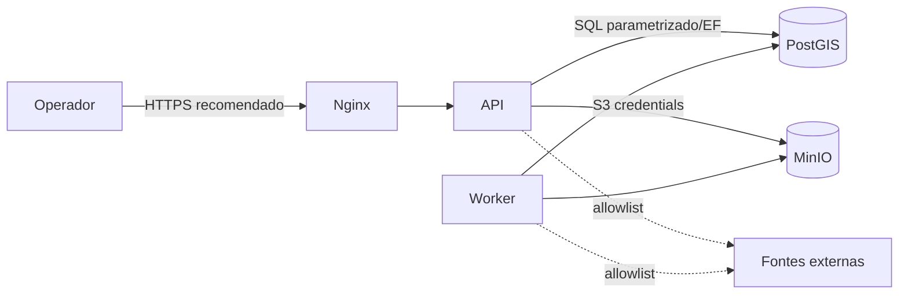

# Segurança

## Fronteiras e fluxo de dados

## Controles presentes no código

- CORS usa `Cors:AllowedOrigins`, sem origem arbitrária por padrão.
- `ProblemDetails` e exception handler evitam stack trace na resposta.
- Validação FluentValidation cobre imports, simulações, zonas e operações.
- Geometrias são sanitizadas/reparadas antes de persistir.
- Consultas usam EF Core/ports; não há SQL concatenado nos endpoints documentados.
- Exclusão operacional é fechamento lógico e possui auditoria.
- Payloads brutos preservam checksum SHA-256 e proveniência.
- Health endpoints separam liveness de readiness; logs estruturados e OpenTelemetry permitem auditoria operacional.
- Compressão e cache reduzem custo, mas não alteram autorização de escrita.

## Lacunas importantes antes de produção

1. O pipeline mostrado em `Program.cs` não registra autenticação/autorização; portanto a implantação deve ficar atrás de identidade, rede privada ou gateway com RBAC antes de expor endpoints de escrita.
2. Credenciais padrão do Compose são apenas desenvolvimento; usar secrets manager, rotação e usuários de menor privilégio.
3. Restringir console/porta do MinIO e PostgreSQL à rede interna; publicar somente Nginx.
4. Aplicar TLS, rate limiting, limites de payload/tempo e proteção contra abuso de fontes externas.
5. Configurar allowlist de hosts, timeout e retry com backoff para Nominatim, Overpass, USGS, JMA, clima e terreno.
6. Redigir dados pessoais em notas/vítimas, limitar retenção e definir política LGPD para auditoria.
7. Assinar/verificar artefatos e imagens de container no CI; escanear dependências e bloquear imagens `latest` em produção.
8. Fazer backup cifrado do PostGIS/MinIO, testar restauração e monitorar fila, erros, latência e espaço.

## Checklist de release

- [ ] autenticação, autorização por cenário e trilha de auditoria habilitadas;
- [ ] segredos fora de código/Compose;
- [ ] HTTPS, headers de segurança e rede interna aplicados;
- [ ] limites de importação, geometria, raster e concorrência revisados;
- [ ] fontes e licenças/proveniência exibidas ao operador;
- [ ] smoke test de `/health/ready`, importação, operação e simulação;
- [ ] plano de rollback e restauração validado.

Resultados sísmicos devem ser rotulados como aproximações científicas/engenharia, nunca como alerta oficial ou laudo estrutural.
