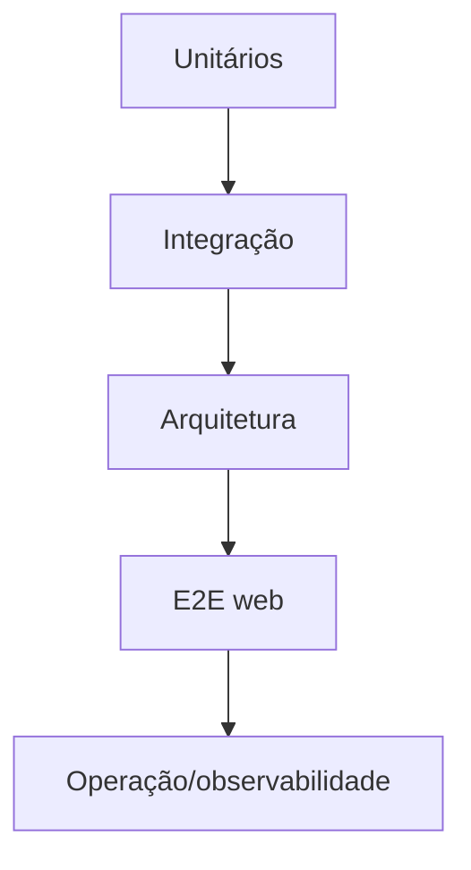

# Documentação de testes

## Estratégia

| Camada | Cobertura | Comando |
|---|---|---|
| Frontend unitário | componentes, stores, toolbox, ferramentas científicas | `cd apps/web && npm test` |
| Frontend tipos/build | TypeScript e bundle | `cd apps/web && npm run typecheck && npm run build` |
| .NET unitário | domínio, validadores, raster, FDTD, Brune, registry | `dotnet test tests/SosLocation.UnitTests/SosLocation.UnitTests.csproj --no-restore` |
| Integração | PostGIS, Overpass normalizer e pipeline sísmico | `dotnet test tests/SosLocation.IntegrationTests/SosLocation.IntegrationTests.csproj --no-restore` |
| Arquitetura | dependências entre camadas | `dotnet test tests/SosLocation.ArchitectureTests/SosLocation.ArchitectureTests.csproj --no-restore` |
| E2E | fluxo visual da cidade, toolbox e workspace científico | `cd apps/web && npm run e2e` |

## Fixtures e isolamento

- `tools/fixtures/demo-district.geojson` fornece dados urbanos determinísticos/offline.
- Testes de integração usam PostgreSQL/PostGIS quando habilitados e não devem depender de uma fonte externa instável.
- Clientes externos devem ser substituídos por fakes/fixtures nos testes unitários.
- Jobs e simulações devem ser testados como máquina de estados: `queued → running → completed`, além de `retrying`, `failed` e `cancelled`.

## Casos mínimos de aceitação

1. Importação inválida retorna `400` e não cria revisão publicada.
2. Geometria operacional inválida retorna `422`; atualização não pode mudar o tipo da feição.
3. Encerramento operacional mantém auditoria e remove a feição ativa.
4. Simulação rejeita desastre sem motor registrado.
5. Execução concluída expõe manifest, respostas de prédio, heatmap, raster numérico e replay.
6. Dois workers concorrentes não processam o mesmo job.
7. MVT/replay usam cache apenas quando a revisão/artefato é imutável.

## Evidência

Antes de publicar uma alteração, guardar: comando, versão do SDK/runtime, resultado, duração, cobertura relevante, logs sem segredos e screenshot/E2E quando houver alteração de UI. `git diff --check` deve estar limpo.
