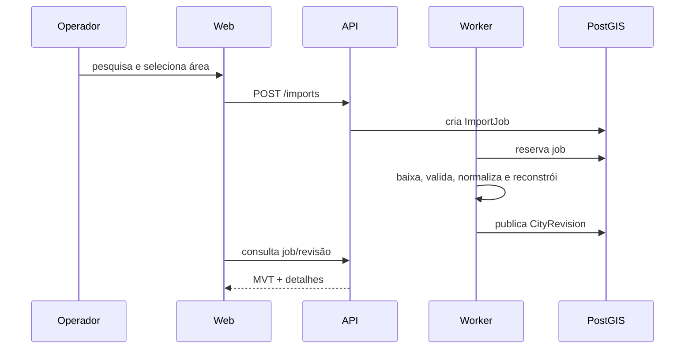

# Guia do usuário

## 1. Abrir uma área

1. Pesquise uma cidade ou lugar no painel de busca.
2. Selecione o resultado; a câmera voa para o envelope geográfico.
3. Inicie uma importação para criar uma nova revisão urbana.
4. Acompanhe o status até a revisão ser publicada; revisões publicadas são imutáveis.

## 2. Ferramentas de campo

Abra **Ferramentas de campo** no canto inferior esquerdo. Escolha uma ação e desenhe no mapa:

- área de risco;
- alerta;
- rota de resgate;
- ocorrência/vítima;
- ponto de apoio;
- interrupção de trânsito;
- área segura;
- setor de busca.

Áreas usam polígono, rotas usam linha e marcações usam ponto. Ao terminar o desenho, informe nome, prioridade, status, equipe, vítimas, capacidade/recursos e observações no quadro operacional. A exclusão é um encerramento lógico: o histórico permanece para auditoria.

## 3. Análise científica de terremoto

1. Abra **Análise científica**.
2. Selecione uma execução concluída.
3. Use as ferramentas: análise sistêmica, fonte/dados, propagação/dissipação, intensidade/mapa de calor, impacto estrutural ou laboratório de simulação.
4. Ative o overlay no mapa quando solicitado.

Os resultados são aproximações para exploração e priorização. PGA, intensidade, direção de onda, dissipação e dano não substituem alerta oficial, vistoria estrutural ou decisão de segurança de vida.

## 4. Leitura do mapa

- MVT urbanos: prédios, vias, água e ferrovias.
- Operações: cores por tipo/status e auditoria no cenário.
- Heatmap: intensidade colorizada; o raster `intensity-data.png` é a imagem numérica para análise.
- Replay: frames temporais da propagação.
- Painel de diagnóstico: FPS, tiles pendentes, zoom, centro e orientação.

## 5. Condições e problemas comuns

- Uma revisão sem dados publicados ainda não gera tiles úteis.
- Importações e simulações são assíncronas; atualize o status, não repita a solicitação sem verificar o job.
- Falha de fonte externa aparece como erro/issue persistido; valide a proveniência antes de usar o resultado.
- Se o mapa não carregar, verifique `/health/ready`, API, banco e MinIO.
